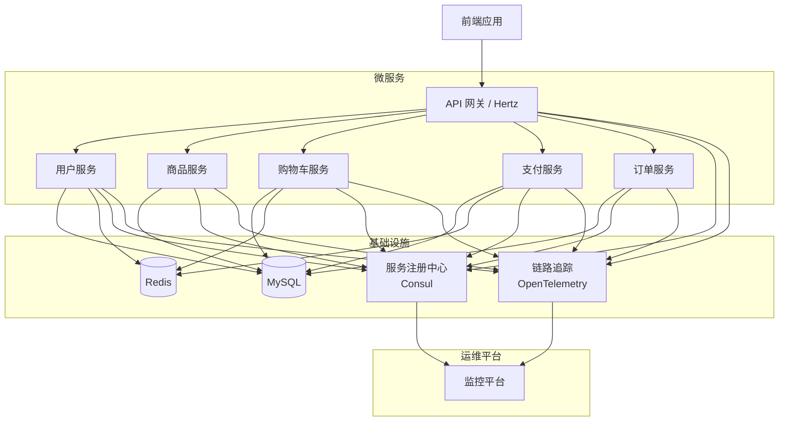

# 字节跳动青训营 TikTok E-Commerce 项目

## 项目架构

## 项目概述

### 项目名称

字节跳动青训营 TikTok E-Commerce 项目

### 项目背景

随着移动互联网的普及和消费者购物习惯的变化，社交电商呈现出蓬勃发展的趋势。抖音作为一款拥有庞大用户群体的短视频社交平台，具有巨大的电商潜力。通过搭建电商平台，抖音可以为用户提供更加丰富的购物体验，同时为商家提供新的销售渠道，实现用户、商家和平台的多赢局面。

### 项目愿景

希望同学们可以通过完成这个项目切实实践课程中（视频中）学到的知识点包括但不限于 Go 语言编程，常用框架、数据库、对象存储，服务治理，服务上云等内容，同时对开发工作有更多的深入了解与认识，长远讲能对大家的个人技术成长或视野有启发。

### 项目标

做一个抖音商城。为用户提供便捷、优质的购物环境，满足用户多样化的购物需求，打造一个具有影响力的社交电商平台，提升抖音在电商领域的市场竞争力。

### 技术栈

- Go
- Hertz
- Kitex
- Consul
- OpenTelemetry
- Gorm
- cwgo
- Redis
- Java
- SpringBoot
- Dubbo
- Sentinel
- MyBatis

## 技术需求

### 注册中心集成

- 服务注册与发现：该服务能够与注册中心（如 Consul、Nacos、etcd 等）进行集成，自动注册服务数据。

### 身份认证

- 登录认证：可以使用第三方现成的登录验证框架（CasBin、Satoken 等），对请求进行身份验证。
- 可配置的认证白名单和黑名单。

### 可观测要求

- 日志记录与监控：对服务的运行状态和请求处理过程进行详细的日志记录，方便故障排查和性能分析。
- 提供实时监控功能。

### 可靠性要求

- 容错机制：该服务应具备一定的容错能力，保证下游在异常情况下，系统的整体可用性不会受太大影响，且核心服务可用。
- 流量兜底措施：在服务流量激增时，给予一定的限流措施。

## 功能需求

结合项目背景和技术需求，开发一个功能齐全的社交电商平台，支持用户注册、登录、商品浏览、购物车、订单管理等核心电商功能。
