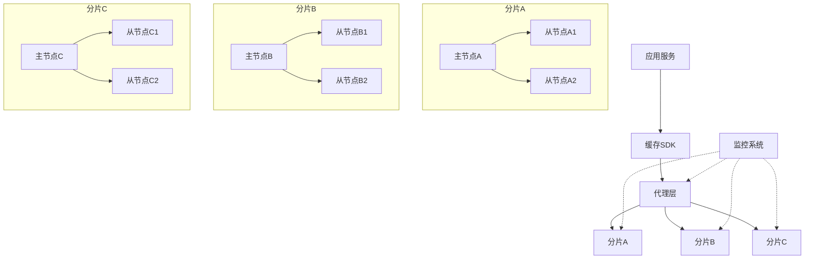

# GoMall 分布式缓存集群设计方案

> 本文档详细介绍了为 GoMall 项目设计和实现分布式缓存集群的完整方案，包括架构设计、技术选型、实现步骤和最佳实践。该方案旨在提升系统性能、可用性和扩展性，满足电商平台高并发、低延迟的业务需求。

## 1. 需求分析与目标

### 1.1 当前缓存使用现状

GoMall 项目目前采用单节点 Redis 实例作为缓存，存在以下问题：

1. **单点故障风险**：单个 Redis 节点故障会导致整个缓存系统不可用
2. **扩展性受限**：随着业务增长，单节点 Redis 的内存和性能瓶颈明显
3. **缓存容量有限**：单节点内存容量有限，无法满足大规模数据缓存需求
4. **服务隔离不足**：不同业务模块共用同一 Redis 实例，相互影响

### 1.2 设计目标

设计分布式缓存集群的主要目标：

1. **高可用性**：集群整体可用性达到 99.99%，单节点故障不影响整体服务
2. **高扩展性**：支持水平扩展，轻松应对业务增长
3. **高性能**：读写延迟控制在毫秒级，支持高并发访问
4. **业务隔离**：不同业务模块的缓存相互隔离，避免相互影响
5. **运维友好**：提供完善的监控、告警和管理工具

## 2. 整体架构设计

### 2.1 架构图



### 2.2 架构层次

分布式缓存集群架构分为四个层次：

1. **应用层**：GoMall 各业务服务，通过缓存 SDK 访问缓存
2. **接入层**：缓存代理层，负责路由、负载均衡和故障转移
3. **服务层**：Redis 分片集群，提供实际的缓存存储服务
4. **管理层**：监控、告警和管理工具，保障集群稳定运行

### 2.3 数据分片策略

采用一致性哈希算法进行数据分片：

1. **虚拟节点**：每个物理节点映射到多个虚拟节点，均衡数据分布
2. **哈希环**：将键通过哈希函数映射到哈希环上，分配到最近的节点
3. **分片迁移**：节点增减时，只影响相邻节点的数据，最小化数据迁移

## 3. 技术选型

### 3.1 缓存集群方案对比

| 方案 | 优点 | 缺点 | 适用场景 |
|-----|-----|-----|---------|
| Redis Cluster | 原生集群，自动分片，去中心化 | 配置复杂，至少需要6个节点 | 大规模部署，需要自动分片 |
| Redis Sentinel | 高可用，主从复制，自动故障转移 | 需要额外的哨兵节点，不支持自动分片 | 中小规模部署，注重高可用 |
| Codis | 支持动态扩容，兼容 Redis 协议 | 需要额外的组件，有一定学习成本 | 需要平滑扩容的大规模集群 |
| Twemproxy | 轻量级，低延迟 | 单点故障风险，不支持动态扩容 | 追求极致性能的场景 |

### 3.2 推荐方案

根据 GoMall 的需求和未来发展，推荐采用 **Redis Cluster** 作为分布式缓存集群方案：

1. **原生支持**：Redis 官方支持，稳定可靠
2. **自动分片**：支持数据自动分片和重新平衡
3. **去中心化**：无中心节点，避免单点故障
4. **高可用性**：支持主从复制和自动故障转移
5. **线性扩展**：支持在线动态扩容

### 3.3 客户端选型

推荐使用 **go-redis/v9** 作为客户端库，理由如下：

1. **兼容性**：与 GoMall 现有代码兼容，迁移成本低
2. **集群支持**：原生支持 Redis Cluster 模式
3. **功能完善**：支持连接池、重试、超时等高级特性
4. **社区活跃**：持续更新和维护，Bug 修复及时

## 4. 详细设计

### 4.1 集群拓扑结构

初始规模建议：

- **3个分片**：每个分片1主2从，共9个节点
- **每个节点**：8GB 内存，2核 CPU
- **网络要求**：节点间延迟小于1ms，带宽至少1Gbps

随业务增长可水平扩展至更多分片。

### 4.2 数据分片与复制

1. **数据分片**：
   - 16384个哈希槽，平均分配给各主节点
   - 使用 CRC16 算法计算键的哈希值
   - 通过 HASH_SLOT = CRC16(key) mod 16384 确定槽位

2. **数据复制**：
   - 每个主节点至少配置2个从节点
   - 采用异步复制机制，保证数据最终一致性
   - 从节点提供读服务，分担主节点压力

### 4.3 高可用设计

1. **故障检测**：
   - 节点间通过 Gossip 协议通信
   - 主观下线 (PFAIL) 和客观下线 (FAIL) 两阶段判定
   - 超过半数主节点认为某节点下线时，标记为客观下线

2. **故障转移**：
   - 主节点故障时，从节点自动选举新主节点
   - 选举基于配置纪元 (configuration epoch) 机制
   - 新主节点接管原主节点的哈希槽，继续提供服务

### 4.4 缓存策略设计

1. **缓存粒度**：
   - 细粒度缓存：单个对象或字段级别缓存
   - 粗粒度缓存：聚合数据或完整页面缓存

2. **缓存更新策略**：
   - 读写直达 (Read/Write Through)：应用同时更新缓存和数据库
   - 延迟加载 (Lazy Loading)：按需加载数据到缓存
   - 写回 (Write Back)：先写缓存，异步写入数据库

3. **过期策略**：
   - 基于时间的过期 (TTL)：设置合理的过期时间
   - 基于容量的淘汰 (LRU/LFU)：内存不足时淘汰低价值数据

### 4.5 缓存穿透、击穿与雪崩防护

1. **缓存穿透防护**：
   - 布隆过滤器：快速判断 key 是否存在
   - 空值缓存：对不存在的数据也进行缓存，但设置较短的过期时间

2. **缓存击穿防护**：
   - 互斥锁：获取缓存时加锁，防止并发重建缓存
   - 热点数据永不过期：对热点数据设置永不过期，后台异步更新

3. **缓存雪崩防护**：
   - 过期时间随机化：为缓存设置随机附加时间
   - 多级缓存：构建多级缓存架构，降低依赖
   - 熔断降级：缓存故障时启动降级机制

## 5. 实现步骤

### 5.1 基础设施准备

1. **服务器资源**：
   - 9台服务器（或虚拟机）用于 Redis 节点
   - 2台服务器用于监控和管理

2. **网络配置**：
   - 配置内部网络，确保节点间低延迟通信
   - 设置安全组和防火墙规则

3. **操作系统优化**：
   - 调整系统参数：`vm.overcommit_memory = 1`
   - 禁用 Transparent Huge Pages：`echo never > /sys/kernel/mm/transparent_hugepage/enabled`
   - 配置最大文件描述符：`ulimit -n 65535`

### 5.2 Redis Cluster 部署

1. **安装 Redis**：

```bash
# 在每个节点上执行
apt-get update
apt-get install -y redis-server
```

2. **配置 Redis 节点**：

创建配置文件 `redis.conf`：

```
# 基本配置
port 6379
cluster-enabled yes
cluster-config-file nodes.conf
cluster-node-timeout 5000
appendonly yes

# 内存配置
maxmemory 6GB
maxmemory-policy allkeys-lru

# 安全配置
requirepass StrongPassword
masterauth StrongPassword
```

3. **创建集群**：

```bash
# 使用 redis-cli 创建集群
redis-cli --cluster create \
  192.168.1.1:6379 192.168.1.2:6379 192.168.1.3:6379 \
  192.168.1.4:6379 192.168.1.5:6379 192.168.1.6:6379 \
  192.168.1.7:6379 192.168.1.8:6379 192.168.1.9:6379 \
  --cluster-replicas 2 \
  -a StrongPassword
```

### 5.3 客户端适配

1. **创建缓存 SDK**：

```go
// 文件：common/cache/redis_cluster.go
package cache

import (
	"context"
	"time"

	"github.com/redis/go-redis/v9"
)

var (
	ClusterClient *redis.ClusterClient
)

// 集群配置
type RedisClusterConfig struct {
	Addresses []string
	Username  string
	Password  string
	PoolSize  int
	Timeout   time.Duration
}

// 初始化 Redis 集群
func InitRedisCluster(cfg RedisClusterConfig) {
	ClusterClient = redis.NewClusterClient(&redis.ClusterOptions{
		Addrs:        cfg.Addresses,
		Username:     cfg.Username,
		Password:     cfg.Password,
		PoolSize:     cfg.PoolSize,
		ReadTimeout:  cfg.Timeout,
		WriteTimeout: cfg.Timeout,
		// 高可用配置
		MaxRetries:      3,
		MinRetryBackoff: 8 * time.Millisecond,
		MaxRetryBackoff: 512 * time.Millisecond,
		// 路由配置
		RouteByLatency: true,
		RouteRandomly:  true,
	})

	// 测试连接
	if err := ClusterClient.Ping(context.Background()).Err(); err != nil {
		panic(err)
	}
}

// 关闭集群连接
func CloseRedisCluster() error {
	return ClusterClient.Close()
}
```

2. **更新配置文件**：

```yaml
# 文件：app/user/conf/config.yaml
redis_cluster:
  addresses:
    - "192.168.1.1:6379"
    - "192.168.1.2:6379"
    - "192.168.1.3:6379"
    - "192.168.1.4:6379"
    - "192.168.1.5:6379"
    - "192.168.1.6:6379"
    - "192.168.1.7:6379"
    - "192.168.1.8:6379"
    - "192.168.1.9:6379"
  username: ""
  password: "StrongPassword"
  pool_size: 100
  timeout: 200ms
```

3. **业务层适配**：

```go
// 文件：app/user/biz/service/user.go
package service

import (
	"context"
	"encoding/json"
	"time"

	"zqzqsb.com/gomall/common/cache"
)

// 用户缓存
func (s *UserService) GetUserByID(ctx context.Context, userID int64) (*User, error) {
	// 构建缓存键
	cacheKey := fmt.Sprintf("user:%d", userID)
	
	// 尝试从缓存获取
	val, err := cache.ClusterClient.Get(ctx, cacheKey).Result()
	if err == nil {
		// 缓存命中
		var user User
		if err := json.Unmarshal([]byte(val), &user); err == nil {
			return &user, nil
		}
	}
	
	// 缓存未命中，从数据库获取
	user, err := s.userRepo.GetByID(ctx, userID)
	if err != nil {
		return nil, err
	}
	
	// 更新缓存
	if userBytes, err := json.Marshal(user); err == nil {
		cache.ClusterClient.Set(ctx, cacheKey, userBytes, 30*time.Minute)
	}
	
	return user, nil
}
```

### 5.4 监控与运维

1. **部署 Prometheus 和 Grafana**：

```bash
# 安装 Prometheus
wget https://github.com/prometheus/prometheus/releases/download/v2.43.0/prometheus-2.43.0.linux-amd64.tar.gz
tar xvfz prometheus-2.43.0.linux-amd64.tar.gz
cd prometheus-2.43.0.linux-amd64
./prometheus --config.file=prometheus.yml

# 安装 Grafana
apt-get install -y grafana
systemctl start grafana-server
```

2. **配置 Redis Exporter**：

```bash
# 安装 Redis Exporter
wget https://github.com/oliver006/redis_exporter/releases/download/v1.45.0/redis_exporter-v1.45.0.linux-amd64.tar.gz
tar xvfz redis_exporter-v1.45.0.linux-amd64.tar.gz
cd redis_exporter-v1.45.0.linux-amd64
./redis_exporter -redis.addr=redis://192.168.1.1:6379,redis://192.168.1.2:6379 -redis.password=StrongPassword
```

3. **配置告警规则**：

```yaml
# prometheus.yml 中添加告警规则
rule_files:
  - "redis_alerts.yml"

# redis_alerts.yml
groups:
- name: redis_alerts
  rules:
  - alert: RedisDown
    expr: redis_up == 0
    for: 1m
    labels:
      severity: critical
    annotations:
      summary: "Redis instance down"
      description: "Redis instance {{ $labels.instance }} is down"
      
  - alert: RedisMemoryHigh
    expr: redis_memory_used_bytes / redis_memory_max_bytes * 100 > 85
    for: 10m
    labels:
      severity: warning
    annotations:
      summary: "Redis memory usage high"
      description: "Redis instance {{ $labels.instance }} memory usage is {{ $value }}%"
```

## 6. 性能优化与调优

### 6.1 客户端优化

1. **连接池优化**：
   - 根据服务器 CPU 核心数设置合适的连接池大小
   - 通常设置为 CPU 核心数 * 2 到 CPU 核心数 * 4

2. **批量操作**：
   - 使用 Pipeline 和 Multi/Exec 批量处理命令
   - 减少网络往返次数，提高吞吐量

3. **超时设置**：
   - 设置合理的连接超时和操作超时
   - 避免因单个慢请求影响整体服务

### 6.2 服务端优化

1. **内存优化**：
   - 启用 Redis 压缩：`activedefrag yes`
   - 合理设置 maxmemory 和淘汰策略

2. **持久化优化**：
   - 使用 RDB 和 AOF 混合持久化
   - 配置 AOF 重写阈值：`auto-aof-rewrite-percentage 100`

3. **网络优化**：
   - 启用 TCP keepalive：`tcp-keepalive 300`
   - 调整 TCP 缓冲区大小

### 6.3 数据结构优化

1. **键设计优化**：
   - 避免过长的键名，使用短键名节省内存
   - 使用冒号分隔的命名约定：`object-type:id:field`

2. **数据类型选择**：
   - 合理选择数据类型，如 Hash 代替多个 String
   - 使用位操作 (Bitmap) 存储布尔标志
   - 使用 HyperLogLog 进行基数统计

3. **过期策略优化**：
   - 避免同时设置大量键同时过期
   - 使用随机过期时间避免缓存雪崩

## 7. 迁移策略

### 7.1 数据迁移方案

1. **双写迁移**：
   - 应用程序同时写入旧 Redis 和新集群
   - 优先从新集群读取，失败时回退到旧 Redis
   - 待新集群稳定后，停止写入旧 Redis

2. **批量导入**：
   - 使用 `DUMP` 和 `RESTORE` 命令迁移数据
   - 或使用 RDB 文件导入导出

3. **增量同步**：
   - 使用 Redis 复制功能进行增量同步
   - 将旧 Redis 配置为新集群的从节点

### 7.2 迁移步骤

1. **准备阶段**：
   - 部署新的 Redis Cluster
   - 开发和测试缓存 SDK
   - 准备回滚方案

2. **灰度发布**：
   - 选择低风险业务进行试点
   - 监控性能和稳定性
   - 收集反馈并优化

3. **全量迁移**：
   - 逐步将所有业务迁移到新集群
   - 监控迁移过程中的性能和错误率
   - 完成迁移后下线旧 Redis

## 8. 最佳实践与注意事项

### 8.1 安全最佳实践

1. **网络安全**：
   - 将 Redis 部署在私有网络中
   - 使用防火墙限制访问
   - 禁用危险命令：`rename-command FLUSHALL ""`

2. **认证与授权**：
   - 设置强密码
   - 使用 ACL 限制用户权限
   - 定期轮换密码

3. **数据安全**：
   - 启用 TLS 加密传输
   - 定期备份数据
   - 测试恢复流程

### 8.2 运维最佳实践

1. **变更管理**：
   - 所有变更经过测试环境验证
   - 重大变更在低峰期执行
   - 保持变更记录

2. **容量规划**：
   - 定期评估资源使用情况
   - 预留 30% 以上的内存余量
   - 根据增长趋势提前扩容

3. **故障演练**：
   - 定期进行节点故障演练
   - 测试自动故障转移
   - 验证恢复流程

### 8.3 常见陷阱与规避

1. **集群陷阱**：
   - 避免跨槽事务：Redis Cluster 不支持跨槽的事务
   - 注意 Lua 脚本限制：脚本中的键必须在同一个槽

2. **性能陷阱**：
   - 避免使用 `KEYS` 命令：在生产环境中禁用
   - 避免大 Hash 对象：考虑拆分大 Hash
   - 避免过度使用 `SCAN`：可能导致性能问题

3. **设计陷阱**：
   - 避免过度依赖缓存：设计降级机制
   - 避免缓存与数据库不一致：明确更新策略
   - 避免热点键问题：使用哈希标签分散热点

## 9. 总结与展望

### 9.1 方案总结

本设计方案提供了 GoMall 项目分布式缓存集群的完整解决方案，包括：

1. 基于 Redis Cluster 的高可用、高性能缓存集群
2. 完善的数据分片、复制和故障转移机制
3. 全面的缓存策略和防护措施
4. 详细的实现步骤和最佳实践指南

通过实施本方案，GoMall 项目将获得：

- 显著提升的系统性能和用户体验
- 增强的系统可靠性和可用性
- 更好的扩展性，支持业务持续增长
- 更完善的缓存管理和监控能力

### 9.2 未来展望

随着 GoMall 业务的发展，缓存集群可以进一步演进：

1. **多级缓存**：
   - 引入本地缓存（如 Caffeine）作为 L1 缓存
   - Redis 集群作为 L2 缓存
   - 构建完整的缓存层次结构

2. **全球部署**：
   - 多区域部署 Redis 集群
   - 实现跨区域数据同步
   - 支持就近访问，降低延迟

3. **智能缓存**：
   - 引入机器学习预测热点数据
   - 实现自适应缓存策略
   - 优化资源利用效率

4. **混合存储**：
   - 结合 Redis 和 Pika/Tendis 等磁盘存储
   - 实现冷热数据分层存储
   - 降低内存成本，提高性价比
