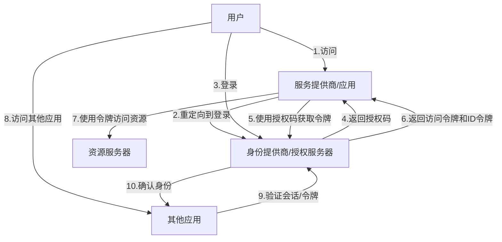
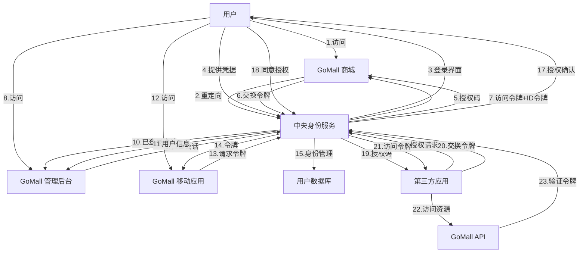

# OAuth 2.0 与单点登录（SSO）的关系

> OAuth 2.0 和单点登录（SSO）是现代身份验证与授权系统中的两个核心概念，它们相互补充但又各自独立。OAuth 2.0 主要解决授权问题，允许第三方应用访问用户资源而无需共享密码；而 SSO 则专注于提供一次登录、多处访问的用户体验。本文将详细探讨两者的关系、协同工作方式以及在实际项目中的应用。

## 1. 基本概念与定义

> OAuth 2.0 是一个授权框架，而 SSO 是一种身份验证模式。虽然两者关注点不同，但在现代应用架构中常常协同工作，共同构建完整的身份与访问管理解决方案。

### 1.1 OAuth 2.0 定义

OAuth 2.0（开放授权）是一个授权框架，允许第三方应用获得对用户资源的有限访问权，而无需用户向第三方应用提供其凭据。OAuth 2.0 的核心目标是解决授权问题：

- 允许用户授权第三方应用访问其在资源服务器上的受保护资源
- 提供一种安全的方式，使第三方应用无需知道用户的凭据
- 支持不同类型的客户端（Web 应用、移动应用、服务器应用等）
- 分离身份验证与授权流程

### 1.2 单点登录（SSO）定义

单点登录（Single Sign-On，SSO）是一种身份验证机制，允许用户使用一组凭据（通常是用户名和密码）访问多个相关但独立的应用系统。SSO 的主要目标是：

- 提供一次登录、多处访问的用户体验
- 集中管理用户身份和访问控制
- 减少用户需要记忆的凭据数量
- 简化身份管理和安全审计

## 2. OAuth 2.0 与 SSO 的关系

> OAuth 2.0 与 SSO 虽然解决不同的问题，但在实际应用中经常结合使用。OAuth 2.0 可以作为实现 SSO 的技术手段之一，而 SSO 则可以利用 OAuth 2.0 的授权能力扩展其功能范围。

### 2.1 相似点与区别

**相似点：**

1. 都涉及身份和访问管理
2. 都使用令牌作为关键技术组件
3. 都需要安全的通信通道（如 HTTPS）
4. 都可以提高用户体验和系统安全性

**关键区别：**

| 特性       | OAuth 2.0                                  | SSO                                   |
| ---------- | ------------------------------------------ | ------------------------------------- |
| 主要目的   | 授权（Authorization）                      | 身份验证（Authentication）            |
| 解决问题   | 如何安全地授权第三方访问                   | 如何一次登录多处使用                  |
| 核心机制   | 访问令牌（Access Token）                   | 会话令牌/票据（Session Token/Ticket） |
| 参与方     | 资源所有者、客户端、授权服务器、资源服务器 | 用户、服务提供商、身份提供商          |
| 标准化程度 | 高（RFC 6749 等规范）                      | 中（有多种实现标准）                  |

### 2.2 协同工作模式

OAuth 2.0 与 SSO 可以在以下几种模式下协同工作：

1. **OAuth 2.0 作为 SSO 的实现技术**

   - 使用 OAuth 2.0 的授权码流程实现 SSO 登录
   - 身份提供商（IdP）同时作为 OAuth 2.0 的授权服务器

2. **SSO 系统使用 OAuth 2.0 进行第三方集成**

   - SSO 系统处理内部应用的身份验证
   - 使用 OAuth 2.0 允许外部应用访问内部资源

3. **混合模式**
   - 使用 OpenID Connect（基于 OAuth 2.0 的身份层）同时提供身份验证和授权
   - 结合 SAML（另一种 SSO 协议）与 OAuth 2.0 实现完整解决方案



## 3. 技术实现比较

> OAuth 2.0 和 SSO 在技术实现上有明显差异，但现代身份解决方案通常会结合两者的特点，提供统一的用户体验和安全保障。OpenID Connect 作为 OAuth 2.0 的扩展，成为连接两者的重要桥梁。

### 3.1 OAuth 2.0 的主要流程

OAuth 2.0 定义了四种授权流程：

1. **授权码流程（Authorization Code Flow）**
   - 适用于有后端服务器的 Web 应用
   - 最完整、最安全的流程
   - 包含前后通道通信

```
+--------+                               +---------------+
|        |--(A)- 授权请求 ---------->|    授权服务器    |
|        |                               |               |
|        |<-(B)-- 授权码 ------------|               |
|        |                               +---------------+
|  客户端  |
|        |                               +---------------+
|        |--(C)-- 授权码 ---------->|               |
|        |                               |    令牌端点    |
|        |<-(D)-- 访问令牌 ---------|               |
+--------+                               +---------------+
```

2. **隐式流程（Implicit Flow）**

   - 适用于公共客户端（如单页应用）
   - 简化流程，没有授权码交换步骤
   - 安全性较低，已不推荐使用

3. **资源所有者密码凭据流程（Password Flow）**

   - 适用于高度受信任的应用
   - 用户直接向客户端提供凭据
   - 仅在特殊情况下使用

4. **客户端凭据流程（Client Credentials Flow）**
   - 适用于服务器间通信
   - 不涉及用户，只有客户端身份

### 3.2 SSO 的主要实现方式

SSO 有多种实现技术，主要包括：

1. **基于 Cookie 的 SSO**

   - 使用共享域 Cookie 实现
   - 简单但受同源策略限制
   - 适用于同一域名下的多个子域应用

2. **基于令牌的 SSO**

   - 使用 JWT 等令牌技术
   - 不受同源策略限制
   - 适用于分布式系统

3. **基于 SAML 的 SSO**

   - 使用 SAML 断言传递身份信息
   - 成熟的企业级标准
   - 适用于传统企业应用

4. **基于 OpenID Connect 的 SSO**
   - 结合 OAuth 2.0 与身份验证
   - 现代 Web 和移动应用的首选
   - 提供标准化的用户信息获取方式

### 3.3 OpenID Connect：桥接 OAuth 2.0 与 SSO

OpenID Connect (OIDC) 是 OAuth 2.0 的身份层扩展，它将身份验证功能添加到 OAuth 2.0 授权框架中，成为连接 OAuth 2.0 与 SSO 的重要桥梁：

- 在 OAuth 2.0 基础上添加了 ID 令牌（ID Token）
- 提供标准化的用户信息端点
- 支持多种客户端类型和身份验证方法
- 包含会话管理和注销功能

```
+--------+                                   +--------+
|        |                                   |        |
|        |---------(1) 认证请求----------->|        |
|        |                                   |        |
|        |  +--------+                       |        |
|        |  |        |                       |        |
|        |  | 最终用户 |                       |  OpenID  |
|   RP   |  |        |                       | Provider |
|        |  +--------+                       |        |
|        |                                   |        |
|        |<--------(2) 认证响应-----------|        |
|        |                                   |        |
|        |---------(3) UserInfo 请求-------->|        |
|        |                                   |        |
|        |<--------(4) UserInfo 响应--------|        |
|        |                                   |        |
+--------+                                   +--------+
```

## 4. 在 GoMall 项目中的应用

> 在 GoMall 项目中，我们可以结合 OAuth 2.0 和 SSO 的优势，构建一个既支持内部统一登录，又能与第三方服务安全集成的身份认证系统。这种方案既提升了用户体验，又增强了系统安全性和可扩展性。

### 4.1 当前认证系统分析

GoMall 项目目前使用 JWT+Redis 的混合认证方案：

- JWT 用于无状态身份验证
- Redis 存储黑名单，支持令牌撤销
- HTTP-Only Cookie 传递令牌，增强安全性

这种方案虽然有效，但在以下方面存在局限：

1. 缺乏与第三方系统的集成能力
2. 没有提供统一的身份管理
3. 用户需要在不同子系统中重复登录
4. 权限管理与身份验证耦合度高

### 4.2 OAuth 2.0 + SSO 改进方案

我们可以通过引入 OAuth 2.0 和 SSO 机制改进当前系统：

1. **构建中央身份服务**

   - 实现 OAuth 2.0 授权服务器
   - 支持 OpenID Connect 协议
   - 集中管理用户身份和权限

2. **改造现有应用为 OAuth 2.0 客户端**

   - 将各子系统改造为 OAuth 2.0 客户端
   - 使用授权码流程进行身份验证
   - 利用 ID 令牌获取用户信息

3. **实现 SSO 功能**

   - 基于 OpenID Connect 会话管理
   - 提供统一登录和注销功能
   - 支持记住登录状态

4. **与第三方服务集成**
   - 支持第三方登录（如微信、支付宝）
   - 允许第三方应用访问 GoMall API
   - 实现安全的数据共享

### 4.3 实现架构示例



### 4.4 代码实现示例

**1. 中央身份服务（基于 Go 和 OpenID Connect）**

```go
package auth

import (
    "github.com/ory/fosite"
    "github.com/ory/fosite/compose"
    "github.com/ory/fosite/handler/openid"
    "github.com/ory/fosite/token/jwt"
)

// 创建 OAuth2 提供者
func NewOAuth2Provider() fosite.OAuth2Provider {
    config := &fosite.Config{
        AccessTokenLifespan: time.Hour * 24,
        // 其他配置...
    }

    // 使用 OpenID Connect 和 OAuth2 组合
    return compose.ComposeAllEnabled(config,
        store,  // 存储层
        []byte("some-secret-thats-random-and-secure"),
        jwt.NewRS256JWTStrategy(rsaKey))
}

// 授权端点处理
func AuthorizeHandler(w http.ResponseWriter, r *http.Request) {
    ctx := r.Context()

    // 创建授权请求
    ar, err := oauth2.NewAuthorizeRequest(ctx, r)
    if err != nil {
        oauth2.WriteAuthorizeError(ctx, w, ar, err)
        return
    }

    // 检查用户是否已登录，如果没有则重定向到登录页面
    session, err := getSession(r)
    if err != nil || !session.LoggedIn {
        http.Redirect(w, r, "/login?return_to="+url.QueryEscape(r.URL.String()), http.StatusFound)
        return
    }

    // 创建 OpenID 会话
    openIDSession := &openid.DefaultSession{
        Claims: &jwt.IDTokenClaims{
            Subject: session.UserID,
            Issuer:  "https://gomall.com",
            // 其他声明...
        },
        Headers: &jwt.Headers{},
    }

    // 完成授权请求
    response, err := oauth2.NewAuthorizeResponse(ctx, ar, openIDSession)
    if err != nil {
        oauth2.WriteAuthorizeError(ctx, w, ar, err)
        return
    }

    // 写入响应
    oauth2.WriteAuthorizeResponse(ctx, w, ar, response)
}
```

**2. GoMall 应用客户端集成**

```go
package client

import (
    "golang.org/x/oauth2"
    "golang.org/x/oauth2/clientcredentials"
)

// OAuth2 客户端配置
func NewOAuth2Config() *oauth2.Config {
    return &oauth2.Config{
        ClientID:     "gomall-web-client",
        ClientSecret: "some-secret",
        RedirectURL:  "https://mall.gomall.com/callback",
        Scopes:       []string{"openid", "profile", "api"},
        Endpoint: oauth2.Endpoint{
            AuthURL:  "https://auth.gomall.com/oauth2/auth",
            TokenURL: "https://auth.gomall.com/oauth2/token",
        },
    }
}

// 处理回调
func CallbackHandler(w http.ResponseWriter, r *http.Request) {
    // 获取授权码
    code := r.URL.Query().Get("code")
    if code == "" {
        http.Error(w, "未收到授权码", http.StatusBadRequest)
        return
    }

    // 交换访问令牌
    oauth2Config := NewOAuth2Config()
    token, err := oauth2Config.Exchange(r.Context(), code)
    if err != nil {
        http.Error(w, "令牌交换失败: "+err.Error(), http.StatusInternalServerError)
        return
    }

    // 从 ID 令牌中提取用户信息
    idToken := token.Extra("id_token").(string)
    userInfo, err := extractUserFromIDToken(idToken)
    if err != nil {
        http.Error(w, "解析 ID 令牌失败", http.StatusInternalServerError)
        return
    }

    // 创建会话
    session, _ := store.Get(r, "gomall-session")
    session.Values["user"] = userInfo
    session.Values["access_token"] = token.AccessToken
    session.Save(r, w)

    // 重定向到原始请求页面
    returnTo := session.Values["return_to"]
    if returnTo != nil {
        http.Redirect(w, r, returnTo.(string), http.StatusFound)
    } else {
        http.Redirect(w, r, "/", http.StatusFound)
    }
}
```

**3. 第三方应用集成 API**

```go
package api

import (
    "github.com/gin-gonic/gin"
)

// API 中间件，验证 OAuth2 令牌
func OAuth2Middleware() gin.HandlerFunc {
    return func(c *gin.Context) {
        // 从请求中提取令牌
        tokenString := extractTokenFromRequest(c.Request)
        if tokenString == "" {
            c.JSON(401, gin.H{"error": "未授权：缺少访问令牌"})
            c.Abort()
            return
        }

        // 验证令牌
        introspection, err := oauth2Provider.IntrospectToken(c.Request.Context(), tokenString, "access_token")
        if err != nil || !introspection.IsActive() {
            c.JSON(401, gin.H{"error": "未授权：令牌无效或已过期"})
            c.Abort()
            return
        }

        // 检查权限范围
        if !introspection.GetScope().Has("api") {
            c.JSON(403, gin.H{"error": "禁止：缺少必要的权限范围"})
            c.Abort()
            return
        }

        // 设置用户信息
        c.Set("user_id", introspection.GetSubject())
        c.Set("scopes", introspection.GetScope())

        c.Next()
    }
}

// 注册 API 路由
func RegisterAPIRoutes(r *gin.Engine) {
    api := r.Group("/api/v1")
    api.Use(OAuth2Middleware())

    // 产品 API
    api.GET("/products", GetProducts)
    api.GET("/products/:id", GetProduct)

    // 用户 API
    userAPI := api.Group("/users")
    userAPI.GET("/me", GetCurrentUser)

    // 其他 API...
}
```

## 5. 实施建议与最佳实践

> 在 GoMall 项目中实施 OAuth 2.0 和 SSO 需要系统性的规划和分步骤的实施。通过遵循行业最佳实践，我们可以构建一个安全、可扩展且用户友好的身份认证系统，为业务发展提供坚实基础。

### 5.1 实施路线图

1. **准备阶段**（1-2 周）

   - 评估现有身份验证系统
   - 定义需求和目标
   - 选择适当的技术栈和库

2. **基础设施建设**（2-3 周）

   - 搭建 OAuth 2.0 授权服务器
   - 配置数据存储和缓存
   - 实现基本的用户管理功能

3. **核心功能开发**（3-4 周）

   - 实现 OAuth 2.0 授权流程
   - 添加 OpenID Connect 支持
   - 开发 SSO 会话管理

4. **应用集成**（2-3 周）

   - 改造现有应用为 OAuth 2.0 客户端
   - 实现统一登录和注销
   - 测试跨应用 SSO 功能

5. **安全强化与优化**（1-2 周）
   - 进行安全审计和渗透测试
   - 优化性能和用户体验
   - 完善监控和日志系统

### 5.2 安全最佳实践

1. **令牌安全**

   - 使用短期访问令牌（1-2 小时）
   - 实现令牌轮换和刷新机制
   - 存储令牌时使用安全的方式（如 HTTP-Only Cookie）

2. **客户端安全**

   - 使用 PKCE（Proof Key for Code Exchange）增强授权码流程安全性
   - 验证重定向 URI 以防止开放重定向攻击
   - 对客户端密钥进行安全管理

3. **授权服务器安全**

   - 实施强密码策略和多因素认证
   - 使用 TLS 1.3 保护所有通信
   - 定期轮换签名密钥

4. **监控与审计**
   - 记录所有身份验证和授权事件
   - 实现异常检测和警报
   - 定期审查访问日志和权限

### 5.3 用户体验考虑

1. **无缝登录体验**

   - 最小化登录跳转和页面刷新
   - 提供"记住我"功能
   - 支持渐进式身份验证

2. **权限管理透明度**

   - 清晰展示第三方应用请求的权限
   - 允许用户查看和撤销已授权的应用
   - 提供权限变更通知

3. **多设备支持**
   - 支持在多设备间同步登录状态
   - 提供设备管理和远程注销功能
   - 针对不同设备类型优化认证流程

## 6. 总结与展望

> OAuth 2.0 和 SSO 是现代身份认证与授权系统的两个重要组成部分，它们相互补充，共同构建了安全、灵活且用户友好的身份管理解决方案。在 GoMall 项目中结合两者的优势，可以显著提升系统的安全性、可扩展性和用户体验。

### 6.1 主要优势

1. **增强安全性**

   - 减少密码共享和传输
   - 实现细粒度的权限控制
   - 支持集中式的安全策略管理

2. **改善用户体验**

   - 减少登录次数和凭据管理负担
   - 提供一致的身份验证体验
   - 简化第三方服务集成

3. **提高系统可扩展性**
   - 支持新应用和服务的快速集成
   - 适应未来的身份验证需求
   - 与行业标准保持兼容

### 6.2 潜在挑战

1. **实施复杂性**

   - 需要深入理解 OAuth 2.0 和 OpenID Connect 规范
   - 可能需要重构现有身份验证系统
   - 测试和调试相对复杂

2. **性能考虑**

   - 额外的网络请求可能影响性能
   - 需要优化令牌验证和缓存策略
   - 高并发场景下的负载平衡

3. **迁移策略**
   - 需要平滑迁移现有用户和会话
   - 可能需要支持旧系统和新系统并行运行
   - 用户教育和适应过程

### 6.3 未来展望

随着 GoMall 项目的发展，OAuth 2.0 和 SSO 系统可以进一步扩展：

1. **高级身份验证**

   - 集成生物识别和无密码认证
   - 实现自适应身份验证（基于风险评估）
   - 支持去中心化身份（DID）

2. **扩展集成能力**

   - 支持更多第三方身份提供商
   - 实现跨组织的联合身份
   - 集成物联网设备认证

3. **增强分析和智能**
   - 基于机器学习的异常访问检测
   - 用户行为分析和个性化安全策略
   - 预测性安全控制

通过持续改进和优化 OAuth 2.0 和 SSO 实现，GoMall 项目可以构建一个既安全又灵活的身份管理系统，为用户提供卓越的体验，同时为业务增长提供坚实的技术基础。
