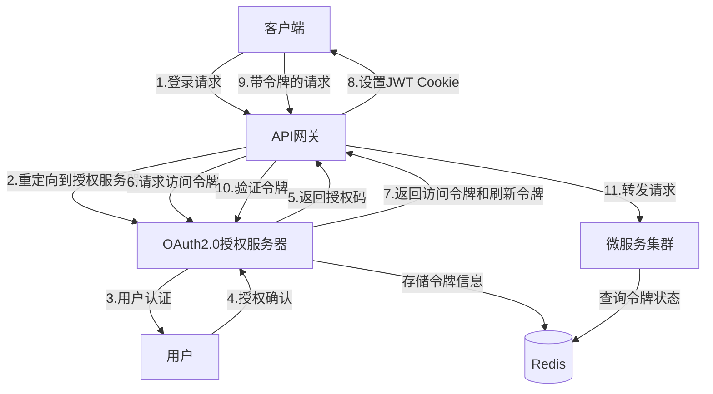

# OAuth 2.0 如何改进 GoMall 项目当前的登录机制

> OAuth 2.0 是一种行业标准的授权协议，能够为 GoMall 项目提供更安全、更灵活的身份验证和授权机制。通过引入 OAuth 2.0，我们可以实现第三方登录、委托授权和更精细的权限控制，同时保持与现有 JWT+Redis 混合认证架构的兼容性。

## 1. OAuth 2.0 概述

> OAuth 2.0 是一个授权框架，允许第三方应用获得对用户资源的有限访问权限，而无需获取用户的完整凭据。它通过将身份验证与授权分离，提供了更安全、更灵活的访问控制机制。

### 1.1 核心概念

OAuth 2.0 涉及以下核心角色：

- **资源所有者**：通常是用户，拥有受保护资源的实体
- **客户端**：请求访问资源的应用程序（如移动应用、Web 应用）
- **授权服务器**：验证资源所有者身份并颁发访问令牌
- **资源服务器**：托管受保护资源的服务器，接受并验证访问令牌

### 1.2 授权流程类型

OAuth 2.0 定义了几种授权流程，适用于不同场景：

- **授权码流程**：适用于有后端服务器的 Web 应用
- **隐式授权流程**：适用于无后端的单页应用
- **资源所有者密码凭据流程**：适用于高度可信的应用
- **客户端凭据流程**：适用于服务器间通信

## 2. GoMall 当前认证架构分析

> GoMall 项目目前采用 JWT + Redis Session 的混合认证架构，虽然满足了基本需求，但在第三方集成、权限管理和用户体验方面存在提升空间。

### 2.1 当前架构优势

- **无状态验证**：JWT 提供了高效的无状态验证机制
- **会话管理**：Redis 提供了会话撤销和集中管理能力
- **安全性**：实现了 CSRF 保护和安全的 Cookie 策略

### 2.2 当前架构局限

- **缺乏标准化授权流程**：未遵循行业标准授权协议
- **第三方集成困难**：无法轻松支持第三方登录
- **授权粒度受限**：难以实现细粒度的资源访问控制
- **用户体验不佳**：每个服务可能需要单独登录

## 3. OAuth 2.0 集成方案

> 通过在 GoMall 中集成 OAuth 2.0，我们可以在保留现有架构优势的同时，引入更强大的授权功能和更灵活的身份验证机制。

### 3.1 架构设计



### 3.2 技术选型

推荐使用以下技术组件实现 OAuth 2.0 集成：

- **Go-OAuth2**：完整的 OAuth 2.0 服务器实现
- **Ory Hydra**：开源 OAuth 2.0 和 OpenID Connect 服务器
- **JWT-Go**：用于处理 JWT 令牌
- **Redis**：用于令牌存储和会话管理

## 4. 实现路径

> 将 OAuth 2.0 集成到 GoMall 项目中需要分阶段实施，确保平稳过渡和向后兼容性。

### 4.1 授权服务器实现

首先，需要实现一个符合 OAuth 2.0 规范的授权服务器：

```go
// OAuth2Config 配置 OAuth 2.0 服务器
type OAuth2Config struct {
    ClientID             string
    ClientSecret         string
    RedirectURL          string
    AuthorizationEndpoint string
    TokenEndpoint        string
    Scopes               []string
}

// 初始化 OAuth 2.0 服务器
func InitOAuth2Server() *server.Server {
    manager := manage.NewDefaultManager()

    // 配置令牌存储
    manager.MustTokenStorage(store.NewRedisTokenStore(&redis.Options{
        Addr:     config.Redis.Address,
        Password: config.Redis.Password,
    }))

    // 配置客户端存储
    clientStore := store.NewClientStore()
    clientStore.Set("client_id", &models.Client{
        ID:     "client_id",
        Secret: "client_secret",
        Domain: "http://localhost:8080",
    })
    manager.MapClientStorage(clientStore)

    // 创建服务器
    srv := server.NewServer(server.NewConfig(), manager)

    // 配置授权处理
    srv.SetPasswordAuthorizationHandler(passwordAuthorizationHandler)
    srv.SetUserAuthorizationHandler(userAuthorizationHandler)

    return srv
}
```

### 4.2 集成到 API 网关

在 API 网关中集成 OAuth 2.0 授权流程：

```go
// 在 API 网关中注册 OAuth 2.0 相关路由
func RegisterOAuth2Routes(h *server.Hertz) {
    oauth2 := h.Group("/oauth2")
    {
        oauth2.GET("/authorize", handleAuthorize)
        oauth2.POST("/token", handleToken)
        oauth2.GET("/userinfo", handleUserInfo)
    }
}

// 处理授权请求
func handleAuthorize(ctx context.Context, c *app.RequestContext) {
    // 验证客户端请求
    // 重定向到登录页面
    // 用户授权后返回授权码
}

// 处理令牌请求
func handleToken(ctx context.Context, c *app.RequestContext) {
    // 验证授权码
    // 生成访问令牌和刷新令牌
    // 返回令牌响应
}
```

### 4.3 微服务适配

修改微服务以支持 OAuth 2.0 令牌验证：

```go
// OAuth2Middleware 验证 OAuth 2.0 令牌
func OAuth2Middleware() app.HandlerFunc {
    return func(ctx context.Context, c *app.RequestContext) {
        token := extractToken(c)
        if token == "" {
            c.AbortWithStatus(http.StatusUnauthorized)
            return
        }

        // 验证令牌
        valid, claims := validateToken(token)
        if !valid {
            c.AbortWithStatus(http.StatusUnauthorized)
            return
        }

        // 将用户信息添加到上下文
        c.Set("user_id", claims.UserID)
        c.Set("scopes", claims.Scopes)

        c.Next(ctx)
    }
}
```

## 5. 第三方登录支持

> OAuth 2.0 的一个主要优势是支持第三方登录，允许用户使用现有的社交媒体或企业账户登录 GoMall。

### 5.1 社交媒体登录

实现常见社交媒体平台的 OAuth 集成：

```go
// 配置社交媒体 OAuth 提供商
var oauthProviders = map[string]*oauth2.Config{
    "google": {
        ClientID:     "google-client-id",
        ClientSecret: "google-client-secret",
        RedirectURL:  "http://localhost:8080/oauth2/callback/google",
        Scopes:       []string{"profile", "email"},
        Endpoint:     google.Endpoint,
    },
    "github": {
        ClientID:     "github-client-id",
        ClientSecret: "github-client-secret",
        RedirectURL:  "http://localhost:8080/oauth2/callback/github",
        Scopes:       []string{"user:email"},
        Endpoint:     github.Endpoint,
    },
    // 其他提供商...
}

// 处理社交媒体登录
func handleSocialLogin(ctx context.Context, c *app.RequestContext) {
    provider := c.Param("provider")
    config, exists := oauthProviders[provider]
    if !exists {
        c.AbortWithStatus(http.StatusBadRequest)
        return
    }

    // 生成并存储状态参数，防止 CSRF
    state := generateRandomState()
    c.SetCookie("oauth_state", state, 3600, "/", "", false, true)

    // 重定向到提供商授权页面
    url := config.AuthCodeURL(state)
    c.Redirect(http.StatusFound, url)
}
```

### 5.2 用户账户关联

实现用户账户与第三方身份的关联：

```go
// 关联第三方账户
func linkSocialAccount(userID int64, provider string, providerUserID string) error {
    // 存储用户与第三方账户的关联关系
    return db.Exec(`
        INSERT INTO user_social_accounts (user_id, provider, provider_user_id)
        VALUES (?, ?, ?)
        ON DUPLICATE KEY UPDATE provider_user_id = ?
    `, userID, provider, providerUserID, providerUserID).Error
}
```

## 6. 细粒度授权控制

> OAuth 2.0 的范围（Scope）机制允许实现细粒度的授权控制，限制客户端对资源的访问权限。

### 6.1 范围定义

定义 GoMall 系统中的授权范围：

```go
// 系统定义的授权范围
var SystemScopes = map[string]string{
    "profile":       "访问用户基本信息",
    "orders:read":   "查看订单信息",
    "orders:write":  "创建和修改订单",
    "cart:read":     "查看购物车",
    "cart:write":    "修改购物车",
    "payment:read":  "查看支付信息",
    "payment:write": "进行支付操作",
    // 其他范围...
}
```

### 6.2 范围验证

在 API 请求中验证授权范围：

```go
// 验证请求是否具有所需范围
func requireScopes(requiredScopes ...string) app.HandlerFunc {
    return func(ctx context.Context, c *app.RequestContext) {
        // 从上下文中获取令牌范围
        scopesValue, exists := c.Get("scopes")
        if !exists {
            c.AbortWithStatus(http.StatusUnauthorized)
            return
        }

        tokenScopes, ok := scopesValue.([]string)
        if !ok {
            c.AbortWithStatus(http.StatusInternalServerError)
            return
        }

        // 验证是否具有所有所需范围
        for _, requiredScope := range requiredScopes {
            if !containsScope(tokenScopes, requiredScope) {
                c.AbortWithStatus(http.StatusForbidden)
                return
            }
        }

        c.Next(ctx)
    }
}
```

## 7. 与现有系统集成

> 为了确保平稳过渡，我们需要将 OAuth 2.0 与 GoMall 现有的 JWT + Redis 认证系统集成。

### 7.1 混合认证策略

实现支持两种认证方式的混合策略：

```go
// 混合认证中间件
func HybridAuthMiddleware() app.HandlerFunc {
    return func(ctx context.Context, c *app.RequestContext) {
        // 尝试 OAuth 2.0 认证
        oauthToken := extractOAuthToken(c)
        if oauthToken != "" {
            valid, claims := validateOAuthToken(oauthToken)
            if valid {
                setUserContext(c, claims)
                c.Next(ctx)
                return
            }
        }

        // 回退到 JWT 认证
        jwtToken := extractJWTToken(c)
        if jwtToken != "" {
            valid, claims := validateJWTToken(jwtToken)
            if valid {
                setUserContext(c, claims)
                c.Next(ctx)
                return
            }
        }

        // 两种认证都失败
        c.AbortWithStatus(http.StatusUnauthorized)
    }
}
```

### 7.2 令牌转换

实现 JWT 和 OAuth 令牌之间的转换：

```go
// 将 OAuth 令牌转换为 JWT
func convertOAuthToJWT(oauthToken string) (string, error) {
    // 验证 OAuth 令牌
    valid, claims := validateOAuthToken(oauthToken)
    if !valid {
        return "", errors.New("invalid oauth token")
    }

    // 创建 JWT
    token := jwt.NewWithClaims(jwt.SigningMethodHS256, jwt.MapClaims{
        "user_id": claims.UserID,
        "exp":     time.Now().Add(time.Hour).Unix(),
        // 其他必要字段...
    })

    // 签名 JWT
    return token.SignedString([]byte("secret key"))
}
```

## 8. 安全性增强

> OAuth 2.0 集成还可以增强 GoMall 系统的整体安全性，提供更强大的保护措施。

### 8.1 PKCE 支持

实现 PKCE（Proof Key for Code Exchange）增强移动应用安全性：

```go
// 验证 PKCE 挑战
func verifyPKCE(ctx context.Context, c *app.RequestContext, authRequest *server.AuthorizeRequest) error {
    // 获取代码挑战和方法
    codeChallenge := c.Query("code_challenge")
    codeChallengeMethod := c.Query("code_challenge_method")

    if codeChallenge == "" {
        return nil // PKCE 是可选的
    }

    // 存储代码挑战信息
    return storePKCEChallenge(authRequest.ClientID, authRequest.State, codeChallenge, codeChallengeMethod)
}

// 验证代码验证器
func validateCodeVerifier(clientID, state, codeVerifier string) error {
    // 获取存储的挑战信息
    challenge, method, err := getPKCEChallenge(clientID, state)
    if err != nil {
        return err
    }

    // 验证代码验证器
    switch method {
    case "S256":
        h := sha256.New()
        h.Write([]byte(codeVerifier))
        calculatedChallenge := base64.RawURLEncoding.EncodeToString(h.Sum(nil))
        if calculatedChallenge != challenge {
            return errors.New("code verifier validation failed")
        }
    case "plain":
        if codeVerifier != challenge {
            return errors.New("code verifier validation failed")
        }
    default:
        return errors.New("unsupported code challenge method")
    }

    return nil
}
```

### 8.2 令牌安全性

增强令牌安全性的措施：

- **短期访问令牌**：减少令牌被滥用的风险
- **令牌轮换**：使用刷新令牌定期更新访问令牌
- **令牌撤销**：支持显式撤销令牌的能力

## 9. 迁移策略

> 从现有认证系统迁移到 OAuth 2.0 需要谨慎规划，确保服务不中断和用户体验平滑。

### 9.1 阶段性迁移计划

1. **准备阶段**：

   - 实现 OAuth 2.0 授权服务器
   - 开发支持 OAuth 2.0 的 API 网关
   - 更新客户端应用以支持新的授权流程

2. **并行运行阶段**：

   - 同时支持现有 JWT 认证和 OAuth 2.0
   - 新功能优先使用 OAuth 2.0
   - 收集性能和用户体验数据

3. **完全迁移阶段**：
   - 将所有服务迁移到 OAuth 2.0
   - 逐步淘汰旧的认证机制
   - 完善文档和开发指南

### 9.2 用户体验考虑

确保迁移过程对用户透明：

- 自动将现有会话转换为 OAuth 2.0 令牌
- 保持登录状态，避免强制用户重新登录
- 提供清晰的用户界面解释新的授权请求

## 10. 性能与可扩展性

> OAuth 2.0 实现需要考虑性能和可扩展性，确保不会成为系统瓶颈。

### 10.1 性能优化

- **令牌缓存**：缓存频繁使用的令牌验证结果
- **分布式令牌存储**：使用 Redis 集群存储令牌信息
- **异步令牌处理**：非关键路径的令牌操作异步处理

### 10.2 可扩展性设计

- **无状态验证**：支持无状态令牌验证，减少存储依赖
- **水平扩展**：授权服务器设计为可水平扩展
- **服务发现**：与现有服务发现机制集成

## 11. 总结

> 通过在 GoMall 项目中集成 OAuth 2.0，我们可以显著提升系统的安全性、灵活性和用户体验。OAuth 2.0 不仅提供了标准化的授权流程和第三方登录支持，还实现了更细粒度的访问控制和更强大的安全保障。

OAuth 2.0 集成的主要优势包括：

1. **标准化授权**：遵循行业标准，提高互操作性
2. **第三方登录**：支持社交媒体和企业账户登录
3. **细粒度控制**：通过范围机制实现精确的权限控制
4. **增强安全性**：支持 PKCE、令牌轮换等安全机制
5. **灵活适应性**：适应不同类型的客户端应用
6. **用户体验改善**：简化登录流程，减少重复登录

通过分阶段实施和与现有系统的平滑集成，GoMall 可以逐步过渡到更现代、更安全的认证授权架构，为未来的功能扩展和系统演进奠定坚实基础。
