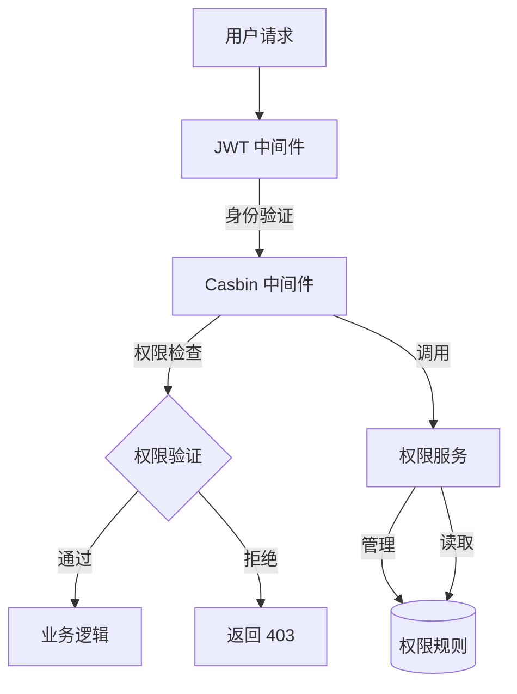

# Casbin 在 GoMall 项目中的鉴权实现与改进方案

> Casbin 是一个强大的、支持多种访问控制模型的授权库，在 GoMall 项目中被用于实现细粒度的访问控制。本文档详细分析了 Casbin 在项目中的当前实现方式、存在的问题以及可能的改进方案，旨在提升系统的安全性、可维护性和性能。

## 1. Casbin 鉴权实现概述

> GoMall 项目采用 Casbin 实现了基于 RBAC 和路径匹配的权限控制系统，结合 JWT 身份验证，构建了一个多层次的安全防护体系。这种实现方式既保证了接口的安全性，又提供了灵活的权限管理能力。

### 1.1 当前架构与实现

GoMall 项目中的 Casbin 鉴权系统主要由以下几个部分组成：

- **权限模型定义**：使用 RBAC (基于角色的访问控制) 模型，支持正则表达式路径匹配
- **中间件集成**：通过 Hertz 框架中间件实现请求拦截和权限验证
- **权限服务**：封装 Casbin 操作，提供权限管理和黑名单功能
- **策略存储**：使用文件存储 (rbac_policy.csv) 保存权限规则



### 1.2 核心代码分析

**1. 权限模型配置 (rbac_model.conf)**

```
[request_definition]
r = sub, obj, act

[policy_definition]
p = sub, obj, act, eft

[policy_effect]
e = some(where (p.eft == allow)) && !some(where (p.eft == deny))

[matchers]
m = (r.sub == p.sub || p.sub == "*") && regexMatch(r.obj, p.obj) && r.act == p.act && p.eft != "deny"
```

这个模型定义了：
- 请求由主体(sub)、资源(obj)和操作(act)组成
- 策略包含额外的效果(eft)字段，可以是 allow 或 deny
- 匹配规则支持通配符和正则表达式匹配

**2. Casbin 中间件实现**

```go
func NewCasbinMiddleware(enforcer *casbin.Enforcer) app.HandlerFunc {
    return func(ctx context.Context, c *app.RequestContext) {
        // 从请求中获取用户信息
        userID := c.GetInt64("identity")
        user := strconv.FormatInt(userID, 10)

        // 获取请求方法和路径
        method := string(c.Method())
        path := string(c.Path())

        // 首先检查是否在黑名单中
        if res, err := permissionSvc.IsBlacklisted(user); res || err != nil {
            c.JSON(403, utils.H{
                "code":    403,
                "message": "用户已被封禁",
            })
            c.Abort()
            return
        }

        // 检查权限
        ok, err := enforcer.Enforce(user, path, method)
        if !ok || err != nil {
            c.JSON(403, utils.H{
                "code":    403,
                "message": "没有访问权限",
            })
            c.Abort()
            return
        }

        c.Next(ctx)
    }
}
```

**3. 权限服务实现**

```go
type PermissionService struct {
    enforcer *casbin.Enforcer
    mu       sync.RWMutex
}

// AddPolicy 添加权限策略
func (s *PermissionService) AddPolicy(sub, obj, act string, eft string) error {
    s.mu.Lock()
    defer s.mu.Unlock()
    _, err := s.enforcer.AddPolicy(sub, obj, act, eft)
    if err != nil {
        return err
    }
    return s.enforcer.SavePolicy()
}

// 其他方法: RemovePolicy, AddToBlacklist, IsBlacklisted 等
```

## 2. 当前实现的问题与挑战

> 当前的 Casbin 实现虽然满足了基本的权限控制需求，但在可扩展性、性能和管理方面仍存在一些问题。随着 GoMall 业务的增长，这些问题可能会变得更加突出，需要进行针对性的改进。

### 2.1 存在的主要问题

1. **策略存储方式**：
   - 使用文件存储 (CSV) 不适合频繁变更和大规模部署
   - 缺乏版本控制和变更审计能力
   - 多实例部署时可能导致策略不一致

2. **性能考虑**：
   - 每次请求都需要进行权限检查，可能成为性能瓶颈
   - 缺乏有效的缓存机制，导致重复检查
   - 随着规则增加，匹配效率可能下降

3. **管理与维护**：
   - 缺少可视化的权限管理界面
   - 权限规则变更需要修改文件并重启服务
   - 难以进行大规模的权限规则管理

4. **功能局限性**：
   - 仅支持基本的 RBAC 模型，缺乏更复杂的权限控制能力
   - 没有与业务逻辑深度集成的动态权限控制
   - 缺少权限变更的通知机制

### 2.2 与当前认证系统的集成问题

GoMall 项目目前使用 JWT+Redis 的混合认证方案：

- JWT 用于无状态身份验证
- Redis 存储黑名单，支持令牌撤销
- HTTP-Only Cookie 传递令牌，增强安全性

但 Casbin 与这一认证系统的集成存在以下问题：

- 权限信息未嵌入 JWT 中，导致每次请求都需要查询完整权限
- 黑名单机制重复实现（JWT 黑名单和 Casbin 黑名单）
- 缺乏统一的会话管理与权限控制接口

## 3. 改进方案

> 针对当前实现中存在的问题，我们提出了一系列改进方案，从存储方式、性能优化、功能扩展和管理工具等多个方面进行优化，以提升 GoMall 项目的权限控制能力和整体安全性。

### 3.1 存储方式优化

**1. 数据库存储适配器**

将权限规则从文件存储迁移到数据库存储，提供更好的可扩展性和管理能力：

```go
// 使用 MySQL 适配器示例
import "github.com/casbin/gorm-adapter/v3"

func InitCasbin() (*casbin.Enforcer, error) {
    // 创建 MySQL 适配器
    adapter, err := gormadapter.NewAdapter("mysql", "user:pass@tcp(127.0.0.1:3306)/gomall", true)
    if err != nil {
        return nil, err
    }
    
    // 使用适配器创建 enforcer
    enforcer, err := casbin.NewEnforcer("conf/rbac_model.conf", adapter)
    if err != nil {
        return nil, err
    }
    
    return enforcer, nil
}
```

**2. Redis 缓存集成**

添加 Redis 缓存层，减少数据库查询，提高性能：

```go
import "github.com/casbin/redis-adapter/v2"

func InitCasbinWithCache() (*casbin.Enforcer, error) {
    // 创建数据库适配器
    adapter, err := gormadapter.NewAdapter("mysql", "user:pass@tcp(127.0.0.1:3306)/gomall", true)
    if err != nil {
        return nil, err
    }
    
    // 创建 Redis 缓存
    redisOpts := &redis.Options{
        Addr:     "localhost:6379",
        Password: "",
        DB:       0,
    }
    cache := redisadapter.NewAdapter(redisOpts)
    
    // 使用适配器和缓存创建 enforcer
    enforcer, err := casbin.NewCachedEnforcer("conf/rbac_model.conf", adapter, true)
    if err != nil {
        return nil, err
    }
    
    enforcer.SetCache(cache)
    
    return enforcer, nil
}
```

### 3.2 性能优化

**1. 分组策略优化**

使用 RBAC 分组功能减少规则数量，提高匹配效率：

```go
// 添加角色和组
func (s *PermissionService) AddRoleForUser(user, role string) error {
    s.mu.Lock()
    defer s.mu.Unlock()
    _, err := s.enforcer.AddRoleForUser(user, role)
    return err
}

// 为角色添加权限
func (s *PermissionService) AddPolicyForRole(role, obj, act string) error {
    s.mu.Lock()
    defer s.mu.Unlock()
    _, err := s.enforcer.AddPolicy(role, obj, act, "allow")
    return err
}
```

**2. 请求过滤优化**

对不需要权限检查的请求进行提前过滤，减少不必要的检查：

```go
func NewOptimizedCasbinMiddleware(enforcer *casbin.Enforcer) app.HandlerFunc {
    // 预编译白名单路径正则表达式
    publicPaths := regexp.MustCompile(`^/(login|register|public|static).*`)
    
    return func(ctx context.Context, c *app.RequestContext) {
        path := string(c.Path())
        
        // 对公开路径跳过检查
        if publicPaths.MatchString(path) {
            c.Next(ctx)
            return
        }
        
        // 权限检查逻辑...
    }
}
```

**3. 并发控制优化**

优化读写锁的使用，减少锁竞争：

```go
type PermissionService struct {
    enforcer *casbin.Enforcer
    mu       sync.RWMutex  // 读写锁
}

// 读操作使用读锁
func (s *PermissionService) CheckPermission(sub, obj, act string) (bool, error) {
    s.mu.RLock()  // 使用读锁
    defer s.mu.RUnlock()
    return s.enforcer.Enforce(sub, obj, act)
}

// 写操作使用写锁
func (s *PermissionService) AddPolicy(sub, obj, act string, eft string) error {
    s.mu.Lock()  // 使用写锁
    defer s.mu.Unlock()
    _, err := s.enforcer.AddPolicy(sub, obj, act, eft)
    return err
}
```

### 3.3 功能扩展

**1. 基于属性的访问控制 (ABAC)**

扩展当前模型，支持基于属性的访问控制：

```go
// 自定义函数，检查资源所有者
func keyMatch(key1 string, key2 string) bool {
    // 实现资源所有权匹配逻辑
    return strings.HasPrefix(key1, key2)
}

func InitABACCasbin() (*casbin.Enforcer, error) {
    enforcer, err := casbin.NewEnforcer("conf/abac_model.conf", "conf/abac_policy.csv")
    if err != nil {
        return nil, err
    }
    
    // 注册自定义函数
    enforcer.AddFunction("keyMatch", keyMatchFunc)
    
    return enforcer, nil
}
```

**2. 动态权限控制**

实现基于业务规则的动态权限控制：

```go
func DynamicPermissionMiddleware(enforcer *casbin.Enforcer, service *BusinessService) app.HandlerFunc {
    return func(ctx context.Context, c *app.RequestContext) {
        userID := c.GetInt64("identity")
        path := string(c.Path())
        method := string(c.Method())
        
        // 基本权限检查
        if ok, _ := enforcer.Enforce(strconv.FormatInt(userID, 10), path, method); !ok {
            c.JSON(403, utils.H{"message": "没有访问权限"})
            c.Abort()
            return
        }
        
        // 动态业务规则检查
        if strings.Contains(path, "/orders/") {
            orderID := extractOrderID(path)
            if !service.CanUserAccessOrder(userID, orderID) {
                c.JSON(403, utils.H{"message": "没有访问该订单的权限"})
                c.Abort()
                return
            }
        }
        
        c.Next(ctx)
    }
}
```

**3. 权限变更通知**

实现权限变更的实时通知机制：

```go
type PermissionChangeNotifier struct {
    redisClient *redis.Client
    channel     string
}

func NewPermissionChangeNotifier(client *redis.Client) *PermissionChangeNotifier {
    return &PermissionChangeNotifier{
        redisClient: client,
        channel:     "permission_changes",
    }
}

func (n *PermissionChangeNotifier) NotifyChange(userID string) error {
    return n.redisClient.Publish(context.Background(), n.channel, userID).Err()
}

// 在权限服务中集成通知
func (s *PermissionService) AddPolicy(sub, obj, act string, eft string) error {
    s.mu.Lock()
    defer s.mu.Unlock()
    
    _, err := s.enforcer.AddPolicy(sub, obj, act, eft)
    if err != nil {
        return err
    }
    
    // 发送权限变更通知
    if err := s.notifier.NotifyChange(sub); err != nil {
        log.Printf("Failed to notify permission change: %v", err)
    }
    
    return s.enforcer.SavePolicy()
}
```

### 3.4 管理工具与接口

**1. RESTful 管理 API**

实现完整的权限管理 API，支持权限的增删改查：

```go
func RegisterPermissionAPI(r *server.Hertz, permissionSvc *service.PermissionService) {
    permGroup := r.Group("/api/permissions")
    
    // 获取用户权限
    permGroup.GET("/users/:id", func(ctx context.Context, c *app.RequestContext) {
        userID := c.Param("id")
        policies := permissionSvc.GetPoliciesForUser(userID)
        c.JSON(200, policies)
    })
    
    // 添加权限
    permGroup.POST("/", func(ctx context.Context, c *app.RequestContext) {
        var req struct {
            Subject string `json:"subject"`
            Object  string `json:"object"`
            Action  string `json:"action"`
            Effect  string `json:"effect"`
        }
        
        if err := c.BindJSON(&req); err != nil {
            c.JSON(400, utils.H{"error": err.Error()})
            return
        }
        
        err := permissionSvc.AddPolicy(req.Subject, req.Object, req.Action, req.Effect)
        if err != nil {
            c.JSON(500, utils.H{"error": err.Error()})
            return
        }
        
        c.JSON(201, utils.H{"message": "权限添加成功"})
    })
    
    // 其他 API: 删除权限、角色管理等
}
```

**2. 权限管理界面**

开发一个简单的权限管理 Web 界面，方便管理员操作：

```go
func RegisterPermissionUI(r *server.Hertz) {
    r.GET("/admin/permissions", func(ctx context.Context, c *app.RequestContext) {
        // 渲染权限管理页面
        c.HTML(200, "permissions.html", nil)
    })
    
    // 其他权限管理界面路由
}
```

## 4. 与其他系统的集成

> 为了构建更完整的安全体系，Casbin 权限控制需要与 GoMall 项目中的其他系统进行深度集成，包括认证系统、日志系统和缓存系统等。这种集成可以提供更统一的用户体验和更高效的系统性能。

### 4.1 与 JWT 认证系统集成

优化 JWT 与 Casbin 的集成，减少重复验证：

```go
// JWT 中间件生成函数
func NewJWTMiddleware() *jwt.GinJWTMiddleware {
    return &jwt.GinJWTMiddleware{
        // ... 其他配置
        PayloadFunc: func(data interface{}) jwt.MapClaims {
            if v, ok := data.(models.User); ok {
                // 在 JWT 中包含用户角色信息
                return jwt.MapClaims{
                    "identity": v.ID,
                    "roles":    v.Roles,
                }
            }
            return jwt.MapClaims{}
        },
    }
}

// 优化的 Casbin 中间件
func NewIntegratedCasbinMiddleware(enforcer *casbin.Enforcer) app.HandlerFunc {
    return func(ctx context.Context, c *app.RequestContext) {
        claims := jwt.ExtractClaims(c)
        userID := claims["identity"].(string)
        roles := claims["roles"].([]string)
        
        // 使用 JWT 中的角色信息进行快速权限检查
        path := string(c.Path())
        method := string(c.Method())
        
        // 检查用户直接权限
        if ok, _ := enforcer.Enforce(userID, path, method); ok {
            c.Next(ctx)
            return
        }
        
        // 检查角色权限
        for _, role := range roles {
            if ok, _ := enforcer.Enforce(role, path, method); ok {
                c.Next(ctx)
                return
            }
        }
        
        c.JSON(403, utils.H{"message": "没有访问权限"})
        c.Abort()
    }
}
```

### 4.2 与分布式缓存集成

利用 Redis 缓存提高权限检查性能：

```go
type CachedPermissionService struct {
    enforcer    *casbin.Enforcer
    redisClient *redis.Client
    expiration  time.Duration
    mu          sync.RWMutex
}

func (s *CachedPermissionService) CheckPermission(sub, obj, act string) (bool, error) {
    // 生成缓存键
    cacheKey := fmt.Sprintf("perm:%s:%s:%s", sub, obj, act)
    
    // 尝试从缓存获取结果
    result, err := s.redisClient.Get(context.Background(), cacheKey).Result()
    if err == nil {
        return result == "true", nil
    }
    
    // 缓存未命中，执行实际检查
    s.mu.RLock()
    allowed, err := s.enforcer.Enforce(sub, obj, act)
    s.mu.RUnlock()
    
    if err != nil {
        return false, err
    }
    
    // 将结果存入缓存
    resultStr := "false"
    if allowed {
        resultStr = "true"
    }
    s.redisClient.Set(context.Background(), cacheKey, resultStr, s.expiration)
    
    return allowed, nil
}

// 权限变更时清除缓存
func (s *CachedPermissionService) InvalidateCache(sub string) {
    pattern := fmt.Sprintf("perm:%s:*", sub)
    keys, _ := s.redisClient.Keys(context.Background(), pattern).Result()
    if len(keys) > 0 {
        s.redisClient.Del(context.Background(), keys...)
    }
}
```

### 4.3 与日志系统集成

实现详细的权限操作审计日志：

```go
type AuditLogger struct {
    logger *log.Logger
}

func NewAuditLogger() *AuditLogger {
    return &AuditLogger{
        logger: log.New(os.Stdout, "[AUDIT] ", log.LstdFlags),
    }
}

func (l *AuditLogger) LogPermissionCheck(sub, obj, act string, allowed bool) {
    l.logger.Printf("Permission check: sub=%s, obj=%s, act=%s, allowed=%v", 
                   sub, obj, act, allowed)
}

func (l *AuditLogger) LogPermissionChange(admin, sub, obj, act, effect string) {
    l.logger.Printf("Permission change by %s: sub=%s, obj=%s, act=%s, effect=%s", 
                   admin, sub, obj, act, effect)
}

// 在中间件中集成审计日志
func NewAuditedCasbinMiddleware(enforcer *casbin.Enforcer, auditLogger *AuditLogger) app.HandlerFunc {
    return func(ctx context.Context, c *app.RequestContext) {
        userID := c.GetInt64("identity")
        user := strconv.FormatInt(userID, 10)
        path := string(c.Path())
        method := string(c.Method())
        
        // 权限检查
        allowed, err := enforcer.Enforce(user, path, method)
        
        // 记录审计日志
        auditLogger.LogPermissionCheck(user, path, method, allowed && err == nil)
        
        if !allowed || err != nil {
            c.JSON(403, utils.H{"message": "没有访问权限"})
            c.Abort()
            return
        }
        
        c.Next(ctx)
    }
}
```

## 5. 实施路线图

> 为了系统地改进 GoMall 项目中的 Casbin 权限控制系统，我们提出了一个分阶段的实施路线图，从基础优化到高级功能，逐步提升系统的安全性和可用性。

### 5.1 第一阶段：基础优化

**目标**：解决当前实现中的关键问题，提高系统稳定性和性能。

1. **迁移到数据库存储**
   - 实现 MySQL 适配器集成
   - 迁移现有权限规则
   - 添加基本的权限管理 API

2. **性能优化**
   - 实现基本的缓存机制
   - 优化中间件性能
   - 添加权限检查日志

**预计时间**：2-3 周

### 5.2 第二阶段：功能扩展

**目标**：增强权限控制能力，支持更复杂的业务场景。

1. **RBAC 模型完善**
   - 实现角色继承
   - 添加资源分组
   - 支持域分隔的多租户

2. **动态权限控制**
   - 实现基于业务规则的权限检查
   - 添加权限变更通知机制
   - 集成用户属性检查

**预计时间**：3-4 周

### 5.3 第三阶段：系统集成

**目标**：与其他系统深度集成，构建统一的安全体系。

1. **与认证系统集成**
   - 优化 JWT 与 Casbin 的协作
   - 统一会话管理
   - 实现单点登录支持

2. **管理工具开发**
   - 实现完整的权限管理 API
   - 开发权限管理 Web 界面
   - 添加权限分析和报告功能

**预计时间**：4-5 周

## 6. 总结与最佳实践

> Casbin 作为一个强大的授权库，在 GoMall 项目中发挥了重要作用。通过本文提出的改进方案，我们可以进一步提升系统的安全性、性能和可维护性，为用户提供更好的体验。

### 6.1 主要改进点总结

1. **存储方式**：从文件存储迁移到数据库存储，提高可扩展性和管理能力
2. **性能优化**：添加缓存机制，优化并发控制，减少不必要的权限检查
3. **功能扩展**：支持更复杂的权限模型，实现动态权限控制和权限变更通知
4. **系统集成**：与认证系统、缓存系统和日志系统深度集成，构建统一的安全体系
5. **管理工具**：开发完整的权限管理 API 和 Web 界面，提高可维护性

### 6.2 权限设计最佳实践

在 GoMall 项目中实施权限控制时，建议遵循以下最佳实践：

1. **最小权限原则**：默认拒绝所有访问，只允许明确授权的操作
2. **分层权限设计**：将权限分为系统级、应用级和数据级，分别控制
3. **角色设计**：基于业务职能设计角色，避免角色爆炸
4. **权限审计**：记录所有权限变更和访问拒绝事件，定期审查
5. **性能平衡**：在安全性和性能之间找到平衡点，适当使用缓存
6. **定期更新**：跟踪 Casbin 的更新，及时应用安全补丁和新功能

### 6.3 未来展望

随着 GoMall 业务的发展，权限控制系统还可以向以下方向演进：

1. **基于机器学习的异常检测**：识别可疑的权限使用模式
2. **图形化权限分析**：可视化权限结构和访问路径
3. **自适应权限控制**：根据用户行为和上下文动态调整权限
4. **跨服务权限协调**：在微服务架构中实现统一的权限控制
5. **合规性支持**：添加对特定行业法规的合规性检查和报告

通过持续改进和优化 Casbin 的实现，GoMall 项目可以构建一个更安全、更高效的权限控制系统，为用户提供更好的保护和体验。