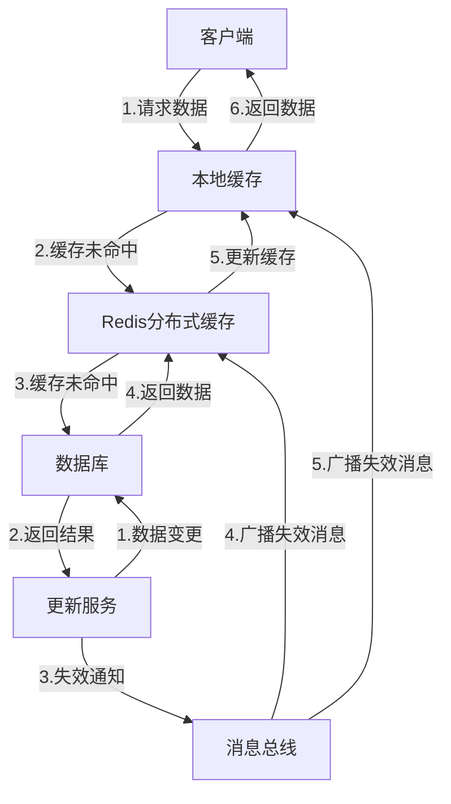

# GoMall 分布式缓存与并发问题解决方案

> GoMall 作为一个电商微服务平台，在处理高并发请求和大规模数据时，必须有效地利用分布式缓存和解决并发问题。本文档分析了 GoMall 项目中当前的分布式缓存使用情况、并发处理机制，以及未来可能的优化方向，旨在提供一个全面的技术参考，帮助开发者理解和优化系统性能。

## 1. 当前分布式缓存架构

> GoMall 目前采用了基础的 Redis 单实例作为分布式缓存解决方案，主要用于会话管理和认证。虽然实现相对简单，但为未来的扩展奠定了基础。

### 1.1 Redis 基础配置

GoMall 项目在各个服务中使用 Redis 作为分布式缓存，配置相对简单：

```go
// Redis客户端初始化 (app/user/biz/dal/redis/init.go)
func Init() {
    RedisClient = redis.NewClient(&redis.Options{
        Addr:     conf.GetConf().Redis.Address,
        Username: conf.GetConf().Redis.Username,
        Password: conf.GetConf().Redis.Password,
        DB:       conf.GetConf().Redis.DB,
    })
    if err := RedisClient.Ping(context.Background()).Err(); err != nil {
        panic(err)
    }
}
```

当前配置的特点：
- **单实例模式**：使用单个 Redis 实例，尚未实现集群
- **基础连接参数**：包含地址、用户名、密码和数据库编号
- **简单健康检查**：通过 Ping 命令确保连接可用

### 1.2 会话管理应用

GoMall 使用 Redis 存储用户会话，实现了跨服务的会话共享：

```go
// 会话管理配置 (app/user/biz/router/middleware/session.go)
func InitSession(h *server.Hertz) {
    config := conf.GetConf()
    store, err := redis.NewStore(10, "tcp",
        config.Redis.Address,
        config.Redis.Password,
        []byte("your-session-secret-key"))
    if err != nil {
        panic(err)
    }
    h.Use(sessions.New("hertz-session", store))
    log.Println("init session success")
}
```

会话管理的特点：
- **基于 Redis 的会话存储**：使用 `hertz-contrib/sessions/redis` 包
- **简单的连接池**：设置了 10 个连接的池大小
- **统一的会话密钥**：使用固定的会话密钥进行加密

## 2. 当前并发处理机制

> GoMall 项目目前采用了基础的并发控制机制，主要依赖 Go 语言内置的同步原语，如互斥锁和读写锁，以保护共享资源的访问安全。

### 2.1 互斥锁应用

在权限管理服务中，使用了标准的 `sync.RWMutex` 实现并发控制：

```go
// 权限管理服务 (app/user/biz/service/permission.go)
type PermissionService struct {
    enforcer *casbin.Enforcer
    mu       sync.RWMutex
}

// 添加权限策略
func (s *PermissionService) AddPolicy(sub, obj, act string, eft string) error {
    s.mu.Lock()
    defer s.mu.Unlock()
    _, err := s.enforcer.AddPolicy(sub, obj, act, eft)
    if err != nil {
        return err
    }
    return s.enforcer.SavePolicy()
}

// 检查用户是否在黑名单中
func (s *PermissionService) IsBlacklisted(userID string) (bool, error) {
    s.mu.RLock()
    defer s.mu.RUnlock()
    return s.enforcer.HasPolicy(userID, ".*", ".*", "deny")
}
```

并发控制的特点：
- **读写锁区分**：针对读操作使用 `RLock`，写操作使用 `Lock`
- **延迟解锁**：使用 `defer` 确保锁的释放
- **单例模式**：权限服务采用单例模式，确保全局唯一实例

## 3. 未来缓存架构优化方向

> 随着业务规模的增长，GoMall 需要升级当前的缓存架构，引入更高级的分布式缓存功能，以支持更大规模的并发访问和更复杂的业务场景。

### 3.1 Redis 集群配置

建议升级为 Redis 集群架构，提高可用性和扩展性：

```go
// Redis集群配置示例
type RedisClusterConfig struct {
    Addresses    []string      // Redis节点地址列表
    Password     string        // 认证密码
    PoolSize     int           // 连接池大小
    MinIdleConns int           // 最小空闲连接数
    IdleTimeout  time.Duration // 空闲连接超时时间
    MaxRetries   int           // 最大重试次数
}

// 初始化Redis集群客户端
func initRedisCluster() *redis.ClusterClient {
    return redis.NewClusterClient(&redis.ClusterOptions{
        Addrs:        []string{"redis-node1:6379", "redis-node2:6379", "redis-node3:6379"},
        Password:     config.Redis.Password,
        PoolSize:     50,
        MinIdleConns: 10,
        IdleTimeout:  time.Minute * 5,
        MaxRetries:   3,
    })
}
```

### 3.2 缓存分层策略

建议实现多层次缓存策略，平衡性能与一致性：



建议的缓存层次：
- **本地缓存层**：使用内存缓存（如 go-cache）存储热点数据
- **分布式缓存层**：Redis 集群存储共享数据
- **持久化层**：MySQL 数据库作为最终数据源

### 3.3 数据一致性保障

建议实现以下机制保障缓存数据一致性：

```go
// 缓存一致性示例：更新商品信息
func UpdateProduct(ctx context.Context, product *model.Product) error {
    // 1. 开始数据库事务
    tx, err := db.BeginTx(ctx, nil)
    if err != nil {
        return err
    }
    
    // 2. 更新数据库
    err = productRepo.UpdateWithTx(tx, product)
    if err != nil {
        tx.Rollback()
        return err
    }
    
    // 3. 提交事务
    if err = tx.Commit(); err != nil {
        return err
    }
    
    // 4. 发布缓存失效消息
    cacheInvalidationMsg := &message.CacheInvalidation{
        Key:       fmt.Sprintf("product:%d", product.ID),
        Timestamp: time.Now().UnixNano(),
    }
    
    err = kafkaProducer.PublishMessage(ctx, "cache_invalidation", cacheInvalidationMsg)
    if err != nil {
        log.Errorf("Failed to publish cache invalidation message: %v", err)
        // 继续执行，不影响主流程
    }
    
    // 5. 直接删除本地Redis缓存
    cacheKey := fmt.Sprintf("product:%d", product.ID)
    err = redisClient.Del(ctx, cacheKey).Err()
    if err != nil {
        log.Warnf("Failed to delete product cache: %v", err)
        // 继续执行，消息总线会保证最终一致性
    }
    
    return nil
}
```

## 4. 未来并发控制优化方向

> 随着业务复杂度的提高，GoMall 需要引入更高级的并发控制机制，特别是在分布式环境下的锁机制和事务处理，以确保数据一致性和系统稳定性。

### 4.1 分布式锁实现

建议使用 Redis 实现分布式锁，用于跨服务的并发控制：

```go
// 基于Redis的分布式锁实现
type RedisLock struct {
    redisClient *redis.Client
    key         string
    value       string
    expiration  time.Duration
}

// 尝试获取锁
func (l *RedisLock) TryLock(ctx context.Context) (bool, error) {
    // 使用SET NX命令实现锁操作
    result, err := l.redisClient.SetNX(ctx, l.key, l.value, l.expiration).Result()
    if err != nil {
        return false, fmt.Errorf("failed to acquire lock: %w", err)
    }
    return result, nil
}

// 释放锁（使用Lua脚本确保原子性）
func (l *RedisLock) Unlock(ctx context.Context) error {
    script := `
    if redis.call("GET", KEYS[1]) == ARGV[1] then
        return redis.call("DEL", KEYS[1])
    else
        return 0
    end`
    
    result, err := l.redisClient.Eval(ctx, script, []string{l.key}, l.value).Result()
    if err != nil {
        return fmt.Errorf("failed to release lock: %w", err)
    }
    
    if result.(int64) == 0 {
        return fmt.Errorf("lock was already released or owned by another process")
    }
    
    return nil
}
```

### 4.2 乐观锁与悲观锁策略

建议根据不同业务场景，实现乐观锁和悲观锁策略：

```go
// 使用版本号实现乐观锁
func UpdateProductWithOptimisticLock(ctx context.Context, product *model.Product) error {
    // 查询当前版本
    currentProduct, err := productRepo.GetByID(ctx, product.ID)
    if err != nil {
        return err
    }
    
    // 检查版本号
    if product.Version != currentProduct.Version {
        return errors.New("product has been modified by another transaction")
    }
    
    // 更新版本号
    product.Version++
    
    // 执行更新，WHERE条件包含版本号
    result, err := db.ExecContext(ctx, 
        "UPDATE products SET name=?, price=?, stock=?, version=? WHERE id=? AND version=?",
        product.Name, product.Price, product.Stock, product.Version, product.ID, product.Version-1)
    if err != nil {
        return err
    }
    
    affected, err := result.RowsAffected()
    if err != nil {
        return err
    }
    
    if affected == 0 {
        return errors.New("update failed due to concurrent modification")
    }
    
    // 删除缓存
    cacheKey := fmt.Sprintf("product:%d", product.ID)
    redisClient.Del(ctx, cacheKey)
    
    return nil
}
```

## 5. 缓存使用场景扩展

> 随着 GoMall 业务的发展，分布式缓存的应用场景将更加广泛，从用户会话管理扩展到商品数据缓存、热点数据处理等多个方面。

### 5.1 商品数据缓存

建议为商品数据实现多级缓存策略：

```go
// 获取商品详情（多级缓存）
func GetProductDetail(ctx context.Context, productID int64) (*model.ProductDetail, error) {
    cacheKey := fmt.Sprintf("product:detail:%d", productID)
    
    // 1. 尝试从本地缓存获取
    if cachedProduct, found := localCache.Get(cacheKey); found {
        return cachedProduct.(*model.ProductDetail), nil
    }
    
    // 2. 尝试从Redis获取
    productJSON, err := redisClient.Get(ctx, cacheKey).Result()
    if err == nil {
        var product model.ProductDetail
        if err := json.Unmarshal([]byte(productJSON), &product); err == nil {
            // 更新本地缓存
            localCache.Set(cacheKey, &product, 5*time.Minute)
            return &product, nil
        }
    }
    
    // 3. 从数据库获取
    product, err := productRepo.GetDetailByID(ctx, productID)
    if err != nil {
        return nil, err
    }
    
    // 4. 更新Redis缓存
    productJSON, _ = json.Marshal(product)
    redisClient.Set(ctx, cacheKey, productJSON, 30*time.Minute)
    
    // 5. 更新本地缓存
    localCache.Set(cacheKey, product, 5*time.Minute)
    
    return product, nil
}
```

### 5.2 热点数据处理

建议为秒杀、促销等场景实现特殊的缓存策略：

```go
// 秒杀商品库存预热
func PrewarmFlashSaleStock(ctx context.Context, flashSaleID int64) error {
    // 1. 获取秒杀活动信息
    flashSale, err := flashSaleRepo.GetByID(ctx, flashSaleID)
    if err != nil {
        return err
    }
    
    // 2. 获取所有秒杀商品
    products, err := flashSaleRepo.GetProducts(ctx, flashSaleID)
    if err != nil {
        return err
    }
    
    // 3. 将库存数据预热到Redis
    pipe := redisClient.Pipeline()
    for _, product := range products {
        stockKey := fmt.Sprintf("flashsale:stock:%d:%d", flashSaleID, product.ID)
        pipe.Set(ctx, stockKey, product.Stock, time.Duration(flashSale.EndTime-time.Now().Unix())*time.Second)
    }
    
    _, err = pipe.Exec(ctx)
    return err
}
```

## 6. 缓存防护机制

> 为了确保系统在高负载下的稳定性，GoMall 需要实现完善的缓存防护机制，防止缓存穿透、击穿和雪崩等问题。

### 6.1 缓存穿透防护

建议使用布隆过滤器和空值缓存防止缓存穿透：

```go
// 使用布隆过滤器防止缓存穿透
var productIDFilter *bloom.BloomFilter

// 初始化布隆过滤器
func initProductBloomFilter(ctx context.Context) {
    // 创建布隆过滤器
    productIDFilter = bloom.NewWithEstimates(1000000, 0.01)
    
    // 加载所有商品ID
    productIDs, err := productRepo.GetAllIDs(ctx)
    if err != nil {
        log.Errorf("Failed to load product IDs: %v", err)
        return
    }
    
    // 将ID添加到过滤器
    for _, id := range productIDs {
        productIDFilter.Add([]byte(fmt.Sprintf("%d", id)))
    }
    
    log.Info("Product bloom filter initialized")
}
```

### 6.2 缓存击穿防护

建议使用互斥锁和热点数据预热防止缓存击穿：

```go
// 使用互斥锁防止缓存击穿
var hotKeyMutex sync.Map

func GetDataWithMutex(ctx context.Context, key string) (interface{}, error) {
    cacheKey := fmt.Sprintf("data:%s", key)
    
    // 尝试从缓存获取
    data, err := redisClient.Get(ctx, cacheKey).Result()
    if err == nil {
        return data, nil
    }
    
    // 缓存未命中，使用互斥锁
    lockKey := fmt.Sprintf("mutex:%s", key)
    
    // 获取或创建互斥锁
    actual, _ := hotKeyMutex.LoadOrStore(lockKey, &sync.Mutex{})
    mutex := actual.(*sync.Mutex)
    
    mutex.Lock()
    defer mutex.Unlock()
    
    // 双重检查，可能其他协程已经加载了数据
    data, err = redisClient.Get(ctx, cacheKey).Result()
    if err == nil {
        return data, nil
    }
    
    // 从数据库加载
    result, err := repository.Get(ctx, key)
    if err != nil {
        return nil, err
    }
    
    // 更新缓存
    dataJSON, _ := json.Marshal(result)
    redisClient.Set(ctx, cacheKey, dataJSON, 30*time.Minute)
    
    return result, nil
}
```

## 7. 性能优化

> 为了提高系统性能，GoMall 需要对缓存和并发处理进行持续优化，包括连接池管理、序列化选择和监控告警等方面。

### 7.1 连接池优化

建议优化 Redis 连接池配置：

```go
// Redis连接池优化配置
func initOptimizedRedisPool() *redis.Client {
    return redis.NewClient(&redis.Options{
        Addr:         config.Redis.Address,
        Password:     config.Redis.Password,
        DB:           0,
        PoolSize:     100,                // 增大连接池大小
        MinIdleConns: 20,                 // 保持更多空闲连接
        MaxConnAge:   time.Hour,          // 连接最大存活时间
        PoolTimeout:  time.Second * 3,    // 连接池超时时间
        IdleTimeout:  time.Minute * 5,    // 空闲连接超时时间
        DialTimeout:  time.Second * 2,    // 连接超时时间
        ReadTimeout:  time.Second * 2,    // 读取超时时间
        WriteTimeout: time.Second * 2,    // 写入超时时间
    })
}
```

### 7.2 监控与告警

建议建立全面的监控和告警系统：

```go
// 缓存监控指标
type CacheMetrics struct {
    HitCount        prometheus.Counter
    MissCount       prometheus.Counter
    ErrorCount      prometheus.Counter
    LatencyHistogram prometheus.Histogram
    KeysCount       prometheus.Gauge
    ExpiredCount    prometheus.Counter
    EvictedCount    prometheus.Counter
}

// 初始化缓存监控
func initCacheMonitoring() *CacheMetrics {
    metrics := &CacheMetrics{
        HitCount: prometheus.NewCounter(prometheus.CounterOpts{
            Name: "cache_hit_total",
            Help: "Total number of cache hits",
        }),
        MissCount: prometheus.NewCounter(prometheus.CounterOpts{
            Name: "cache_miss_total",
            Help: "Total number of cache misses",
        }),
        // 其他指标初始化...
    }
    
    // 注册指标
    prometheus.MustRegister(metrics.HitCount)
    prometheus.MustRegister(metrics.MissCount)
    // 注册其他指标...
    
    return metrics
}
```

## 8. 总结

> GoMall 项目当前已经初步使用了分布式缓存和基础的并发控制机制，但随着业务规模的增长，需要进一步完善和优化这些机制，以支持更大规模的并发访问和更复杂的业务场景。

GoMall 项目在分布式缓存和并发处理方面的发展路线：

1. **当前状态**：
   - 基础的 Redis 单实例缓存，主要用于会话管理
   - 标准的 Go 互斥锁和读写锁用于并发控制

2. **短期优化目标**：
   - 升级为 Redis 集群，提高可用性和扩展性
   - 实现分布式锁机制，支持跨服务的并发控制
   - 为商品数据等核心业务实现多级缓存

3. **长期发展方向**：
   - 完善的缓存一致性机制，包括消息总线通知和版本控制
   - 全面的缓存防护机制，防止缓存穿透、击穿和雪崩
   - 高级的并发控制模式，包括乐观锁、悲观锁和分段锁
   - 完善的监控和告警系统，实时监控缓存和并发性能

通过这些优化和完善，GoMall 项目将能够更好地支持高并发访问和大规模数据处理需求，为用户提供流畅、可靠的电商体验。