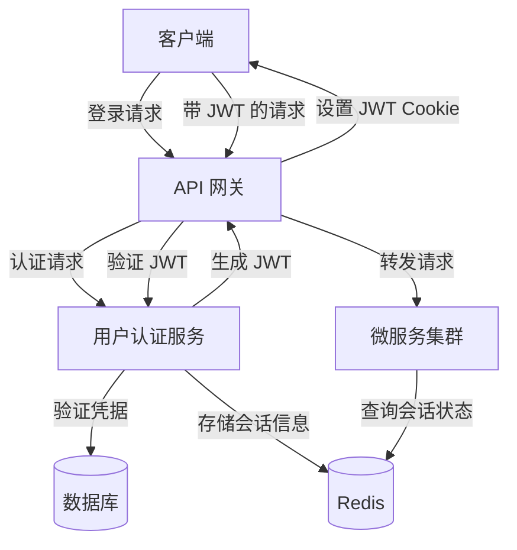

# GoMall 项目的单点登录实现方案

> 单点登录（Single Sign-On，SSO）是一种身份验证机制，允许用户使用一组凭据访问多个应用程序或系统。在 GoMall 微服务架构中，我们采用了基于 JWT（JSON Web Token）结合 Redis Session 的混合认证方案，实现了高效、安全且可扩展的单点登录系统。

## 1. 单点登录核心概念

> 单点登录系统需要解决的核心问题是如何在分布式系统中维护用户的认证状态，并确保这种状态能够在多个服务间共享和验证，同时保持高性能和安全性。

单点登录系统通常需要解决以下几个关键问题：

- **集中式身份验证**：用户只需登录一次，即可访问所有授权的系统
- **会话管理**：跨多个服务维护用户会话状态
- **令牌传递**：在微服务之间安全地传递用户身份信息
- **安全性**：防止会话劫持、CSRF 攻击等安全威胁
- **性能**：确保认证过程不会成为系统瓶颈

## 2. GoMall 的认证架构

> GoMall 项目采用了 JWT + Redis Session 的混合认证架构，结合了两种方案的优点：JWT 提供了无状态验证的便利性，而 Redis Session 则提供了会话撤销和集中管理的能力。

### 2.1 整体架构



### 2.2 技术选型

GoMall 项目的单点登录实现基于以下技术组件：

- **Hertz**：字节跳动开源的 Go HTTP 框架，用于处理 HTTP 请求
- **JWT**：用于生成和验证身份令牌
- **Redis**：用于存储会话信息和实现会话管理
- **Kitex**：字节跳动开源的 RPC 框架，用于服务间通信

## 3. JWT 认证实现

> JWT（JSON Web Token）是一种紧凑的、自包含的方式，用于在各方之间安全地传输信息。在 GoMall 中，JWT 用于维护用户的认证状态，并在微服务之间传递用户身份信息。

### 3.1 JWT 中间件配置

GoMall 使用 Hertz 框架的 JWT 中间件实现认证功能：

```go
// InitJwt 初始化 JWT 中间件
func InitJwt() {
    JwtMiddleware, err = jwt.New(&jwt.HertzJWTMiddleware{
        Realm:        "test zone",          // 认证领域
        Key:          []byte("secret key"), // 签名密钥
        Timeout:      time.Hour,            // 令牌有效期
        MaxRefresh:   time.Hour,            // 最大刷新时间
        TokenLookup:  "cookie: jwt",        // 从 Cookie 中获取令牌
        TokenHeadName: "Bearer",            // 令牌前缀
        // 其他配置...
    })
}
```

### 3.2 登录流程

1. 用户提交登录凭据（邮箱/密码）
2. 认证服务验证凭据
3. 生成包含用户 ID 的 JWT
4. 将 JWT 设置为 HTTP-Only Cookie
5. 在 Redis 中存储会话信息

```go
// 登录成功后的响应处理
LoginResponse: func(ctx context.Context, c *app.RequestContext, code int, token string, expire time.Time) {
    // 设置 HTTP-Only Cookie
    c.SetCookie(
        "jwt",   // Cookie 名称
        token,   // JWT 令牌
        3600,    // 过期时间(秒)
        "/",     // 路径
        "",      // 域名
        protocol.CookieSameSiteDefaultMode,
        true,    // Secure
        true,    // HttpOnly
    )
    // 返回 JSON 响应
    c.JSON(http.StatusOK, utils.H{
        "code":    code,
        "token":   token,
        "expire":  expire.Format(time.RFC3339),
        "message": "success",
    })
},
```

### 3.3 身份验证流程

1. 客户端请求携带 JWT Cookie
2. 网关提取并验证 JWT
3. 从 JWT 中提取用户身份信息
4. 将用户信息添加到请求上下文
5. 转发请求到目标微服务

```go
// 从 JWT 中提取用户身份
IdentityHandler: func(ctx context.Context, c *app.RequestContext) interface{} {
    claims := jwt.ExtractClaims(ctx, c)
    val, ok := claims[IdentityKey]
    if !ok {
        log.Printf("no identity in token")
        return nil
    }
    f64, ok := val.(float64)
    if !ok {
        log.Printf("invalid identity in token")
        return "-1"
    }
    log.Printf("identity in token: %v", f64)
    return int64(f64)
},
```

## 4. Session 管理

> 除了 JWT，GoMall 还使用 Redis 实现了会话管理，提供了会话撤销、状态共享和集中式管理的能力。

### 4.1 Session 配置

GoMall 使用 Redis 作为会话存储后端：

```go
func InitSession(h *server.Hertz) {
    config := conf.GetConf()
    store, err := redis.NewStore(10, "tcp",
        config.Redis.Address,
        config.Redis.Password,
        []byte("your-session-secret-key"))
    if err != nil {
        panic(err)
    }
    h.Use(sessions.New("hertz-session", store))
    log.Println("init session success")
}
```

### 4.2 会话管理功能

- **会话创建**：用户登录成功后创建新会话
- **会话验证**：验证会话是否有效
- **会话撤销**：用户登出或管理员强制下线时撤销会话
- **会话刷新**：延长会话有效期
- **会话数据共享**：在微服务之间共享会话数据

## 5. 安全性考虑

> GoMall 的单点登录实现采取了多种措施确保系统安全，防止常见的身份验证和会话管理攻击。

### 5.1 CSRF 保护

GoMall 实现了 CSRF（跨站请求伪造）保护机制：

- 使用 CSRF Token 验证请求合法性
- 在敏感操作中要求验证 CSRF Token

### 5.2 Cookie 安全

- 使用 HTTP-Only 标志防止 JavaScript 访问 Cookie
- 使用 Secure 标志确保 Cookie 只通过 HTTPS 传输
- 实施适当的 Cookie 过期策略

### 5.3 其他安全措施

- JWT 签名验证确保令牌未被篡改
- 令牌过期机制限制令牌的有效期
- 敏感操作的二次验证

## 6. 跨服务认证

> 在微服务架构中，单点登录系统需要确保用户身份信息能够在不同服务之间安全传递。GoMall 通过在请求上下文中传递用户身份信息实现了这一点。

### 6.1 网关层身份传递

1. 网关验证 JWT 并提取用户 ID
2. 将用户 ID 添加到请求上下文
3. 在转发请求时保留上下文信息

### 6.2 服务间身份传递

- 在服务间 RPC 调用中传递用户身份信息
- 使用 Kitex 的上下文机制传递元数据

## 7. 性能优化

> GoMall 的单点登录实现考虑了性能因素，确保认证过程不会成为系统瓶颈。

### 7.1 JWT 验证的无状态特性

- JWT 验证不需要查询数据库，减少了 I/O 操作
- 分布式验证减轻了中央认证服务器的负担

### 7.2 Redis 会话存储优化

- 使用连接池减少连接开销
- 适当的缓存策略减少 Redis 查询次数
- 会话数据的合理过期策略

## 8. 未来改进方向

> GoMall 的单点登录系统仍有改进空间，以下是一些可能的未来演进方向。

### 8.1 OAuth2.0 和 OpenID Connect 支持

- 实现标准的 OAuth2.0 授权流程
- 支持 OpenID Connect 身份验证

### 8.2 多因素认证

- 添加短信验证码、邮箱验证等第二因素认证
- 支持 TOTP（基于时间的一次性密码）

### 8.3 权限系统增强

- 基于 RBAC（基于角色的访问控制）的细粒度权限管理
- 动态权限策略配置

## 9. 总结

> GoMall 项目采用的 JWT + Redis Session 混合认证方案，成功地解决了微服务架构中的单点登录需求。通过结合 JWT 的无状态特性和 Redis 会话管理的灵活性，实现了一个既安全又高效的认证系统，为用户提供了无缝的访问体验，同时为开发者提供了灵活的认证框架。

这种混合认证方案的优势在于：

1. **高性能**：JWT 的无状态验证减少了数据库查询
2. **高可用性**：分布式验证避免了单点故障
3. **安全性**：多层次的安全措施防止常见攻击
4. **灵活性**：Redis 会话管理提供了会话控制能力
5. **可扩展性**：架构设计便于未来功能扩展
