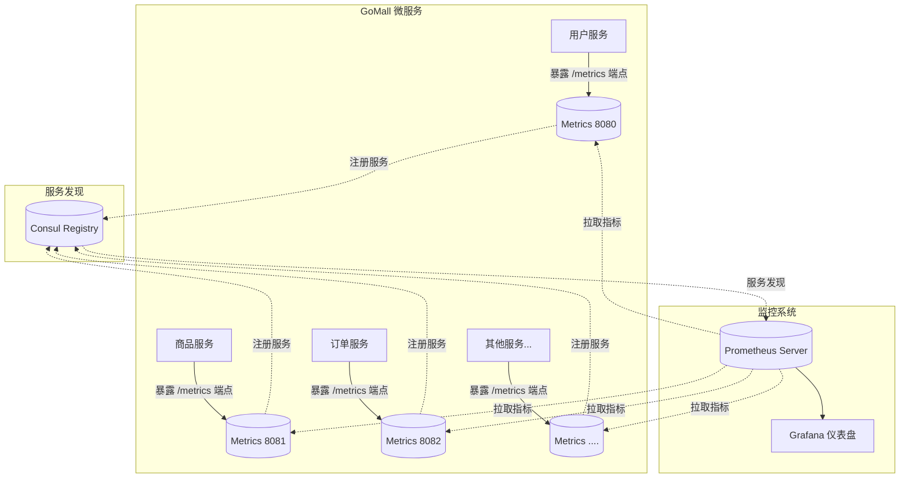

# Prometheus 集成方式

> Prometheus 是一个开源的监控和告警系统，在 GoMall 项目中，我们通过自定义的初始化函数，结合 Consul 服务发现机制和 Go 运行时指标收集，实现了完整的监控体系，为服务提供实时性能和健康状态的可观测性。

## 整体架构

### Prometheus 监控架构

> GoMall 项目采用了 Prometheus + Consul + Go Runtime Metrics 的监控架构，实现了服务自动注册、指标收集和监控面板的完整解决方案。



## 核心组件详解

### 1. Prometheus 客户端

> Prometheus 客户端负责创建和暴露监控指标，在 GoMall 项目中，我们通过 `prometheus/client_golang` 库实现指标的注册、收集和暴露。

Prometheus 客户端在应用中主要承担以下职责：
- 创建和注册各类监控指标（计数器、仪表盘、直方图等）
- 收集 Go 运行时指标（GC、goroutine 数量等）
- 暴露 HTTP 端点供 Prometheus 服务器抓取

### 2. Consul 服务注册

> Consul 负责服务发现，使 Prometheus 能够自动发现并监控新部署的服务实例，无需手动配置目标。

在 GoMall 项目中，每个微服务的 metrics 端点都会注册到 Consul，包含以下信息：
- 服务名称（统一为 "prometheus"）
- 服务地址和端口
- 服务标签（包含原始微服务名称）

### 3. Go Runtime Metrics

> Go Runtime Metrics 提供了 Go 应用程序内部运行状态的关键指标，包括内存使用、GC 状态和 goroutine 数量等。

这些指标对于诊断性能问题和资源使用情况至关重要，通过 `collectors.NewGoCollector()` 自动收集。

## 关键代码实现

### 初始化函数

核心的 `InitMetrics` 函数实现了 Prometheus 集成的完整流程：

```go
func InitMetrics(serviceName, metricsPort, registeryAddr string) {
	// 1. 创建 Prometheus Registry
	Register = prometheus.NewRegistry()
	
	// 2. 注册 Go 运行时收集器
	Register.MustRegister(collectors.NewGoCollector())
	
	// 3. 注册进程收集器
	Register.MustRegister(collectors.NewProcessCollector(collectors.ProcessCollectorOpts{}))
	
	// 4. 创建 Consul 注册客户端
	r, _ := consul.NewConsulRegister(registeryAddr)
	
	// 5. 配置服务地址
	addr, _ := net.ResolveTCPAddr("tcp", metricsPort)
	
	// 6. 创建注册信息
	registerInfo := &registry.Info{
		ServiceName: "prometheus",
		Addr:        addr,
		Weight:      1,
		Tags:        map[string]string{"service": serviceName},
	}
	
	// 7. 注册服务到 Consul
	r.Register(registerInfo)
	
	// 8. 注册关闭钩子，确保服务优雅退出
	server.RegisterShutdownHook(func() {
		r.Deregister(registerInfo)
	})
	
	// 9. 配置 /metrics 端点
	http.Handle("/metrics", promhttp.HandlerFor(Register, promhttp.HandlerOpts{}))
	
	// 10. 启动 HTTP 服务器
	go http.ListenAndServe(metricsPort, nil)
}
```

### 在微服务中的使用方式

在 GoMall 的微服务中，通常在 `main.go` 文件中初始化监控：

```go
import (
	"gomall/common/mtl"
	"gomall/app/user/conf"
)

func main() {
	// 初始化配置
	cfg := conf.Init()
	
	// 初始化监控
	mtl.InitMetrics(
		"user-service",    // 服务名称
		":8080",           // 监控端口
		"localhost:8500"   // Consul 地址
	)
	
	// 启动服务...
}
```

## Prometheus 配置

### Prometheus 服务端配置示例

```yaml
global:
  scrape_interval: 15s
  evaluation_interval: 15s

scrape_configs:
  - job_name: 'consul-services'
    consul_sd_configs:
      - server: 'localhost:8500'
        services: ['prometheus']
    relabel_configs:
      - source_labels: [__meta_consul_service_metadata_service]
        target_label: service
```

## 自定义指标

> 除了默认的 Go 运行时指标外，GoMall 项目还可以定义和收集自定义业务指标，以监控关键业务流程的性能和状态。

### 计数器示例 (Counter)

```go
// 定义请求计数器
requestCounter := prometheus.NewCounterVec(
    prometheus.CounterOpts{
        Name: "gomall_http_requests_total",
        Help: "Total number of HTTP requests",
    },
    []string{"method", "endpoint", "status"},
)

// 注册计数器
mtl.Register.MustRegister(requestCounter)

// 使用计数器
requestCounter.WithLabelValues("GET", "/api/products", "200").Inc()
```

### 直方图示例 (Histogram)

```go
// 定义请求延迟直方图
requestDuration := prometheus.NewHistogramVec(
    prometheus.HistogramOpts{
        Name:    "gomall_http_request_duration_seconds",
        Help:    "HTTP request duration in seconds",
        Buckets: prometheus.DefBuckets,
    },
    []string{"method", "endpoint"},
)

// 注册直方图
mtl.Register.MustRegister(requestDuration)

// 使用直方图
timer := prometheus.NewTimer(requestDuration.WithLabelValues("GET", "/api/products"))
defer timer.ObserveDuration()
```

## 监控指标最佳实践

### 关键监控指标

1. **系统资源指标**
   - CPU 使用率
   - 内存使用量
   - Goroutine 数量
   - GC 频率和持续时间

2. **业务指标**
   - 请求吞吐量
   - 请求延迟
   - 错误率
   - 业务操作计数（下单、支付等）

### 告警配置

```yaml
groups:
- name: gomall-alerts
  rules:
  - alert: HighErrorRate
    expr: rate(gomall_http_requests_total{status=~"5.."}[5m]) / rate(gomall_http_requests_total[5m]) > 0.1
    for: 5m
    labels:
      severity: critical
    annotations:
      summary: "High error rate detected"
      description: "Error rate is above 10% for more than 5 minutes."
```

## 总结

> GoMall 项目的 Prometheus 集成方案通过结合 Prometheus 客户端、Consul 服务发现和 Go 运行时指标收集，构建了一个完整的服务监控体系。该方案实现了自动服务注册、指标收集和优雅退出，为微服务架构提供了强大的可观测性能力。

通过这种集成方式，我们可以：
1. 实时监控所有微服务的性能和健康状况
2. 自动发现和监控新部署的服务实例
3. 收集详细的系统和业务指标
4. 设置基于规则的告警机制
5. 通过 Grafana 创建直观的监控仪表盘