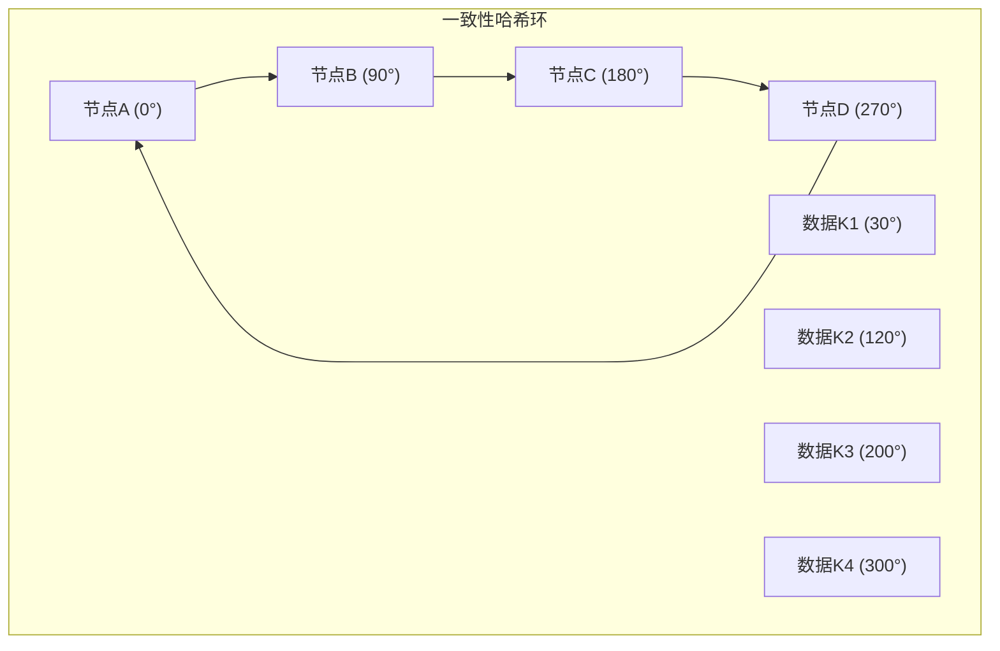
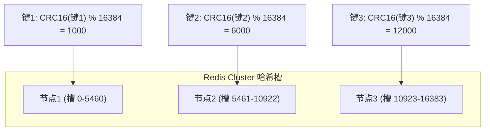

# Redis Cluster 与一致性哈希的关系

> 本文档详细介绍了 Redis Cluster 的哈希槽分片机制与一致性哈希算法的关系、区别和各自的优缺点，帮助开发和运维人员理解 Redis Cluster 的数据分布原理。

## 1. 分布式缓存中的数据分片问题

### 1.1 数据分片的必要性

在分布式系统中，随着数据量的增长，单节点的存储和处理能力无法满足需求，需要将数据分散到多个节点上。数据分片（Sharding）是解决这一问题的关键技术，它需要解决以下核心问题：

- 如何将数据均匀分布到多个节点
- 如何在节点增减时最小化数据迁移
- 如何保证客户端能够准确定位数据所在节点

### 1.2 传统哈希分片的局限性

最简单的分片方法是使用取模哈希：`hash(key) % N`（N为节点数量）。但这种方法存在严重问题：

- 当节点数量变化时，几乎所有数据的映射关系都会改变
- 导致大规模的数据迁移，系统性能严重下降
- 在扩容/缩容期间，系统可用性受到影响

## 2. 一致性哈希算法

### 2.1 一致性哈希的基本原理

> 一致性哈希是一种特殊的哈希算法，目的是在节点变化时，最小化数据迁移量，保持系统稳定性。

一致性哈希的工作原理：

1. **哈希环构建**：将 0 到 2^32-1 的整数空间首尾相连，形成一个环
2. **节点映射**：将每个节点通过哈希函数映射到环上的某个位置
3. **数据映射**：将每个数据键通过相同的哈希函数映射到环上，然后沿顺时针方向找到第一个节点，即为数据所属节点
4. **节点变化处理**：当节点增减时，只影响该节点到环上前一个节点之间的数据



### 2.2 虚拟节点与负载均衡

一致性哈希存在的问题：

- 当节点数量较少时，数据可能分布不均
- 当节点的哈希值分布不均匀时，会导致负载不均衡

解决方案是引入虚拟节点（Virtual Node）：

- 为每个物理节点创建多个虚拟节点
- 每个虚拟节点都映射到哈希环上的不同位置
- 增加虚拟节点数量可以使数据分布更加均匀
- 通常每个物理节点对应数百个虚拟节点

### 2.3 一致性哈希的使用场景

> 一致性哈希算法在大规模分布式系统中有广泛应用，特别是在需要动态扩缩容且希望最小化数据迁移的场景。

**主要应用场景**：

1. **分布式缓存系统**：
   - Memcached 集群
   - 大型内存缓存系统
   - 分布式键值存储

2. **内容分发网络(CDN)**：
   - 根据内容哈希将请求分发到最近的边缘节点
   - 动态增减边缘节点时保持稳定性

3. **负载均衡器**：
   - 将客户端请求分发到后端服务器
   - 服务器扩缩容时保持会话亲和性

4. **分布式数据库**：
   - 数据库分片
   - NoSQL 数据库集群
   - 时序数据库的数据分布

5. **P2P 网络**：
   - DHT (分布式哈希表) 实现
   - 节点发现和路由

### 2.4 一致性哈希的技术实现

实现一致性哈希算法需要考虑以下技术要点：

1. **哈希函数选择**：
   - 需要分布均匀的哈希函数，如 MD5、SHA-1、Murmur3
   - 哈希函数应具有良好的雪崩效应（输入微小变化导致输出显著不同）

2. **哈希环数据结构**：
   - 通常使用有序映射或树形结构存储节点位置
   - 常见实现包括红黑树、跳表或有序数组

3. **虚拟节点管理**：
   - 需要维护物理节点到虚拟节点的映射关系
   - 虚拟节点数量的动态调整机制

4. **节点权重支持**：
   - 为不同容量的节点分配不同数量的虚拟节点
   - 实现加权一致性哈希

5. **并发控制**：
   - 在高并发环境中需要考虑读写锁或无锁实现
   - 节点变更时的原子性操作

**代码实现示例**（Go语言）：

```go
type ConsistentHash struct {
    ring       map[uint32]string // 哈希环
    sortedKeys []uint32          // 排序后的哈希值
    replicas   int               // 每个节点的虚拟节点数
    hashFunc   HashFunc          // 哈希函数
    mu         sync.RWMutex      // 读写锁
}

// 添加节点
func (c *ConsistentHash) Add(nodes ...string) {
    c.mu.Lock()
    defer c.mu.Unlock()
    
    for _, node := range nodes {
        // 为每个节点创建多个虚拟节点
        for i := 0; i < c.replicas; i++ {
            key := c.hashFunc(fmt.Sprintf("%s-%d", node, i))
            c.ring[key] = node
            c.sortedKeys = append(c.sortedKeys, key)
        }
    }
    // 对哈希值排序
    sort.Slice(c.sortedKeys, func(i, j int) bool {
        return c.sortedKeys[i] < c.sortedKeys[j]
    })
}

// 获取数据所属节点
func (c *ConsistentHash) Get(key string) string {
    c.mu.RLock()
    defer c.mu.RUnlock()
    
    if len(c.sortedKeys) == 0 {
        return ""
    }
    
    // 计算数据的哈希值
    hash := c.hashFunc(key)
    
    // 二分查找找到第一个大于等于 hash 的位置
    idx := sort.Search(len(c.sortedKeys), func(i int) bool {
        return c.sortedKeys[i] >= hash
    })
    
    // 如果没有找到，则回到环的起点
    if idx == len(c.sortedKeys) {
        idx = 0
    }
    
    // 返回对应的节点
    return c.ring[c.sortedKeys[idx]]
}

## 3. Redis Cluster 的哈希槽机制

### 3.1 哈希槽的基本概念

> Redis Cluster 没有直接使用一致性哈希，而是采用了哈希槽（Hash Slot）机制，将整个键空间分为 16384 个槽。

哈希槽机制的工作原理：

1. **固定槽位**：Redis Cluster 使用 16384 个槽（0-16383）
2. **槽位分配**：每个主节点负责一部分槽
3. **数据映射**：通过 `CRC16(key) % 16384` 计算键属于哪个槽
4. **节点查找**：根据槽找到负责的节点



### 3.2 哈希槽的重新分配

当 Redis Cluster 节点变化时：

- 只需要迁移变化节点负责的槽及其数据
- 可以精确控制每个节点负责的槽数量，实现负载均衡
- 迁移过程中，只有被迁移的槽受影响，其他槽正常工作

## 4. 一致性哈希与哈希槽的比较

### 4.1 相似之处

1. **目标相同**：都旨在解决分布式系统中的数据分片问题
2. **减少迁移**：都能在节点变化时最小化数据迁移量
3. **可扩展性**：都支持动态扩容和缩容

### 4.2 主要区别

| 特性 | 一致性哈希 | Redis 哈希槽 |
|------|------------|--------------|
| 分片空间 | 连续的哈希环（2^32） | 离散的 16384 个槽 |
| 数据定位 | 顺时针查找最近节点 | 直接映射到槽，再查找节点 |
| 负载均衡 | 依赖虚拟节点数量 | 通过手动或自动调整槽分配 |
| 实现复杂度 | 相对复杂 | 相对简单 |
| 数据迁移粒度 | 不易精确控制 | 可以精确到槽级别 |

### 4.3 各自优缺点

**一致性哈希优点**：
- 理论上更好的扩展性，可以支持海量节点
- 无需中央元数据服务，完全去中心化
- 适用于超大规模分布式系统

**一致性哈希缺点**：
- 实现复杂，尤其是虚拟节点机制
- 负载均衡依赖于虚拟节点数量和分布
- 数据迁移控制不够精细

**Redis 哈希槽优点**：
- 实现简单直观
- 可以精确控制数据分布和迁移
- 便于管理和监控
- 支持批量操作相关键（通过 hash tags）

**Redis 哈希槽缺点**：
- 槽数量固定（16384），理论上限制了最大节点数
- 需要维护槽到节点的映射关系
- 客户端需要感知集群拓扑变化

## 5. Redis Cluster 为什么选择哈希槽而非一致性哈希

Redis Cluster 选择哈希槽机制而非一致性哈希，主要基于以下考虑：

1. **简化实现**：哈希槽机制实现更简单，易于理解和维护
2. **精确控制**：可以精确控制每个节点负责的槽数量，实现更好的负载均衡
3. **迁移灵活性**：可以一次迁移一个槽，粒度更细，更灵活
4. **集群管理**：便于集群状态管理和监控
5. **性能考虑**：计算简单，查找效率高
6. **Hash Tags 支持**：通过 Hash Tags 机制（{tag}）支持将相关键存储在同一个槽中，便于批量操作

## 6. 在 GoMall 项目中的应用

### 6.1 GoMall 的 Redis Cluster 配置

GoMall 项目使用 Redis Cluster 作为分布式缓存，配置了 3 主 3 从的架构：

- 主节点 1：负责哈希槽 0-5460
- 主节点 2：负责哈希槽 5461-10922
- 主节点 3：负责哈希槽 10923-16383

### 6.2 客户端使用最佳实践

1. **使用 Hash Tags 优化相关数据访问**：
   ```go
   // 将相关数据放在同一个槽中
   // 格式：{common_tag}:specific_part
   key1 := "{user:1001}:profile"
   key2 := "{user:1001}:orders"
   // 这两个键一定会被分配到同一个槽中
   ```

2. **批量操作注意事项**：
   ```go
   // 不同槽的键不能在一个事务中操作
   pipe := client.Pipeline()
   pipe.Set(ctx, "key1", "value1", time.Hour) // 可能在槽 A
   pipe.Set(ctx, "key2", "value2", time.Hour) // 可能在槽 B
   // 如果 key1 和 key2 不在同一个槽中，这会失败
   ```

3. **处理 MOVED 和 ASK 重定向**：
   ```go
   // go-redis 客户端会自动处理重定向
   // 但需要注意重定向可能导致的性能开销
   ```

## 7. 总结

Redis Cluster 的哈希槽机制是一种特殊的数据分片策略，与一致性哈希算法有相似的目标但实现方式不同。哈希槽机制更简单直观，便于管理和控制，特别适合 Redis 这样的分布式缓存系统。

在 GoMall 项目中，我们充分利用了 Redis Cluster 的哈希槽机制，实现了高可用、高性能的分布式缓存系统。通过合理使用 Hash Tags 和了解批量操作的限制，可以更好地发挥 Redis Cluster 的优势。