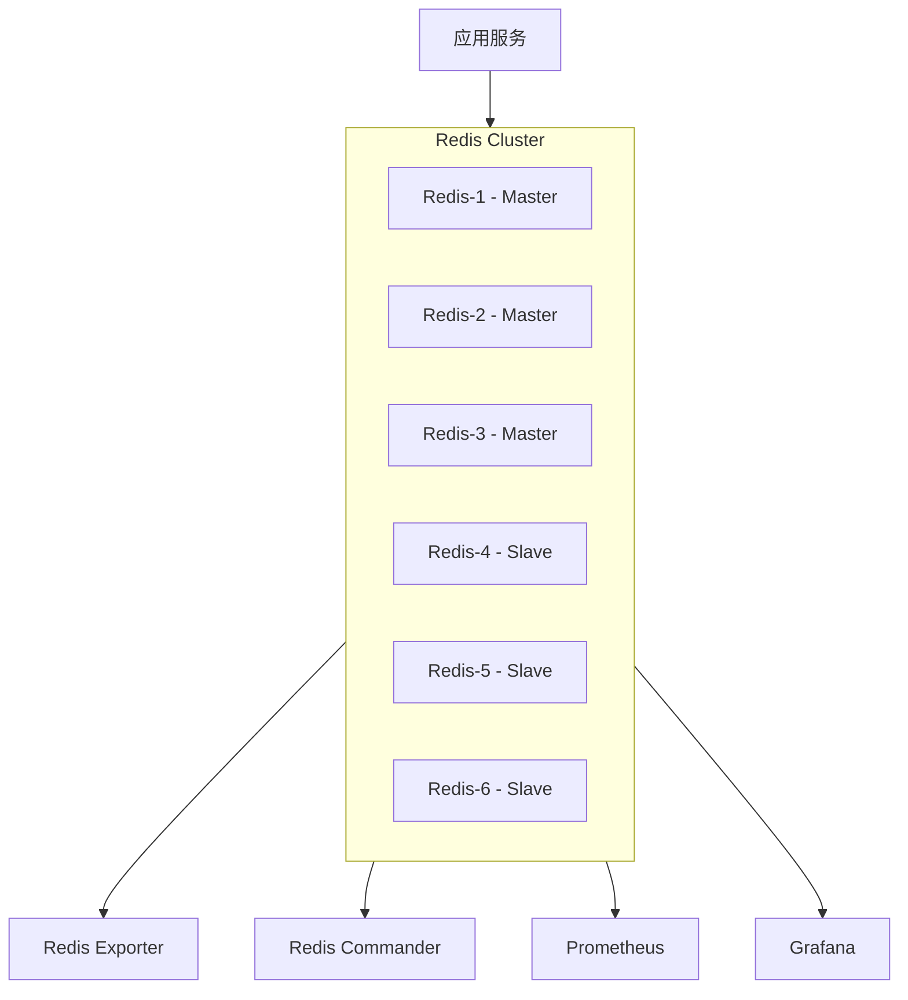

# Redis Cluster 架构与实现指南

> 本文档详细介绍了 GoMall 项目中 Redis Cluster 的架构设计、部署配置和使用方法，包括各组件的功能说明、配置详解和监控方案，为开发和运维人员提供完整的参考指南。

## 1. 架构概述

### 1.1 整体架构

GoMall 项目采用 Redis Cluster 作为分布式缓存解决方案，具有以下特点：

- **去中心化架构**：无中心节点，避免单点故障
- **自动分片**：数据自动分布在多个节点上
- **高可用性**：主从复制和自动故障转移
- **线性扩展**：支持在线动态扩容

架构组成：
- **Redis 节点**：6个节点（3主3从）
- **监控系统**：Prometheus + Grafana
- **管理工具**：Redis Commander
- **指标收集**：Redis Exporter

### 1.2 网络拓扑



## 2. 组件详解

### 2.1 Redis 节点

#### 2.1.1 节点角色与职责

| 节点名称 | 角色 | IP地址 | 端口 | 职责 |
|---------|------|-------|------|------|
| redis-1 | 主节点 | 10.10.0.11 | 6379 | 负责哈希槽 0-5460 |
| redis-2 | 主节点 | 10.10.0.12 | 6379 | 负责哈希槽 5461-10922 |
| redis-3 | 主节点 | 10.10.0.13 | 6379 | 负责哈希槽 10923-16383 |
| redis-4 | 从节点 | 10.10.0.14 | 6379 | redis-3 的从节点 |
| redis-5 | 从节点 | 10.10.0.15 | 6379 | redis-1 的从节点 |
| redis-6 | 从节点 | 10.10.0.16 | 6379 | redis-2 的从节点 |

#### 2.1.2 节点配置文件详解

每个 Redis 节点的配置文件位于 `/home/zq/Projects/GoMall/GomallBackend/docker/redis-cluster/config/` 目录下，以 `redis-1.conf` 为例：

```
# 基本配置
port 6379
cluster-enabled yes
cluster-config-file nodes.conf
cluster-node-timeout 5000
appendonly yes

# 内存配置
maxmemory 1GB
maxmemory-policy allkeys-lru

# 网络配置
bind 0.0.0.0
protected-mode no
```

主要配置参数说明：

| 参数 | 说明 | 推荐值 |
|------|------|--------|
| cluster-enabled | 启用集群模式 | yes |
| cluster-config-file | 集群配置文件 | nodes.conf |
| cluster-node-timeout | 节点超时时间(毫秒) | 5000 |
| appendonly | 是否开启 AOF 持久化 | yes |
| maxmemory | 最大内存限制 | 1GB |
| maxmemory-policy | 内存淘汰策略 | allkeys-lru |

### 2.2 集群创建服务

#### 2.2.1 功能说明

集群创建服务 `redis-cluster-creator` 负责在 Redis 节点启动后自动创建 Redis Cluster。它是一个一次性服务，在集群创建完成后会自动退出。

#### 2.2.2 配置与启动方式

集群创建服务在 docker-compose.yml 中的配置：

```yaml
redis-cluster-creator:
  image: redis:7.0
  container_name: redis-cluster-creator
  command: >
    bash -c "
      echo 'Waiting for Redis nodes to start...' &&
      sleep 10 &&
      echo 'Creating Redis Cluster...' &&
      redis-cli --cluster create 10.10.0.11:6379 10.10.0.12:6379 10.10.0.13:6379 10.10.0.14:6379 10.10.0.15:6379 10.10.0.16:6379 --cluster-replicas 1 --cluster-yes &&
      echo 'Redis Cluster created successfully!'
    "
  networks:
    - redis-net
  depends_on:
    - redis-1
    - redis-2
    - redis-3
    - redis-4
    - redis-5
    - redis-6
  restart: on-failure
```

关键参数说明：

- `--cluster create`：创建集群命令
- `--cluster-replicas 1`：每个主节点配置1个从节点
- `--cluster-yes`：自动确认所有提示

### 2.3 监控系统

#### 2.3.1 Redis Exporter

**功能说明**：Redis Exporter 负责收集 Redis 实例的各项指标，并以 Prometheus 格式暴露这些指标。

**配置与启动方式**：

```yaml
redis-exporter:
  image: oliver006/redis_exporter:latest
  container_name: redis-exporter
  command: >
    --redis.addr=redis://10.10.0.11:6379,redis://10.10.0.12:6379,redis://10.10.0.13:6379,redis://10.10.0.14:6379,redis://10.10.0.15:6379,redis://10.10.0.16:6379
    --redis.file=/tmp/redis.password
    --web.listen-address=:9121
  ports:
    - "9121:9121"
  networks:
    - redis-net
  depends_on:
    - redis-1
    - redis-2
    - redis-3
    - redis-4
    - redis-5
    - redis-6
  restart: unless-stopped
```

主要参数说明：

- `--redis.addr`：Redis 实例地址列表
- `--redis.file`：Redis 密码文件路径
- `--web.listen-address`：指标暴露端口

#### 2.3.2 Prometheus

**功能说明**：Prometheus 负责定期抓取 Redis Exporter 暴露的指标，并提供时序数据存储和查询功能。

**配置文件**：位于 `/home/zq/Projects/GoMall/GomallBackend/docker/redis-cluster/prometheus/prometheus.yml`

```yaml
global:
  scrape_interval: 15s
  evaluation_interval: 15s

scrape_configs:
  - job_name: 'redis'
    static_configs:
      - targets: ['redis-exporter:9121']
```

**启动方式**：

```yaml
prometheus:
  image: prom/prometheus:latest
  container_name: prometheus
  volumes:
    - ./prometheus/prometheus.yml:/etc/prometheus/prometheus.yml
    - prometheus_data:/prometheus
  command:
    - '--config.file=/etc/prometheus/prometheus.yml'
    - '--storage.tsdb.path=/prometheus'
    - '--web.console.libraries=/usr/share/prometheus/console_libraries'
    - '--web.console.templates=/usr/share/prometheus/consoles'
  ports:
    - "9091:9090"
  networks:
    - redis-net
  depends_on:
    - redis-exporter
  restart: unless-stopped
```

#### 2.3.3 Grafana

**功能说明**：Grafana 提供可视化监控面板，展示 Redis 集群的各项指标和状态。

**配置与启动方式**：

```yaml
grafana:
  image: grafana/grafana:latest
  container_name: grafana
  volumes:
    - ./grafana/provisioning:/etc/grafana/provisioning
    - grafana_data:/var/lib/grafana
  environment:
    - GF_SECURITY_ADMIN_USER=admin
    - GF_SECURITY_ADMIN_PASSWORD=admin
    - GF_USERS_ALLOW_SIGN_UP=false
  ports:
    - "3001:3000"
  networks:
    - redis-net
  depends_on:
    - prometheus
  restart: unless-stopped
```

**访问方式**：浏览器访问 http://localhost:3001，使用用户名 `admin` 和密码 `admin` 登录。

### 2.4 管理工具

#### 2.4.1 Redis Commander

**功能说明**：Redis Commander 是一个 Web 界面的 Redis 管理工具，提供直观的方式查看和操作 Redis 数据。

**配置与启动方式**：

```yaml
redis-commander:
  image: rediscommander/redis-commander:latest
  container_name: redis-commander
  environment:
    - REDIS_HOSTS=redis-1:10.10.0.11:6379,redis-2:10.10.0.12:6379,redis-3:10.10.0.13:6379,redis-4:10.10.0.14:6379,redis-5:10.10.0.15:6379,redis-6:10.10.0.16:6379
  ports:
    - "8081:8081"
  networks:
    - redis-net
  depends_on:
    - redis-1
    - redis-2
    - redis-3
    - redis-4
    - redis-5
    - redis-6
  restart: unless-stopped
```

**访问方式**：浏览器访问 http://localhost:8081

## 3. 部署与运维

### 3.1 部署步骤

1. **准备配置文件**：
   ```bash
   mkdir -p config data prometheus grafana/provisioning
   ```

2. **创建 Redis 配置文件**：
   ```bash
   # 为每个节点创建配置文件
   for i in {1..6}; do
     cat > config/redis-$i.conf << EOF
   port 6379
   cluster-enabled yes
   cluster-config-file nodes.conf
   cluster-node-timeout 5000
   appendonly yes
   maxmemory 1GB
   maxmemory-policy allkeys-lru
   bind 0.0.0.0
   protected-mode no
   EOF
   done
   ```

3. **创建 Prometheus 配置文件**：
   ```bash
   cat > prometheus/prometheus.yml << EOF
   global:
     scrape_interval: 15s
     evaluation_interval: 15s

   scrape_configs:
     - job_name: 'redis'
       static_configs:
         - targets: ['redis-exporter:9121']
   EOF
   ```

4. **启动集群**：
   ```bash
   docker compose up -d
   ```

### 3.2 集群状态检查

1. **查看集群信息**：
   ```bash
   docker exec -it redis-1 redis-cli cluster info
   ```

2. **查看节点状态**：
   ```bash
   docker exec -it redis-1 redis-cli cluster nodes
   ```

3. **检查集群槽位分配**：
   ```bash
   docker exec -it redis-1 redis-cli cluster slots
   ```

### 3.3 常见运维操作

#### 3.3.1 添加新节点

1. **添加主节点**：
   ```bash
   docker exec -it redis-1 redis-cli --cluster add-node 10.10.0.17:6379 10.10.0.11:6379
   ```

2. **添加从节点**：
   ```bash
   docker exec -it redis-1 redis-cli --cluster add-node 10.10.0.18:6379 10.10.0.11:6379 --cluster-slave --cluster-master-id <master-node-id>
   ```

3. **重新分片**：
   ```bash
   docker exec -it redis-1 redis-cli --cluster reshard 10.10.0.11:6379
   ```

#### 3.3.2 删除节点

1. **删除从节点**：
   ```bash
   docker exec -it redis-1 redis-cli --cluster del-node 10.10.0.11:6379 <node-id>
   ```

2. **删除主节点**（需先迁移槽位）：
   ```bash
   # 先将槽位迁移到其他节点
   docker exec -it redis-1 redis-cli --cluster reshard 10.10.0.11:6379
   # 然后删除节点
   docker exec -it redis-1 redis-cli --cluster del-node 10.10.0.11:6379 <node-id>
   ```

#### 3.3.3 备份与恢复

1. **备份**：
   ```bash
   # 在每个主节点上执行 SAVE 命令
   docker exec -it redis-1 redis-cli SAVE
   # 复制 RDB 文件
   docker cp redis-1:/data/dump.rdb ./backup/redis-1-dump.rdb
   ```

2. **恢复**：
   ```bash
   # 停止集群
   docker compose down
   # 复制备份文件到数据目录
   cp ./backup/redis-1-dump.rdb ./data/redis-1/dump.rdb
   # 启动集群
   docker compose up -d
   ```

## 4. 监控指标与告警

### 4.1 关键监控指标

| 指标类别 | 指标名称 | 说明 | 告警阈值 |
|---------|---------|------|---------|
| 可用性 | redis_up | Redis 实例是否在线 | 值为 0 时告警 |
| 内存 | redis_memory_used_bytes | 已使用内存 | >85% 时告警 |
| 性能 | redis_commands_processed_total | 命令处理速率 | 突然下降时告警 |
| 连接 | redis_connected_clients | 客户端连接数 | >80% 最大连接数时告警 |
| 复制 | redis_master_repl_offset | 主从复制偏移量 | 与从节点差距过大时告警 |
| 键空间 | redis_db_keys | 键总数 | 突然大幅减少时告警 |

### 4.2 Grafana 仪表盘

Grafana 提供以下仪表盘：

1. **Redis 集群概览**：显示集群整体状态、节点健康状况
2. **节点性能监控**：各节点的 CPU、内存、网络使用情况
3. **命令统计**：命令执行速率、延迟统计
4. **键空间分析**：键数量、过期键、驱逐键统计

### 4.3 告警配置

Prometheus 告警规则示例：

```yaml
groups:
- name: redis_alerts
  rules:
  - alert: RedisDown
    expr: redis_up == 0
    for: 1m
    labels:
      severity: critical
    annotations:
      summary: "Redis 实例宕机"
      description: "Redis 实例 {{ $labels.instance }} 已宕机"
      
  - alert: RedisMemoryHigh
    expr: redis_memory_used_bytes / redis_memory_max_bytes * 100 > 85
    for: 10m
    labels:
      severity: warning
    annotations:
      summary: "Redis 内存使用率高"
      description: "Redis 实例 {{ $labels.instance }} 内存使用率为 {{ $value }}%"
      
  - alert: RedisReplicationBroken
    expr: redis_connected_slaves < 1
    for: 1m
    labels:
      severity: critical
    annotations:
      summary: "Redis 复制中断"
      description: "Redis 主节点 {{ $labels.instance }} 没有可用的从节点"
```

## 5. 客户端接入指南

### 5.1 Go 客户端配置

使用 go-redis/v9 连接 Redis Cluster：

```go
package cache

import (
	"context"
	"time"

	"github.com/redis/go-redis/v9"
)

var (
	ClusterClient *redis.ClusterClient
)

// 初始化 Redis 集群
func InitRedisCluster() {
	ClusterClient = redis.NewClusterClient(&redis.ClusterOptions{
		Addrs: []string{
			"localhost:6379",
			"localhost:6380",
			"localhost:6381",
			"localhost:6382",
			"localhost:6383",
			"localhost:6384",
		},
		// 高可用配置
		MaxRetries:      3,
		MinRetryBackoff: 8 * time.Millisecond,
		MaxRetryBackoff: 512 * time.Millisecond,
		// 路由配置
		RouteByLatency: true,
		RouteRandomly:  true,
	})

	// 测试连接
	if err := ClusterClient.Ping(context.Background()).Err(); err != nil {
		panic(err)
	}
}

// 关闭集群连接
func CloseRedisCluster() error {
	return ClusterClient.Close()
}
```

### 5.2 应用层使用示例

```go
package service

import (
	"context"
	"encoding/json"
	"fmt"
	"time"

	"zqzqsb.com/gomall/common/cache"
)

// 商品缓存示例
func GetProductByID(ctx context.Context, productID int64) (*Product, error) {
	// 构建缓存键
	cacheKey := fmt.Sprintf("product:%d", productID)
	
	// 尝试从缓存获取
	val, err := cache.ClusterClient.Get(ctx, cacheKey).Result()
	if err == nil {
		// 缓存命中
		var product Product
		if err := json.Unmarshal([]byte(val), &product); err == nil {
			return &product, nil
		}
	}
	
	// 缓存未命中，从数据库获取
	product, err := getProductFromDB(ctx, productID)
	if err != nil {
		return nil, err
	}
	
	// 更新缓存
	if productBytes, err := json.Marshal(product); err == nil {
		cache.ClusterClient.Set(ctx, cacheKey, productBytes, 30*time.Minute)
	}
	
	return product, nil
}
```

### 5.3 最佳实践

1. **键命名规范**：
   - 使用冒号分隔的命名约定：`object-type:id:field`
   - 例如：`product:1001:price`、`user:5001:profile`

2. **批量操作**：
   - 使用 Pipeline 批量处理命令
   ```go
   pipe := cache.ClusterClient.Pipeline()
   pipe.Set(ctx, "key1", "value1", time.Hour)
   pipe.Set(ctx, "key2", "value2", time.Hour)
   _, err := pipe.Exec(ctx)
   ```

3. **错误处理**：
   - 处理 MOVED 和 ASK 重定向错误
   - 实现重试机制和熔断降级

4. **缓存防护**：
   - 实现布隆过滤器防止缓存穿透
   - 使用互斥锁防止缓存击穿
   - 设置随机过期时间防止缓存雪崩

## 6. 故障排查与解决方案

### 6.1 常见故障

| 故障现象 | 可能原因 | 解决方案 |
|---------|---------|---------|
| 集群状态异常 | 节点间通信问题 | 检查网络连接和防火墙设置 |
| 节点宕机 | 内存溢出、进程崩溃 | 重启节点，检查内存配置 |
| 主从复制中断 | 网络问题、从节点故障 | 修复网络或重启从节点 |
| 客户端连接失败 | 连接池配置不当、网络问题 | 调整连接池参数，检查网络 |
| 性能下降 | 内存不足、慢查询、网络拥塞 | 增加内存、优化查询、检查网络 |

### 6.2 故障排查步骤

1. **检查集群状态**：
   ```bash
   docker exec -it redis-1 redis-cli cluster info
   ```

2. **检查节点状态**：
   ```bash
   docker exec -it redis-1 redis-cli cluster nodes
   ```

3. **检查内存使用情况**：
   ```bash
   docker exec -it redis-1 redis-cli info memory
   ```

4. **查看慢查询日志**：
   ```bash
   docker exec -it redis-1 redis-cli slowlog get 10
   ```

5. **检查客户端连接**：
   ```bash
   docker exec -it redis-1 redis-cli client list
   ```

### 6.3 常见问题解决方案

1. **集群不可用**：
   - 确保至少有一半以上的主节点在线
   - 检查并修复节点间通信问题
   - 必要时手动修复集群配置

2. **数据不一致**：
   - 检查主从复制状态
   - 必要时重新同步数据
   - 考虑使用 RDB 文件恢复

3. **性能问题**：
   - 优化内存使用和淘汰策略
   - 避免使用耗时命令（如 KEYS）
   - 增加节点扩展集群容量

## 7. 总结

GoMall 项目的 Redis Cluster 架构提供了高可用、高性能的分布式缓存解决方案，具有以下优势：

1. **高可用性**：主从复制和自动故障转移确保服务持续可用
2. **高扩展性**：支持动态添加节点，线性扩展集群容量
3. **高性能**：数据分片和负载均衡提供毫秒级响应时间
4. **完善监控**：全面的监控和告警系统保障集群稳定运行

通过本文档的指导，开发和运维人员可以有效地部署、管理和使用 Redis Cluster，充分发挥其在 GoMall 项目中的价值。