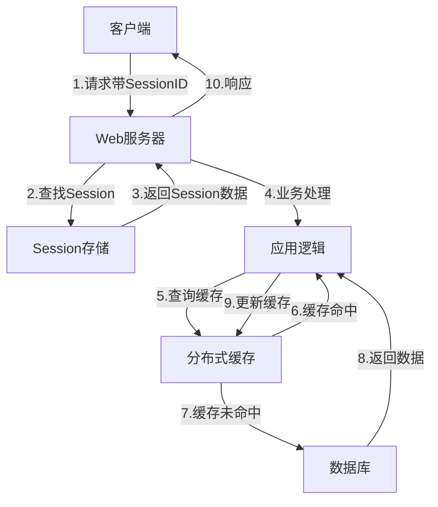

# Session 和分布式缓存的区别与联系

> Session 和分布式缓存是现代 Web 应用中两个密切相关但又有明显区别的概念。本文档详细分析了这两者的定义、特点、应用场景以及在 GoMall 项目中的具体实现，旨在帮助开发者理解它们的区别与联系，从而更有效地利用这些技术构建高性能、可扩展的系统。

## 1. 基本概念与定义

> Session 和分布式缓存虽然都用于临时存储数据，但在设计目的、使用方式和适用场景上有着本质区别。Session 主要关注用户状态管理，而分布式缓存则更广泛地用于提升系统性能和可扩展性。

### 1.1 Session 的定义与特点

**Session（会话）** 是一种在服务器端存储用户状态信息的机制，具有以下特点：

- **用户关联性**：每个 Session 与特定用户关联，用于跟踪和维护用户状态
- **生命周期**：通常与用户会话绑定，用户退出或超时后失效
- **存储内容**：主要存储用户认证信息、权限数据和会话状态
- **访问方式**：通过 SessionID（通常存储在 Cookie 中）识别和访问

```go
// GoMall 中的 Session 初始化示例
func InitSession(h *server.Hertz) {
    config := conf.GetConf()
    store, err := redis.NewStore(10, "tcp",
        config.Redis.Address,
        config.Redis.Password,
        []byte("your-session-secret-key"))
    if err != nil {
        panic(err)
    }
    h.Use(sessions.New("hertz-session", store))
}
```

### 1.2 分布式缓存的定义与特点

**分布式缓存** 是一种跨多个服务器节点共享的临时数据存储系统，具有以下特点：

- **通用性**：不限于特定用户，可存储任何类型的数据
- **性能导向**：主要目的是提高数据访问速度，减轻数据库负担
- **分布式架构**：数据分布在多个节点上，支持水平扩展
- **多样化策略**：支持多种缓存策略，如 LRU、TTL 等

```go
// GoMall 中的 Redis 分布式缓存初始化示例
func Init() {
    RedisClient = redis.NewClient(&redis.Options{
        Addr:     conf.GetConf().Redis.Address,
        Username: conf.GetConf().Redis.Username,
        Password: conf.GetConf().Redis.Password,
        DB:       conf.GetConf().Redis.DB,
    })
    if err := RedisClient.Ping(context.Background()).Err(); err != nil {
        panic(err)
    }
}
```

## 2. 技术实现比较

> 在技术实现层面，Session 和分布式缓存采用了不同的架构和技术栈，但在现代分布式系统中，它们往往相互融合，形成更强大的解决方案。

### 2.1 存储介质

**Session 存储**：
- **传统实现**：单服务器内存存储（如 PHP 的文件 Session）
- **现代实现**：分布式存储（如 Redis、Memcached）
- **GoMall 实现**：基于 Redis 的 Session 存储

**分布式缓存存储**：
- **内存数据库**：Redis、Memcached
- **内存网格**：Hazelcast、Infinispan
- **GoMall 实现**：Redis 单实例（未来可扩展为集群）

### 2.2 数据结构与访问模式



**Session 数据结构**：
- 通常是键值对形式，键为 SessionID，值为用户相关数据
- 访问模式：通过 SessionID 直接查找
- 数据一致性要求高，通常不允许丢失

**分布式缓存数据结构**：
- 支持多种数据结构：字符串、哈希、列表、集合等
- 访问模式：多样化的查询方式，支持复杂操作
- 可接受一定程度的数据丢失（有底层数据源作为保障）

## 3. 在 GoMall 中的应用

> GoMall 项目采用了混合架构，将 Session 管理和分布式缓存结合使用，既保证了用户状态的可靠管理，又提高了系统性能和可扩展性。

### 3.1 Session 应用场景

GoMall 中 Session 主要用于以下场景：

- **用户认证**：存储登录状态和用户身份信息
- **权限控制**：缓存用户权限数据，减少权限检查开销
- **购物车（临时）**：未登录用户的购物车数据

```go
// 使用 Session 存储用户信息示例
func Login(ctx *app.RequestContext) {
    // 验证用户凭证...
    
    // 获取 Session
    session := sessions.Default(ctx)
    
    // 存储用户信息
    session.Set("userID", user.ID)
    session.Set("username", user.Username)
    session.Set("role", user.Role)
    
    // 保存 Session
    if err := session.Save(); err != nil {
        // 处理错误...
    }
    
    // 返回响应...
}
```

### 3.2 分布式缓存应用场景

GoMall 中分布式缓存主要用于以下场景：

- **商品数据**：缓存热门商品信息，减轻数据库压力
- **用户会话**：作为 Session 的底层存储
- **API 结果缓存**：缓存常用 API 响应，提高响应速度
- **计数器和限流**：实现访问计数和限流功能

```go
// 使用分布式缓存获取商品信息示例
func GetProduct(ctx context.Context, productID int64) (*model.Product, error) {
    cacheKey := fmt.Sprintf("product:%d", productID)
    
    // 尝试从缓存获取
    productJSON, err := redisClient.Get(ctx, cacheKey).Result()
    if err == nil {
        // 缓存命中
        var product model.Product
        if err := json.Unmarshal([]byte(productJSON), &product); err == nil {
            return &product, nil
        }
    }
    
    // 缓存未命中，从数据库获取
    product, err := productRepo.GetByID(ctx, productID)
    if err != nil {
        return nil, err
    }
    
    // 更新缓存
    productJSON, _ = json.Marshal(product)
    redisClient.Set(ctx, cacheKey, productJSON, 30*time.Minute)
    
    return product, nil
}
```

## 4. 区别与联系

> Session 和分布式缓存虽然在概念和用途上有明显区别，但在实际应用中常常相互配合，形成完整的数据缓存和状态管理解决方案。

### 4.1 主要区别

| 特性 | Session | 分布式缓存 |
|------|---------|------------|
| **主要目的** | 用户状态管理 | 性能优化和可扩展性 |
| **数据关联** | 与特定用户关联 | 与业务数据关联，不限于用户 |
| **生命周期** | 用户会话期间 | 根据缓存策略灵活设置 |
| **一致性要求** | 较高（用户体验相关） | 相对较低（可从数据源恢复） |
| **访问模式** | 通过 SessionID | 多种键值访问模式 |
| **数据结构** | 主要是键值对 | 支持多种复杂数据结构 |

### 4.2 相互关系

在 GoMall 等现代应用中，Session 和分布式缓存的关系主要体现在：

1. **Session 存储依赖**：现代 Session 管理通常使用分布式缓存作为底层存储
   ```go
   // GoMall 中使用 Redis 存储 Session
   store, err := redis.NewStore(10, "tcp", config.Redis.Address, config.Redis.Password, []byte("secret-key"))
   ```

2. **数据共享与隔离**：
   - Session 数据通常有明确的命名空间（如前缀 `session:`）
   - 分布式缓存中的其他数据有自己的命名空间
   - 它们在同一存储系统中共存但逻辑隔离

3. **性能考量**：
   - Session 数据访问频繁但体积较小
   - 业务缓存数据可能体积较大但访问模式不同
   - 在 Redis 配置中可能需要针对不同类型数据优化

## 5. 最佳实践

> 基于 GoMall 项目的经验，我们总结了一些 Session 和分布式缓存结合使用的最佳实践，帮助开发者更有效地利用这两种技术。

### 5.1 Session 管理最佳实践

1. **使用分布式 Session 存储**：
   - 在多服务器环境中必须使用 Redis 等分布式存储
   - 避免使用本地内存或文件存储 Session

2. **合理设置 Session 过期时间**：
   - 平衡安全性和用户体验
   - 考虑实现"记住我"功能的不同过期策略

3. **最小化 Session 数据**：
   - 只存储必要的用户状态信息
   - 大量数据应存储在专用缓存或数据库中

```go
// Session 配置示例
func ConfigureSession() {
    store.Options(sessions.Options{
        Path:     "/",
        MaxAge:   86400, // 1天
        HttpOnly: true,
        Secure:   config.IsProduction,
    })
}
```

### 5.2 分布式缓存最佳实践

1. **缓存键设计**：
   - 使用一致的命名约定（如 `业务:类型:ID`）
   - 避免过长的键名，增加网络传输和存储开销

2. **缓存策略选择**：
   - 读多写少数据：较长过期时间
   - 频繁变化数据：较短过期时间或事件驱动更新
   - 考虑使用随机过期时间避免缓存雪崩

3. **缓存一致性维护**：
   - 采用"先更新数据库，再删除缓存"的模式
   - 使用消息队列确保最终一致性
   - 实现定时任务检查并修复不一致数据

```go
// 缓存更新策略示例
func UpdateData(ctx context.Context, key string, data interface{}) error {
    // 1. 更新数据库
    if err := repository.Update(ctx, key, data); err != nil {
        return err
    }
    
    // 2. 删除缓存
    cacheKey := fmt.Sprintf("data:%s", key)
    return redisClient.Del(ctx, cacheKey).Err()
}
```

## 6. 未来演进方向

> 随着 GoMall 项目的发展，Session 和分布式缓存的使用将进一步优化和演进，以适应更大规模的业务需求和更复杂的系统架构。

### 6.1 Session 管理演进

1. **JWT 与 Session 混合认证**：
   - 使用 JWT 进行无状态身份验证
   - Redis 存储黑名单，支持令牌撤销
   - 结合两者优势，提高系统可扩展性

2. **多级 Session 存储**：
   - 本地缓存热点 Session 数据
   - Redis 存储完整 Session
   - 分层架构提高性能

### 6.2 分布式缓存演进

1. **Redis 集群升级**：
   - 从单实例升级到 Redis 集群
   - 实现更高的可用性和可扩展性

2. **多级缓存架构**：
   - 本地缓存 + 分布式缓存 + 数据库
   - 针对不同数据类型优化缓存策略

3. **缓存预热与智能缓存**：
   - 基于用户行为分析的智能预热
   - 自适应缓存过期策略

## 7. 总结

> Session 和分布式缓存作为现代 Web 应用的两个核心组件，在 GoMall 项目中扮演着不同但互补的角色。理解它们的区别与联系，有助于开发者构建更高效、可靠的系统架构。

在 GoMall 项目中，我们采用了混合状态管理策略：

1. **认证方面**：
   - JWT + Redis 混合认证方案
   - HTTP-Only Cookie 传递令牌，增强安全性

2. **数据缓存方面**：
   - 多层次缓存策略，平衡性能与一致性
   - 针对不同业务场景定制缓存解决方案

3. **未来发展**：
   - 向更分布式、更高性能的架构演进
   - 保持用户体验与系统性能的平衡

通过合理结合 Session 管理和分布式缓存技术，GoMall 项目成功构建了一个高性能、可扩展且用户友好的电商平台。