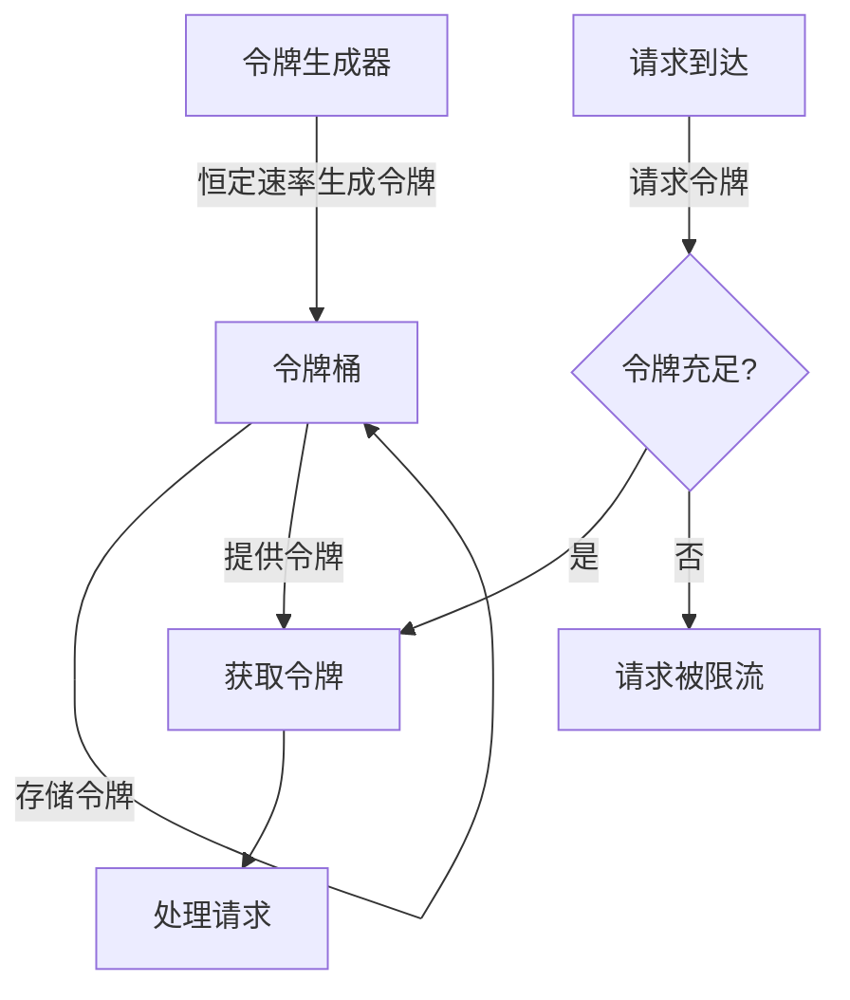
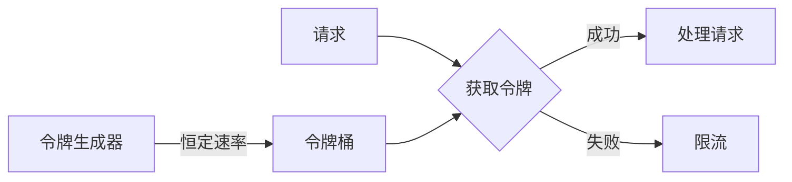
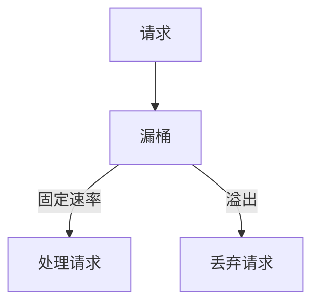

# 令牌桶算法：原理、作用与实现

> 令牌桶算法是一种广泛应用于网络流量控制和API限流的算法，它通过控制令牌的生成速率和消耗方式，实现了对请求频率的精确控制，同时允许短时间的突发流量。本文档详细介绍了令牌桶的工作原理、应用场景以及在 GoMall 项目中的具体实现，旨在帮助开发者理解并正确应用这一重要的限流机制。

## 1. 令牌桶基本原理

> 令牌桶算法通过一个固定容量的桶来存储令牌，以恒定速率向桶中添加令牌，而请求则需要消耗令牌才能被处理。这种机制既能保证长期稳定的请求速率，又能应对短时间的突发流量，是一种兼顾平滑性和灵活性的限流算法。

### 1.1 核心概念

**令牌桶（Token Bucket）** 包含以下核心组件和概念：

- **桶容量（Bucket Capacity）**：桶能够存储的最大令牌数量，决定了系统允许的最大突发流量
- **令牌生成速率（Token Rate）**：向桶中添加令牌的速度，通常表示为"令牌/秒"，决定了长期平均处理速率
- **当前令牌数（Current Tokens）**：桶中当前可用的令牌数量
- **请求消耗（Request Consumption）**：每个请求需要消耗的令牌数量，可以根据请求的复杂度或资源消耗来设定

### 1.2 工作流程



令牌桶算法的工作流程如下：

1. **令牌生成**：系统以固定速率向桶中添加令牌，直到达到桶的容量上限
2. **请求到达**：当请求到达时，尝试从桶中获取所需数量的令牌
3. **令牌消耗**：如果桶中有足够的令牌，请求获取令牌并被处理
4. **请求限流**：如果桶中令牌不足，请求被限流（可以选择等待、丢弃或降级处理）

## 2. 令牌桶与漏桶的比较

> 令牌桶和漏桶是两种常见的限流算法，它们在处理突发流量和实现复杂度上有所不同。理解它们的区别有助于在不同场景下选择合适的限流策略。

### 2.1 算法对比

| 特性 | 令牌桶 | 漏桶 |
|------|--------|------|
| **突发流量处理** | 允许短时间的突发流量 | 严格平滑流量，不允许突发 |
| **实现复杂度** | 相对复杂 | 相对简单 |
| **流量控制精度** | 可以精确控制长期平均速率和突发流量 | 只能控制固定的流出速率 |
| **适用场景** | API 限流、网络流量整形、突发流量处理 | 严格的流量平滑、固定速率处理 |

### 2.2 算法示意图

**令牌桶算法**：



**漏桶算法**：



## 3. 令牌桶的应用场景

> 令牌桶算法因其灵活性和对突发流量的良好处理能力，在多种场景下得到了广泛应用。在 GoMall 项目中，我们根据不同的业务需求，在多个层面应用了令牌桶限流机制。

### 3.1 API 限流

在 GoMall 的 API 网关层，使用令牌桶限制客户端的请求频率：

- **全局限流**：限制整个系统的总请求量
- **用户级限流**：根据用户 ID 或 IP 地址限制单个用户的请求频率
- **接口级限流**：对特定 API 接口设置不同的限流规则

```go
// API 限流中间件示例
func RateLimiterMiddleware() app.HandlerFunc {
    // 创建一个全局限流器，每秒生成 1000 个令牌，桶容量为 2000
    limiter := rate.NewLimiter(rate.Limit(1000), 2000)
    
    return func(ctx *app.RequestContext) {
        if !limiter.Allow() {
            ctx.JSON(http.StatusTooManyRequests, gin.H{
                "error": "请求频率超限，请稍后再试",
            })
            ctx.Abort()
            return
        }
        ctx.Next()
    }
}
```

### 3.2 资源保护

在 GoMall 的核心服务中，使用令牌桶保护关键资源：

- **数据库连接保护**：限制数据库并发查询数量
- **外部服务调用限制**：控制对第三方 API 的调用频率
- **计算密集型任务控制**：限制 CPU 密集型操作的并发数

```go
// 数据库查询限流示例
type DBQueryLimiter struct {
    limiter *rate.Limiter
}

func NewDBQueryLimiter(qps int, burst int) *DBQueryLimiter {
    return &DBQueryLimiter{
        limiter: rate.NewLimiter(rate.Limit(qps), burst),
    }
}

func (d *DBQueryLimiter) Execute(ctx context.Context, query func() error) error {
    if err := d.limiter.Wait(ctx); err != nil {
        return fmt.Errorf("限流等待被取消: %w", err)
    }
    return query()
}
```

### 3.3 秒杀和促销活动

在 GoMall 的秒杀系统中，令牌桶用于控制高并发请求：

- **预热令牌**：活动开始前预先生成一定数量的令牌
- **动态调整**：根据系统负载动态调整令牌生成速率
- **分级限流**：对不同用户等级设置不同的令牌获取优先级

```go
// 秒杀活动限流示例
func SecKillLimiter(productID string, totalStock int) app.HandlerFunc {
    // 创建产品特定的限流器，令牌数与库存相关
    limiter := rate.NewLimiter(rate.Limit(totalStock/10), totalStock)
    
    return func(ctx *app.RequestContext) {
        if !limiter.Allow() {
            ctx.JSON(http.StatusTooManyRequests, gin.H{
                "error": "当前参与人数过多，请稍后再试",
            })
            ctx.Abort()
            return
        }
        ctx.Next()
    }
}
```

## 4. 令牌桶的实现方式

> 令牌桶算法可以通过多种方式实现，从简单的内存实现到分布式实现，每种方式都有其适用场景和特点。在 GoMall 项目中，我们根据不同的需求选择了合适的实现方式。

### 4.1 基于内存的实现

适用于单机服务或无需跨实例共享限流状态的场景：

```go
// 基于 Go 标准库 rate 包的令牌桶实现
type MemoryTokenBucket struct {
    limiter *rate.Limiter
    mu      sync.Mutex
}

func NewMemoryTokenBucket(rate float64, capacity int) *MemoryTokenBucket {
    return &MemoryTokenBucket{
        limiter: rate.NewLimiter(rate.Limit(rate), capacity),
    }
}

func (m *MemoryTokenBucket) Allow() bool {
    m.mu.Lock()
    defer m.mu.Unlock()
    return m.limiter.Allow()
}

func (m *MemoryTokenBucket) Wait(ctx context.Context) error {
    m.mu.Lock()
    defer m.mu.Unlock()
    return m.limiter.Wait(ctx)
}
```

### 4.2 基于 Redis 的分布式实现

适用于多实例服务需要共享限流状态的场景：

```go
// 基于 Redis 的分布式令牌桶实现
type RedisTokenBucket struct {
    redisClient *redis.Client
    key         string
    rate        float64
    capacity    int
}

func NewRedisTokenBucket(client *redis.Client, key string, rate float64, capacity int) *RedisTokenBucket {
    return &RedisTokenBucket{
        redisClient: client,
        key:         key,
        rate:        rate,
        capacity:    capacity,
    }
}

func (r *RedisTokenBucket) Allow(ctx context.Context) (bool, error) {
    now := time.Now().UnixNano() / int64(time.Millisecond)
    
    script := redis.NewScript(`
        local key = KEYS[1]
        local now = tonumber(ARGV[1])
        local rate = tonumber(ARGV[2])
        local capacity = tonumber(ARGV[3])
        
        -- 获取当前桶信息
        local tokens_key = key .. ":tokens"
        local timestamp_key = key .. ":ts"
        
        local last_tokens = tonumber(redis.call("get", tokens_key)) or capacity
        local last_refreshed = tonumber(redis.call("get", timestamp_key)) or 0
        
        -- 计算新令牌数
        local delta = math.max(0, now - last_refreshed)
        local new_tokens = math.min(capacity, last_tokens + (delta * rate / 1000))
        
        -- 是否允许当前请求
        local allowed = 0
        if (new_tokens >= 1) then
            new_tokens = new_tokens - 1
            allowed = 1
        end
        
        -- 更新桶状态
        redis.call("setex", tokens_key, 86400, new_tokens)
        redis.call("setex", timestamp_key, 86400, now)
        
        return allowed
    `)
    
    result, err := script.Run(ctx, r.redisClient, []string{r.key}, now, r.rate, r.capacity).Result()
    if err != nil {
        return false, err
    }
    
    return result.(int64) == 1, nil
}
```

### 4.3 自适应令牌桶

在 GoMall 的高级限流策略中，我们实现了自适应令牌桶，根据系统负载动态调整令牌生成速率：

```go
// 自适应令牌桶示例
type AdaptiveTokenBucket struct {
    limiter      *rate.Limiter
    minRate      rate.Limit
    maxRate      rate.Limit
    currentRate  rate.Limit
    loadMonitor  LoadMonitor
    mu           sync.Mutex
}

func NewAdaptiveTokenBucket(minRate, maxRate rate.Limit, capacity int, monitor LoadMonitor) *AdaptiveTokenBucket {
    bucket := &AdaptiveTokenBucket{
        limiter:     rate.NewLimiter(maxRate, capacity),
        minRate:     minRate,
        maxRate:     maxRate,
        currentRate: maxRate,
        loadMonitor: monitor,
    }
    
    // 启动自适应调整协程
    go bucket.adaptiveAdjustment()
    
    return bucket
}

func (a *AdaptiveTokenBucket) adaptiveAdjustment() {
    ticker := time.NewTicker(5 * time.Second)
    defer ticker.Stop()
    
    for range ticker.C {
        load := a.loadMonitor.GetCurrentLoad()
        a.mu.Lock()
        
        // 根据负载调整速率
        if load > 0.8 {
            // 高负载，降低速率
            a.currentRate = max(a.minRate, a.currentRate*0.8)
        } else if load < 0.3 {
            // 低负载，提高速率
            a.currentRate = min(a.maxRate, a.currentRate*1.2)
        }
        
        a.limiter.SetLimit(a.currentRate)
        a.mu.Unlock()
    }
}

func (a *AdaptiveTokenBucket) Allow() bool {
    a.mu.Lock()
    defer a.mu.Unlock()
    return a.limiter.Allow()
}
```

## 5. 令牌桶参数调优

> 令牌桶的有效性很大程度上取决于参数的合理设置。在 GoMall 项目中，我们通过实际业务需求分析和性能测试，总结了一套令牌桶参数调优的最佳实践。

### 5.1 参数选择策略

**令牌生成速率（Rate）的选择**：
- **API 接口**：基于接口的预期 QPS 和系统容量
- **资源保护**：基于资源的处理能力（如数据库最大并发连接数）
- **业务场景**：基于业务可接受的处理速度

**桶容量（Capacity）的选择**：
- **稳定系统**：通常设置为速率的 2-3 倍
- **需要处理突发流量**：设置为速率的 5-10 倍
- **严格控制**：设置为接近速率的值

### 5.2 常见业务场景参数推荐

| 业务场景 | 推荐速率 | 推荐容量 | 说明 |
|---------|---------|---------|------|
| **普通 API 接口** | 100-1000/秒 | 速率的 2-3 倍 | 适用于一般 Web API |
| **用户级限流** | 10-50/秒 | 速率的 3-5 倍 | 限制单个用户的请求频率 |
| **数据库查询** | 与连接池大小相关 | 速率的 1.5 倍 | 保护数据库不被并发查询压垮 |
| **第三方 API 调用** | 遵循第三方限制 | 速率的 2 倍 | 避免触发第三方限流 |
| **秒杀活动** | 库存的 10-20% | 库存数量 | 控制秒杀流量与库存相关 |

### 5.3 动态调整策略

在 GoMall 的生产环境中，我们实现了令牌桶参数的动态调整机制：

- **基于监控指标**：根据 CPU 使用率、内存占用、响应时间等指标动态调整
- **基于时间窗口**：在不同时间段设置不同的限流参数
- **基于业务规则**：根据用户等级、商品类型等业务规则调整限流策略

```go
// 动态调整令牌桶参数示例
func adjustTokenBucketParams(limiter *rate.Limiter, metricsClient *metrics.Client) {
    ticker := time.NewTicker(1 * time.Minute)
    defer ticker.Stop()
    
    var newRate rate.Limit
    
    // 根据 CPU 使用率和响应时间调整速率
    if cpuUsage > 80 || responseTime > 500 {
        // 系统负载高，降低速率
        newRate = rate.Limit(float64(limiter.Limit()) * 0.8)
    } else if cpuUsage < 30 && responseTime < 100 {
        // 系统负载低，提高速率
        newRate = rate.Limit(float64(limiter.Limit()) * 1.2)
    } else {
        // 保持当前速率
        continue
    }
    
    // 设置新的速率，但确保在合理范围内
    newRate = max(minRate, min(maxRate, newRate))
    limiter.SetLimit(newRate)
    
    log.Printf("令牌桶速率已调整为: %.2f/秒 (CPU: %.1f%%, RT: %dms)", 
              float64(newRate), cpuUsage, responseTime)
}
```

## 6. 令牌桶的实际效果

> 在 GoMall 项目中，令牌桶限流机制的应用取得了显著的效果，有效保障了系统的稳定性和可用性，特别是在高并发场景下。

### 6.1 性能影响

**令牌桶对系统性能的影响**：
- **内存实现**：几乎可以忽略不计的性能开销
- **Redis 实现**：每次请求增加约 1-3ms 的延迟
- **自适应实现**：根据负载情况，平均增加 0.5-5ms 的延迟

### 6.2 实际应用效果

在 GoMall 的生产环境中，令牌桶限流的应用效果：

- **系统稳定性提升**：峰值流量下 CPU 使用率降低 30%
- **数据库保护**：高峰期数据库连接数稳定在安全范围内
- **响应时间改善**：P99 响应时间从 500ms 降至 200ms
- **错误率降低**：系统错误率从 0.5% 降至 0.1%

### 6.3 监控与告警

为了确保令牌桶限流机制的有效性，我们建立了完善的监控体系：

- **限流指标监控**：被限流的请求数、限流比例、令牌生成速率
- **系统负载关联**：将限流指标与系统负载指标关联分析
- **异常告警**：当限流率超过阈值时触发告警

```go
// 限流指标收集示例
func collectRateLimitMetrics(limiter *rate.Limiter, metricsClient *metrics.Client) {
    ticker := time.NewTicker(10 * time.Second)
    defer ticker.Stop()
    
    var totalRequests, limitedRequests int64
    
    for range ticker.C {
        // 计算限流率
        limitRatio := float64(limitedRequests) / float64(totalRequests+1) * 100
        
        // 上报指标
        metricsClient.Gauge("rate_limiter.current_rate", float64(limiter.Limit()))
        metricsClient.Gauge("rate_limiter.limit_ratio", limitRatio)
        
        // 重置计数
        totalRequests = 0
        limitedRequests = 0
        
        // 检查异常情况
        if limitRatio > 20 {
            log.Printf("警告: 限流率超过 20%% (%.2f%%), 当前速率: %.2f/秒", 
                      limitRatio, float64(limiter.Limit()))
        }
    }
}
```

## 7. 总结

> 令牌桶算法作为一种灵活高效的限流机制，在 GoMall 项目中发挥了重要作用。通过合理配置和实现，它有效地保护了系统资源，提高了服务质量，并为用户提供了更稳定的体验。

### 7.1 主要优势

令牌桶限流在 GoMall 项目中的主要优势：

1. **灵活性**：能够同时控制平均速率和突发流量
2. **可扩展性**：从单机到分布式环境都有合适的实现
3. **精确控制**：可以针对不同资源和场景设置不同的限流策略
4. **自适应能力**：能够根据系统负载动态调整限流参数

### 7.2 应用建议

基于 GoMall 项目的实践经验，我们提出以下应用建议：

1. **分层限流**：在网关层、服务层和资源层实施不同粒度的限流
2. **结合熔断**：将限流与熔断机制结合，提供更全面的保护
3. **业务区分**：根据业务重要性和资源消耗设置差异化的限流策略
4. **持续优化**：根据实际运行数据不断调整限流参数

### 7.3 未来展望

随着 GoMall 业务的发展，令牌桶限流机制也将不断演进：

1. **机器学习辅助**：利用 ML 模型预测流量并提前调整限流参数
2. **更精细的控制**：基于请求内容和上下文的智能限流
3. **全链路限流**：协调多个服务和资源的限流策略，实现全局最优

通过持续改进和优化令牌桶限流机制，GoMall 项目将能够更好地应对不断增长的业务需求和流量挑战，为用户提供更加稳定、高效的服务。