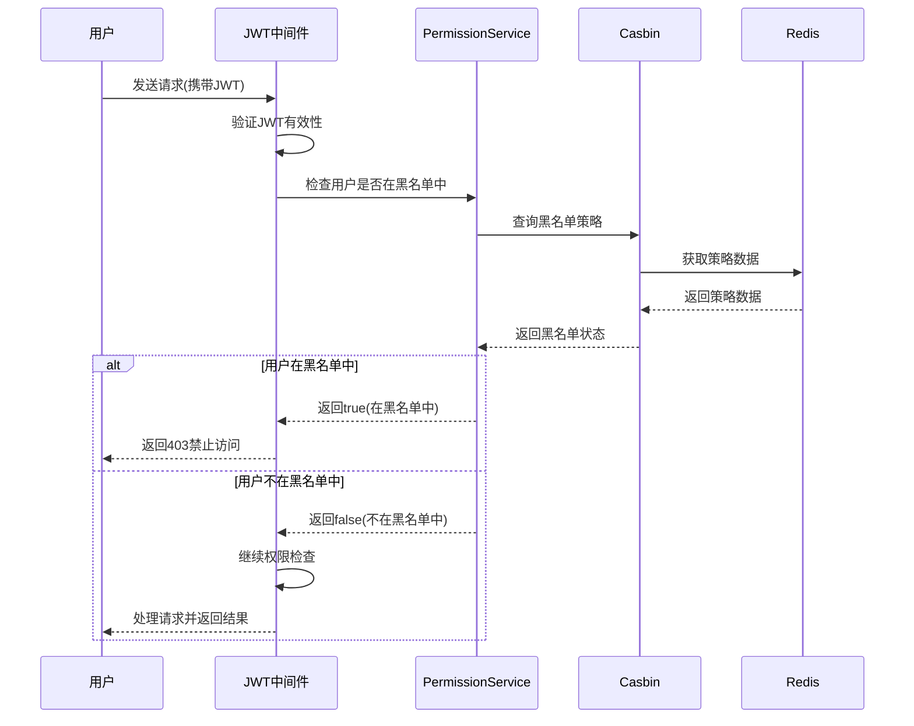

# 令牌撤销和黑名单是怎么基于 Redis 做的

> 在 GoMall 项目中，令牌撤销和用户黑名单功能通过 Redis 与 Casbin 的结合实现，构建了一个灵活且高效的访问控制系统。本文详细分析了这一实现方式的架构设计、核心代码和工作原理，并提出了一些可能的优化方向。

## 1. 整体架构设计

> GoMall 项目采用了 JWT + Redis + Casbin 的混合架构来实现身份验证和访问控制，其中 Redis 在令牌撤销和黑名单管理中扮演着关键角色，提供了高性能的数据存储和快速查询能力。

### 1.1 技术栈组合

GoMall 项目中的令牌撤销和黑名单系统由以下几个关键组件构成：

1. **JWT (JSON Web Token)**
   - 用于无状态身份验证
   - 通过 HTTP-Only Cookie 传递令牌，增强安全性
   - 设置合理的过期时间（1小时）限制令牌有效期

2. **Redis**
   - 存储黑名单数据
   - 提供高性能的查询能力
   - 支持设置过期时间，自动清理过期数据

3. **Casbin**
   - 实现基于策略的访问控制
   - 管理用户黑名单规则
   - 提供灵活的权限检查机制

### 1.2 系统工作流程



## 2. 核心实现分析

> GoMall 项目中的令牌撤销和黑名单功能主要通过 PermissionService 和 Casbin 中间件实现，它们共同构建了一个灵活且可扩展的访问控制系统。Redis 作为底层存储，提供了高效的数据管理能力。

### 2.1 JWT 令牌管理

JWT 中间件负责生成、验证和管理令牌，其核心代码如下：

```go
// 初始化 JWT 中间件
func InitJwt() {
    JwtMiddleware, err = jwt.New(&jwt.HertzJWTMiddleware{
        Realm:      "test zone",
        Key:        []byte("secret key"), // 签名密钥
        Timeout:    time.Hour,            // 令牌有效期为1小时
        MaxRefresh: time.Hour,            // 最大刷新时间为1小时
        TokenLookup: "cookie: jwt",       // 从cookie中获取令牌
        TokenHeadName: "Bearer",
        // 登录成功后设置HTTP-Only Cookie
        LoginResponse: func(ctx context.Context, c *app.RequestContext, code int, token string, expire time.Time) {
            c.SetCookie(
                "jwt",  // Cookie名称
                token,  // JWT令牌
                3600,   // 过期时间(秒)
                "/",    // 路径
                "",     // 域名
                protocol.CookieSameSiteDefaultMode,
                true,   // Secure
                true,   // HttpOnly - 防止XSS攻击
            )
            // 返回JSON响应
            c.JSON(http.StatusOK, utils.H{
                "code":    code,
                "token":   token,
                "expire":  expire.Format(time.RFC3339),
                "message": "success",
            })
        },
        // 其他配置...
    })
}
```

这种实现方式的特点：

1. **安全性**：使用 HTTP-Only Cookie 存储令牌，防止 XSS 攻击
2. **有限生命周期**：令牌有1小时的有效期，减少被盗用的风险
3. **无状态设计**：JWT 本身不需要服务器存储会话状态

### 2.2 黑名单实现

黑名单功能通过 PermissionService 实现，核心代码如下：

```go
// 将用户添加到黑名单
func (s *PermissionService) AddToBlacklist(userID string) error {
    return s.AddPolicy(userID, ".*", ".*", "deny")
}

// 将用户从黑名单移除
func (s *PermissionService) RemoveFromBlacklist(userID string) error {
    return s.RemovePolicy(userID, ".*", ".*")
}

// 检查用户是否在黑名单中
func (s *PermissionService) IsBlacklisted(userID string) (bool, error) {
    s.mu.RLock()
    defer s.mu.RUnlock()
    return s.enforcer.HasPolicy(userID, ".*", ".*", "deny")
}
```

黑名单检查在 Casbin 中间件中进行：

```go
func NewCasbinMiddleware(enforcer *casbin.Enforcer) app.HandlerFunc {
    return func(ctx context.Context, c *app.RequestContext) {
        // 从请求中获取用户信息
        userID := c.GetInt64("identity")
        user := strconv.FormatInt(userID, 10)

        // 首先检查是否在黑名单中
        if res, err := permissionSvc.IsBlacklisted(user); res || err != nil {
            c.JSON(403, utils.H{
                "code":    403,
                "message": "用户已被封禁",
            })
            c.Abort()
            return
        }

        // 继续其他权限检查...
    }
}
```

### 2.3 Redis 存储机制

虽然 GoMall 项目中没有直接在代码层面展示 Redis 如何存储黑名单，但通过 Casbin 的工作原理可以推断其实现方式：

1. **Casbin 策略存储**：Casbin 支持多种适配器，包括 Redis 适配器
2. **策略格式**：黑名单策略以 `p, userID, ".*", ".*", "deny"` 的格式存储
3. **Redis 键值设计**：
   ```
   # 策略存储示例
   "casbin:policies" -> [
     "p, 1001, .*, .*, deny",
     "p, 1002, .*, .*, deny",
     ...
   ]
   ```

4. **过期时间管理**：可以为黑名单条目设置过期时间，实现自动解除封禁

## 3. 令牌撤销机制

> GoMall 项目中的令牌撤销机制结合了 JWT 的无状态特性和 Redis 的高效存储能力，通过黑名单方式实现了对已颁发令牌的撤销控制，平衡了安全性和性能。

### 3.1 撤销策略

GoMall 项目采用了"黑名单"策略来实现令牌撤销：

1. **用户级撤销**：
   - 将用户 ID 添加到黑名单中
   - 该用户的所有令牌（即使尚未过期）都将被拒绝
   - 适用于账户被盗、用户违规等场景

2. **隐式撤销**：
   - JWT 令牌设置较短的过期时间（1小时）
   - 不需要显式撤销，令牌自动失效
   - 减少了黑名单的维护成本

3. **无需存储所有令牌**：
   - 不需要在 Redis 中存储每个颁发的令牌
   - 只存储被撤销的用户 ID
   - 大幅减少了存储和查询开销

### 3.2 实现优势

这种令牌撤销机制具有以下优势：

1. **高效性**：
   - 只需检查用户 ID 是否在黑名单中
   - 无需存储和检查每个令牌
   - 减少了 Redis 的存储压力

2. **实时性**：
   - 一旦用户被加入黑名单，所有后续请求立即被拒绝
   - 不存在缓存延迟问题

3. **可扩展性**：
   - 支持大规模用户和令牌
   - 黑名单检查的复杂度不随令牌数量增加而增加

## 4. 与其他系统的集成

> GoMall 项目中的令牌撤销和黑名单功能与其他系统紧密集成，形成了一个完整的身份验证和访问控制体系。这种集成方式既保证了系统的安全性，又提供了良好的用户体验。

### 4.1 与认证系统的集成

令牌撤销和黑名单功能与 JWT 认证系统的集成：

1. **认证流程**：
   - 用户登录成功后获取 JWT 令牌
   - 令牌通过 HTTP-Only Cookie 传递
   - 每次请求都会验证令牌有效性

2. **撤销检查**：
   - 令牌验证通过后，检查用户是否在黑名单中
   - 如果在黑名单中，即使令牌有效也拒绝访问

3. **安全增强**：
   - 结合 JWT 的加密安全和黑名单的撤销能力
   - 双重保障系统安全

### 4.2 与权限系统的集成

令牌撤销和黑名单功能与 Casbin 权限系统的集成：

1. **权限检查流程**：
   - 首先检查用户是否在黑名单中
   - 然后进行常规的权限检查
   - 两层过滤确保安全

2. **统一策略管理**：
   - 黑名单作为特殊的权限策略管理
   - 与其他权限规则共同存储和维护

3. **灵活的控制粒度**：
   - 支持全局黑名单（拒绝所有访问）
   - 理论上也支持特定资源的黑名单（当前未实现）

## 5. 性能与扩展性考虑

> GoMall 项目中的令牌撤销和黑名单实现在性能和扩展性方面有着良好的设计，但随着系统规模的增长，仍有一些优化空间和注意事项需要考虑。

### 5.1 性能优化

当前实现的性能特点：

1. **查询效率**：
   - Redis 提供了 O(1) 的查询复杂度
   - 黑名单检查速度快，对请求延迟影响小

2. **内存占用**：
   - 只存储被撤销的用户 ID，而非所有令牌
   - 内存占用随黑名单用户数量线性增长，而非令牌数量

3. **并发处理**：
   - 使用读写锁控制并发访问
   - Redis 本身支持高并发操作

### 5.2 扩展性建议

为了支持更大规模的应用，可以考虑以下扩展性优化：

1. **分布式 Redis**：
   - 使用 Redis 集群存储黑名单数据
   - 提高可用性和吞吐量

2. **缓存优化**：
   - 在应用层增加本地缓存
   - 减少对 Redis 的频繁查询

3. **批量操作**：
   - 支持批量添加和移除黑名单
   - 优化大规模管理场景

## 6. 最佳实践与改进建议

> 基于对 GoMall 项目中令牌撤销和黑名单实现的分析，我们提出了一些最佳实践和改进建议，以进一步提升系统的安全性、性能和可维护性。

### 6.1 安全性增强

1. **令牌指纹**：
   - 为每个令牌生成唯一指纹
   - 在黑名单中存储特定令牌的指纹
   - 实现更精细的令牌撤销控制

```go
// 生成令牌指纹
func generateTokenFingerprint(token string) string {
    hash := sha256.Sum256([]byte(token))
    return hex.EncodeToString(hash[:])
}

// 将特定令牌加入黑名单
func (s *TokenService) RevokeToken(token string) error {
    fingerprint := generateTokenFingerprint(token)
    return s.redisClient.Set(context.Background(), 
        fmt.Sprintf("revoked_token:%s", fingerprint), 
        "1", 
        s.tokenExpiration).Err()
}

// 检查令牌是否被撤销
func (s *TokenService) IsTokenRevoked(token string) (bool, error) {
    fingerprint := generateTokenFingerprint(token)
    result, err := s.redisClient.Exists(context.Background(), 
        fmt.Sprintf("revoked_token:%s", fingerprint)).Result()
    return result > 0, err
}
```

2. **分级黑名单**：
   - 实现临时黑名单和永久黑名单
   - 支持不同的封禁策略和时长

```go
// 将用户添加到临时黑名单
func (s *PermissionService) AddToTemporaryBlacklist(userID string, duration time.Duration) error {
    key := fmt.Sprintf("blacklist:temp:%s", userID)
    return s.redisClient.Set(context.Background(), key, "1", duration).Err()
}

// 将用户添加到永久黑名单
func (s *PermissionService) AddToPermanentBlacklist(userID string) error {
    return s.AddPolicy(userID, ".*", ".*", "deny")
}
```

### 6.2 性能优化建议

1. **分层缓存策略**：
   - 实现应用层内存缓存
   - 减少对 Redis 的查询频率

```go
type BlacklistService struct {
    redisClient  *redis.Client
    localCache   *cache.Cache // 本地内存缓存
    cacheTTL     time.Duration
}

func (s *BlacklistService) IsBlacklisted(userID string) (bool, error) {
    // 先查本地缓存
    if value, found := s.localCache.Get(userID); found {
        return value.(bool), nil
    }
    
    // 本地缓存未命中，查询Redis
    result, err := s.redisClient.Exists(context.Background(), 
        fmt.Sprintf("blacklist:%s", userID)).Result()
    
    // 更新本地缓存
    if err == nil {
        s.localCache.Set(userID, result > 0, s.cacheTTL)
    }
    
    return result > 0, err
}
```

2. **异步处理**：
   - 黑名单更新操作异步处理
   - 减少对主请求流程的影响

```go
func (s *PermissionService) AsyncAddToBlacklist(userID string) {
    go func() {
        err := s.AddToBlacklist(userID)
        if err != nil {
            log.Printf("Failed to add user %s to blacklist: %v", userID, err)
            // 可以实现重试机制
        }
    }()
}
```

### 6.3 可观测性增强

1. **审计日志**：
   - 记录所有黑名单操作
   - 包括添加、移除和检查操作

```go
func (s *PermissionService) AddToBlacklist(userID string) error {
    // 记录审计日志
    s.auditLogger.Log("ADD_TO_BLACKLIST", map[string]interface{}{
        "user_id": userID,
        "time":    time.Now(),
        "by":      "admin", // 操作者信息
    })
    
    return s.AddPolicy(userID, ".*", ".*", "deny")
}
```

2. **监控指标**：
   - 收集黑名单大小、命中率等指标
   - 监控系统性能和使用情况

```go
func (s *PermissionService) IsBlacklisted(userID string) (bool, error) {
    startTime := time.Now()
    result, err := s.enforcer.HasPolicy(userID, ".*", ".*", "deny")
    
    // 记录性能指标
    metrics.RecordLatency("blacklist_check", time.Since(startTime))
    if result {
        metrics.IncrementCounter("blacklist_hit")
    } else {
        metrics.IncrementCounter("blacklist_miss")
    }
    
    return result, err
}
```

## 7. 总结

> GoMall 项目中的令牌撤销和黑名单实现采用了 JWT + Redis + Casbin 的组合方案，构建了一个高效、安全且可扩展的访问控制系统。这种实现方式平衡了安全性和性能，为用户提供了良好的保护。

### 7.1 主要特点

1. **高效的撤销机制**：
   - 基于用户 ID 的黑名单策略
   - 无需存储所有颁发的令牌
   - Redis 提供高性能的存储和查询

2. **多层次的安全保障**：
   - JWT 的加密安全
   - HTTP-Only Cookie 防止 XSS 攻击
   - 黑名单机制防止令牌滥用

3. **灵活的集成能力**：
   - 与认证系统无缝集成
   - 与权限系统协同工作
   - 支持多种安全策略

### 7.2 未来展望

随着 GoMall 项目的发展，令牌撤销和黑名单功能可以向以下方向演进：

1. **更精细的控制**：
   - 支持特定令牌的撤销
   - 实现基于上下文的动态黑名单

2. **智能安全**：
   - 结合异常检测自动加入黑名单
   - 基于风险评估的自适应控制

3. **全球化部署**：
   - 支持地理分布的黑名单同步
   - 实现跨区域的一致性控制

通过持续改进和优化，GoMall 项目的令牌撤销和黑名单功能将能够应对不断变化的安全挑战，为用户提供更可靠的保护。