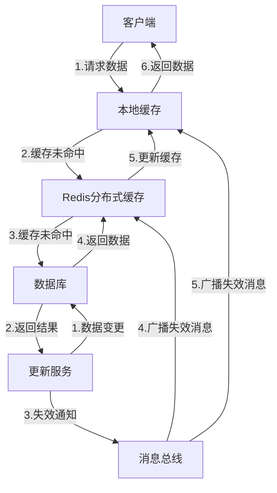
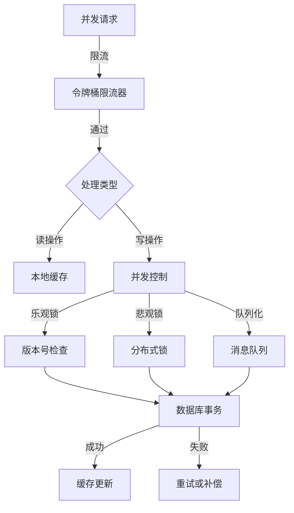

# GoMall 分布式缓存与并发问题解决方案

> GoMall 作为一个高性能电商微服务平台，在处理高并发请求和大规模数据时，必须有效地利用分布式缓存和解决并发问题。本文档详细分析了 GoMall 项目中分布式缓存的使用策略、缓存一致性维护方法以及并发问题的解决方案，旨在提供一个全面的技术参考，帮助开发者理解和优化系统性能。

## 1. 分布式缓存架构

> GoMall 采用多层次的分布式缓存架构，以 Redis 集群为核心，结合本地缓存和数据库，形成了一个高效、可靠且一致的数据访问层，有效支撑了系统的高并发需求。

### 1.1 Redis 集群配置

GoMall 项目使用 Redis 集群作为主要的分布式缓存解决方案，具有以下特点：

- **主从复制**：采用 Redis 主从架构，确保数据高可用性
- **哨兵机制**：使用 Redis Sentinel 监控实例健康状态，自动故障转移
- **分片策略**：基于一致性哈希算法的数据分片，提高扩展性

```go
// Redis集群配置示例
type RedisClusterConfig struct {
    Addresses    []string      // Redis节点地址列表
    Password     string        // 认证密码
    PoolSize     int           // 连接池大小
    MinIdleConns int           // 最小空闲连接数
    IdleTimeout  time.Duration // 空闲连接超时时间
    MaxRetries   int           // 最大重试次数
}

// 初始化Redis集群客户端
func initRedisCluster() *redis.ClusterClient {
    return redis.NewClusterClient(&redis.ClusterOptions{
        Addrs:        config.Redis.Addresses,
        Password:     config.Redis.Password,
        PoolSize:     config.Redis.PoolSize,
        MinIdleConns: config.Redis.MinIdleConns,
        IdleTimeout:  config.Redis.IdleTimeout,
        MaxRetries:   config.Redis.MaxRetries,
    })
}
```

### 1.2 缓存分层策略

GoMall 采用多层次缓存策略，平衡性能与一致性：



- **本地缓存层**：使用内存缓存（如 go-cache）存储热点数据，减少网络开销
- **分布式缓存层**：Redis 集群存储共享数据，支持跨服务访问
- **持久化层**：MySQL 数据库作为最终数据源

### 1.3 数据一致性保障

在分布式环境中，GoMall 通过以下机制保障缓存数据一致性：

- **缓存更新策略**：采用"先更新数据库，再删除缓存"的模式
- **消息总线通知**：使用 Kafka 发布缓存失效消息，确保跨服务一致性
- **过期时间控制**：为不同类型的数据设置合理的 TTL（存活时间）
- **版本号机制**：关键数据使用版本号标记，避免缓存更新冲突

````go
// 缓存一致性示例：更新商品信息
func UpdateProduct(ctx context.Context, product *model.Product) error {
    // 1. 开始数据库事务
    tx, err := db.BeginTx(ctx, nil)
    if err != nil {
        return err
    }

    // 2. 更新数据库
    err = productRepo.UpdateWithTx(tx, product)
    if err != nil {
        tx.Rollback()
        return err
    }

    // 3. 提交事务
    if err = tx.Commit(); err != nil {
        return err
    }

    // 4. 发布缓存失效消息
    cacheInvalidationMsg := &message.CacheInvalidation{
        Key:       fmt.Sprintf("product:%d", product.ID),
        Timestamp: time.Now().UnixNano(),
    }

    err = kafkaProducer.PublishMessage(ctx, "cache_invalidation", cacheInvalidationMsg)
    if err != nil {
        log.Errorf("Failed to publish cache invalidation message: %v", err)
        // 继续执行，不影响主流程
    }

    // 5. 直接删除本地Redis缓存
    cacheKey := fmt.Sprintf("product:%d", product.ID)
    err = redisClient.Del(ctx, cacheKey).Err()
    if err != nil {
        log.Warnf("Failed to delete product cache: %v", err)
        // 继续执行，消息总线会保证最终一致性
    }

    return nil
}

## 2. 并发问题与解决方案

> GoMall 作为高并发系统，面临着多种并发场景的挑战，通过分布式锁、乐观并发控制和事务隔离等多种机制，有效地解决了数据竞争、超卖和死锁等并发问题。

### 2.1 分布式锁实现

在分布式环境中，GoMall 使用 Redis 实现了高效的分布式锁机制：

```go
// 基于Redis的分布式锁实现
type RedisLock struct {
    redisClient *redis.Client
    key         string
    value       string
    expiration  time.Duration
}

// 尝试获取锁
func (l *RedisLock) TryLock(ctx context.Context) (bool, error) {
    // 使用SET NX命令实现锁操作
    result, err := l.redisClient.SetNX(ctx, l.key, l.value, l.expiration).Result()
    if err != nil {
        return false, fmt.Errorf("failed to acquire lock: %w", err)
    }
    return result, nil
}

// 释放锁（使用Lua脚本确保原子性）
func (l *RedisLock) Unlock(ctx context.Context) error {
    script := `
    if redis.call("GET", KEYS[1]) == ARGV[1] then
        return redis.call("DEL", KEYS[1])
    else
        return 0
    end`

    result, err := l.redisClient.Eval(ctx, script, []string{l.key}, l.value).Result()
    if err != nil {
        return fmt.Errorf("failed to release lock: %w", err)
    }

    if result.(int64) == 0 {
        return fmt.Errorf("lock was already released or owned by another process")
    }

    return nil
}

// 创建分布式锁的工厂函数
func NewRedisLock(client *redis.Client, key string, expiration time.Duration) *RedisLock {
    return &RedisLock{
        redisClient: client,
        key:         fmt.Sprintf("lock:%s", key),
        value:       uuid.New().String(), // 使用UUID作为锁的值，确保唯一性
        expiration:  expiration,
    }
}
````

GoMall 在以下场景中使用分布式锁：

- **库存操作**：防止超卖问题
- **订单创建**：确保订单号唯一性
- **定时任务**：防止任务重复执行
- **秒杀活动**：控制并发请求

### 2.2 乐观锁与悲观锁策略

GoMall 根据不同业务场景，灵活使用乐观锁和悲观锁策略：

- **乐观锁**：适用于读多写少的场景，如商品详情页

  ```go
  // 使用版本号实现乐观锁
  func UpdateProductWithOptimisticLock(ctx context.Context, product *model.Product) error {
      // 查询当前版本
      currentProduct, err := productRepo.GetByID(ctx, product.ID)
      if err != nil {
          return err
      }

      // 检查版本号
      if product.Version != currentProduct.Version {
          return errors.New("product has been modified by another transaction")
      }

      // 更新版本号
      product.Version++

      // 执行更新，WHERE条件包含版本号
      result, err := db.ExecContext(ctx,
          "UPDATE products SET name=?, price=?, stock=?, version=? WHERE id=? AND version=?",
          product.Name, product.Price, product.Stock, product.Version, product.ID, product.Version-1)
      if err != nil {
          return err
      }

      affected, err := result.RowsAffected()
      if err != nil {
          return err
      }

      if affected == 0 {
          return errors.New("update failed due to concurrent modification")
      }

      // 删除缓存
      cacheKey := fmt.Sprintf("product:%d", product.ID)
      redisClient.Del(ctx, cacheKey)

      return nil
  }
  ```

- **悲观锁**：适用于写多读少的场景，如库存扣减
  ```go
  // 使用行锁实现悲观锁
  func DeductInventoryWithPessimisticLock(ctx context.Context, productID int64, quantity int) error {
      // 开始事务
      tx, err := db.BeginTx(ctx, &sql.TxOptions{Isolation: sql.LevelRepeatableRead})
      if err != nil {
          return err
      }
      defer tx.Rollback()

      // 查询并锁定行
      var stock int
      err = tx.QueryRowContext(ctx, "SELECT stock FROM products WHERE id = ? FOR UPDATE", productID).Scan(&stock)
      if err != nil {
          return err
      }

      // 检查库存
      if stock < quantity {
          return errors.New("insufficient stock")
      }

      // 扣减库存
      _, err = tx.ExecContext(ctx, "UPDATE products SET stock = stock - ? WHERE id = ?", quantity, productID)
      if err != nil {
          return err
      }

      // 提交事务
      if err = tx.Commit(); err != nil {
          return err
      }

      // 删除缓存
      cacheKey := fmt.Sprintf("product:%d", productID)
      redisClient.Del(ctx, cacheKey)

      return nil
  }
  ```

### 2.3 并发控制模式

GoMall 实现了多种并发控制模式，以应对不同的业务场景：



- **限流控制**：使用令牌桶算法限制并发请求数
- **读写分离**：读操作使用缓存，写操作使用并发控制
- **队列化处理**：高并发写入通过消息队列串行化处理
- **分段锁**：根据数据 ID 分段加锁，减少锁竞争

## 3. 缓存使用场景

> GoMall 项目中分布式缓存的应用场景广泛，从用户会话管理到商品数据缓存，再到热点数据处理，每个场景都有针对性的缓存策略和实现方式。

### 3.1 用户会话管理

GoMall 使用 Redis 作为会话存储，实现了高效的用户认证和状态管理：

```go
// 会话管理配置
func InitSession(h *server.Hertz) {
    store, err := redis.NewStore(10, "tcp", config.Redis.Address, config.Redis.Password, []byte("your-session-secret-key"))
    if err != nil {
        log.Fatal("Failed to initialize session store: ", err)
    }

    // 设置会话配置
    store.Options(sessions.Options{
        Path:     "/",
        MaxAge:   86400, // 1天
        HttpOnly: true,
        Secure:   config.IsProduction,
    })

    h.Use(sessions.New("hertz-session", store))
}
```

GoMall 采用混合状态管理策略：

- **JWT + Redis**：使用 JWT 进行无状态身份验证，Redis 存储黑名单
- **HTTP-Only Cookie**：安全传递令牌，防止 XSS 攻击
- **分布式会话**：支持多服务器间的会话共享

### 3.2 商品数据缓存

商品数据是电商系统中最频繁访问的数据之一，GoMall 针对商品数据设计了多级缓存策略：

```go
// 获取商品详情（多级缓存）
func GetProductDetail(ctx context.Context, productID int64) (*model.ProductDetail, error) {
    cacheKey := fmt.Sprintf("product:detail:%d", productID)

    // 1. 尝试从本地缓存获取
    if cachedProduct, found := localCache.Get(cacheKey); found {
        return cachedProduct.(*model.ProductDetail), nil
    }

    // 2. 尝试从Redis获取
    productJSON, err := redisClient.Get(ctx, cacheKey).Result()
    if err == nil {
        var product model.ProductDetail
        if err := json.Unmarshal([]byte(productJSON), &product); err == nil {
            // 更新本地缓存
            localCache.Set(cacheKey, &product, 5*time.Minute)
            return &product, nil
        }
    }

    // 3. 从数据库获取
    product, err := productRepo.GetDetailByID(ctx, productID)
    if err != nil {
        return nil, err
    }

    // 4. 更新Redis缓存
    productJSON, _ = json.Marshal(product)
    redisClient.Set(ctx, cacheKey, productJSON, 30*time.Minute)

    // 5. 更新本地缓存
    localCache.Set(cacheKey, product, 5*time.Minute)

    return product, nil
}
```

商品数据缓存策略：

- **热门商品**：更长的缓存时间，主动预热
- **新品上架**：较短的缓存时间，确保数据新鲜度
- **促销商品**：设置精确的过期时间，与活动同步

### 3.3 热点数据处理

对于秒杀、促销等场景下的热点数据，GoMall 采用特殊的缓存策略：

```go
// 秒杀商品库存预热
func PrewarmFlashSaleStock(ctx context.Context, flashSaleID int64) error {
    // 1. 获取秒杀活动信息
    flashSale, err := flashSaleRepo.GetByID(ctx, flashSaleID)
    if err != nil {
        return err
    }

    // 2. 获取所有秒杀商品
    products, err := flashSaleRepo.GetProducts(ctx, flashSaleID)
    if err != nil {
        return err
    }

    // 3. 将库存数据预热到Redis
    pipe := redisClient.Pipeline()
    for _, product := range products {
        stockKey := fmt.Sprintf("flashsale:stock:%d:%d", flashSaleID, product.ID)
        pipe.Set(ctx, stockKey, product.Stock, time.Duration(flashSale.EndTime-time.Now().Unix())*time.Second)
    }

    _, err = pipe.Exec(ctx)
    return err
}

// 秒杀减库存（完全基于Redis）
func DeductFlashSaleStock(ctx context.Context, flashSaleID, productID int64) (bool, error) {
    stockKey := fmt.Sprintf("flashsale:stock:%d:%d", flashSaleID, productID)

    // 使用Lua脚本保证原子性
    script := `
    local stock = redis.call("GET", KEYS[1])
    if stock and tonumber(stock) > 0 then
        redis.call("DECR", KEYS[1])
        return 1
    else
        return 0
    end`

    result, err := redisClient.Eval(ctx, script, []string{stockKey}).Result()
    if err != nil {
        return false, err
    }

    // 异步同步到数据库
    if result.(int64) == 1 {
        go syncStockToDatabase(flashSaleID, productID)
        return true, nil
    }

    return false, nil
}
```

热点数据处理策略：

- **全量缓存**：热点数据完全加载到缓存，避免数据库访问
- **本地缓存**：极热点数据复制到本地内存，减少网络开销
- **过期策略**：根据活动时间设置精确的过期时间
- **异步同步**：使用消息队列异步更新数据库

## 4. 缓存一致性维护

> 在分布式环境中，缓存一致性是一个核心挑战。GoMall 通过精心设计的缓存更新策略、失效机制和防护措施，有效地解决了缓存穿透、击穿和雪崩等问题，保障了数据的一致性和系统的稳定性。

### 4.1 缓存更新策略

GoMall 根据不同场景采用不同的缓存更新策略：

1. **Cache-Aside 模式**：最常用的模式，先更新数据库，再删除缓存

   ```go
   func UpdateData(ctx context.Context, key string, data interface{}) error {
       // 1. 更新数据库
       if err := repository.Update(ctx, key, data); err != nil {
           return err
       }

       // 2. 删除缓存
       cacheKey := fmt.Sprintf("data:%s", key)
       return redisClient.Del(ctx, cacheKey).Err()
   }
   ```

2. **Write-Through 模式**：适用于写入频率较高的场景

   ```go
   func WriteThrough(ctx context.Context, key string, data interface{}) error {
       // 1. 更新数据库
       if err := repository.Update(ctx, key, data); err != nil {
           return err
       }

       // 2. 更新缓存
       cacheKey := fmt.Sprintf("data:%s", key)
       dataJSON, _ := json.Marshal(data)
       return redisClient.Set(ctx, cacheKey, dataJSON, 30*time.Minute).Err()
   }
   ```

3. **Write-Behind 模式**：适用于高并发写入场景
   ```go
   func WriteBehind(ctx context.Context, key string, data interface{}) error {
       // 1. 更新缓存
       cacheKey := fmt.Sprintf("data:%s", key)
       dataJSON, _ := json.Marshal(data)
       if err := redisClient.Set(ctx, cacheKey, dataJSON, 30*time.Minute).Err(); err != nil {
           return err
       }

       // 2. 异步更新数据库
       dataMsg := &message.DataUpdate{
           Key:  key,
           Data: dataJSON,
       }
       return kafkaProducer.PublishMessage(ctx, "data_updates", dataMsg)
   }
   ```

### 4.2 缓存失效机制

GoMall 实现了多种缓存失效机制，确保数据一致性：

1. **基于时间的过期策略**：为不同类型的数据设置合适的 TTL
2. **主动失效**：数据更新时主动删除或更新缓存
3. **消息总线通知**：通过 Kafka 广播缓存失效消息

```go
// 缓存失效监听器
func StartCacheInvalidationListener() {
    consumer := kafka.NewConsumer(&kafka.ConfigMap{
        "bootstrap.servers":  config.Kafka.Brokers,
        "group.id":          "cache_invalidation_group",
        "auto.offset.reset": "earliest",
    })

    consumer.SubscribeTopics([]string{"cache_invalidation"}, nil)

    for {
        msg, err := consumer.ReadMessage(-1)
        if err != nil {
            log.Errorf("Error reading message: %v", err)
            continue
        }

        var invalidation message.CacheInvalidation
        if err := json.Unmarshal(msg.Value, &invalidation); err != nil {
            log.Errorf("Error unmarshaling message: %v", err)
            continue
        }

        // 删除本地缓存
        localCache.Delete(invalidation.Key)

        // 删除Redis缓存
        redisClient.Del(context.Background(), invalidation.Key)

        log.Infof("Cache invalidated: %s", invalidation.Key)
    }
}
```

### 4.3 缓存穿透、击穿与雪崩防护

GoMall 实现了完善的缓存防护机制：

1. **缓存穿透防护**：使用布隆过滤器和空值缓存

   ```go
   // 使用布隆过滤器防止缓存穿透
   var productIDFilter *bloom.BloomFilter

   // 初始化布隆过滤器
   func initProductBloomFilter(ctx context.Context) {
       // 创建布隆过滤器
       productIDFilter = bloom.NewWithEstimates(1000000, 0.01)

       // 加载所有商品ID
       productIDs, err := productRepo.GetAllIDs(ctx)
       if err != nil {
           log.Errorf("Failed to load product IDs: %v", err)
           return
       }

       // 将ID添加到过滤器
       for _, id := range productIDs {
           productIDFilter.Add([]byte(fmt.Sprintf("%d", id)))
       }

       log.Info("Product bloom filter initialized")
   }

   // 获取商品时使用布隆过滤器
   func GetProduct(ctx context.Context, productID int64) (*model.Product, error) {
       // 检查ID是否可能存在
       if !productIDFilter.Test([]byte(fmt.Sprintf("%d", productID))) {
           return nil, errors.New("product not found")
       }

       // 继续正常的缓存和数据库查询...
   }
   ```

2. **缓存击穿防护**：使用互斥锁和热点数据预热

   ```go
   // 使用互斥锁防止缓存击穿
   var hotKeyMutex sync.Map

   func GetDataWithMutex(ctx context.Context, key string) (interface{}, error) {
       cacheKey := fmt.Sprintf("data:%s", key)

       // 尝试从缓存获取
       data, err := redisClient.Get(ctx, cacheKey).Result()
       if err == nil {
           return data, nil
       }

       // 缓存未命中，使用互斥锁
       lockKey := fmt.Sprintf("mutex:%s", key)

       // 获取或创建互斥锁
       actual, _ := hotKeyMutex.LoadOrStore(lockKey, &sync.Mutex{})
       mutex := actual.(*sync.Mutex)

       mutex.Lock()
       defer mutex.Unlock()

       // 双重检查，可能其他协程已经加载了数据
       data, err = redisClient.Get(ctx, cacheKey).Result()
       if err == nil {
           return data, nil
       }

       // 从数据库加载
       result, err := repository.Get(ctx, key)
       if err != nil {
           return nil, err
       }

       // 更新缓存
       dataJSON, _ := json.Marshal(result)
       redisClient.Set(ctx, cacheKey, dataJSON, 30*time.Minute)

       return result, nil
   }
   ```

3. **缓存雪崩防护**：使用随机过期时间和熔断机制
   ```go
   // 使用随机过期时间防止缓存雪崩
   func setWithJitter(ctx context.Context, key string, value interface{}, ttl time.Duration) error {
       // 添加随机抖动，避免同时过期
       jitter := time.Duration(rand.Int63n(int64(ttl / 10)))
       expiration := ttl + jitter

       valueJSON, _ := json.Marshal(value)
       return redisClient.Set(ctx, key, valueJSON, expiration).Err()
   }
   ```

## 5. 性能优化

> GoMall 通过精细的连接池管理、高效的序列化选择和全面的监控告警系统，不断优化缓存和并发处理的性能，确保系统在高负载下仍能保持稳定和高效。

### 5.1 连接池管理

GoMall 通过精细的连接池管理，优化了与 Redis 的交互性能：

```go
// Redis连接池配置
func initRedisPool() *redis.Client {
    return redis.NewClient(&redis.Options{
        Addr:         config.Redis.Address,
        Password:     config.Redis.Password,
        DB:           0,
        PoolSize:     config.Redis.PoolSize,        // 连接池大小
        MinIdleConns: config.Redis.MinIdleConns,    // 最小空闲连接数
        MaxConnAge:   config.Redis.MaxConnAge,      // 连接最大存活时间
        PoolTimeout:  config.Redis.PoolTimeout,     // 连接池超时时间
        IdleTimeout:  config.Redis.IdleTimeout,     // 空闲连接超时时间
        DialTimeout:  config.Redis.DialTimeout,     // 连接超时时间
        ReadTimeout:  config.Redis.ReadTimeout,     // 读取超时时间
        WriteTimeout: config.Redis.WriteTimeout,    // 写入超时时间
    })
}
```

连接池优化策略：

- **动态调整**：根据系统负载动态调整连接池大小
- **健康检查**：定期检查连接健康状态，及时关闭异常连接
- **监控指标**：实时监控连接池使用情况，包括活跃连接数、等待时间等

### 5.2 序列化选择

GoMall 针对不同场景选择了最适合的序列化方式：

```go
// 使用Protocol Buffers序列化
func serializeWithProtobuf(product *model.Product) ([]byte, error) {
    return proto.Marshal(product.ToProto())
}

// 使用JSON序列化
func serializeWithJSON(product *model.Product) ([]byte, error) {
    return json.Marshal(product)
}

// 使用MessagePack序列化
func serializeWithMsgPack(product *model.Product) ([]byte, error) {
    return msgpack.Marshal(product)
}
```

序列化策略：

- **Protocol Buffers**：用于服务间通信，体积小、解析快
- **JSON**：用于与前端交互和可读性要求高的场景
- **MessagePack**：用于缓存存储，兼顾性能和灵活性

### 5.3 监控与告警

GoMall 建立了全面的监控和告警系统，确保缓存和并发问题能够被及时发现和处理：

```go
// 缓存监控指标
type CacheMetrics struct {
    HitCount        prometheus.Counter
    MissCount       prometheus.Counter
    ErrorCount      prometheus.Counter
    LatencyHistogram prometheus.Histogram
    KeysCount       prometheus.Gauge
    ExpiredCount    prometheus.Counter
    EvictedCount    prometheus.Counter
}

// 初始化缓存监控
func initCacheMonitoring() *CacheMetrics {
    metrics := &CacheMetrics{
        HitCount: prometheus.NewCounter(prometheus.CounterOpts{
            Name: "cache_hit_total",
            Help: "Total number of cache hits",
        }),
        MissCount: prometheus.NewCounter(prometheus.CounterOpts{
            Name: "cache_miss_total",
            Help: "Total number of cache misses",
        }),
        // 其他指标初始化...
    }

    // 注册指标
    prometheus.MustRegister(metrics.HitCount)
    prometheus.MustRegister(metrics.MissCount)
    // 注册其他指标...

    return metrics
}

// 使用监控的缓存获取函数
func GetProductWithMonitoring(ctx context.Context, productID int64) (*model.Product, error) {
    cacheKey := fmt.Sprintf("product:%d", productID)
    startTime := time.Now()

    // 尝试从缓存获取
    productJSON, err := redisClient.Get(ctx, cacheKey).Result()
    latency := time.Since(startTime)
    cacheMetrics.LatencyHistogram.Observe(latency.Seconds())

    if err == nil {
        // 缓存命中
        cacheMetrics.HitCount.Inc()
        var product model.Product
        if err := json.Unmarshal([]byte(productJSON), &product); err != nil {
            cacheMetrics.ErrorCount.Inc()
            return nil, err
        }
        return &product, nil
    }

    if err != redis.Nil {
        // 缓存错误
        cacheMetrics.ErrorCount.Inc()
        log.Errorf("Redis error: %v", err)
    } else {
        // 缓存未命中
        cacheMetrics.MissCount.Inc()
    }

    // 从数据库获取
    product, err := productRepo.GetByID(ctx, productID)
    if err != nil {
        return nil, err
    }

    // 更新缓存
    productJSON, _ = json.Marshal(product)
    redisClient.Set(ctx, cacheKey, productJSON, 30*time.Minute)

    return product, nil
}
```

监控与告警策略：

- **关键指标**：缓存命中率、延迟、错误率、连接池状态
- **异常检测**：使用统计算法检测异常模式，如突发的缓存未命中
- **分级告警**：根据问题严重程度设置不同级别的告警
- **自动恢复**：对于某些可自动处理的问题实现自动恢复机制

## 6. 最佳实践

> GoMall 项目在长期实践中总结了一系列分布式缓存和并发处理的最佳实践，这些经验可以帮助开发者避免常见陷阱，构建更加健壮和高效的系统。

### 6.1 缓存使用原则

1. **合理设置过期时间**

   - 根据数据更新频率设置过期时间
   - 热点数据设置较长过期时间，并主动更新
   - 敏感数据设置较短过期时间，确保安全性

2. **避免缓存雪崩**

   - 为相同类型的缓存设置随机过期时间
   - 实现缓存预热机制，避免冷启动问题
   - 使用多级缓存策略，降低单点故障影响

3. **缓存键设计**
   - 使用统一的命名规范，如 `{业务}:{类型}:{ID}`
   - 避免过长的键名，增加网络传输和存储开销
   - 考虑键的分布性，避免 Redis 集群中的热点问题

```go
// 缓存键生成器
func generateCacheKey(business, objectType string, id interface{}) string {
    return fmt.Sprintf("%s:%s:%v", business, objectType, id)
}

// 示例使用
productKey := generateCacheKey("product", "detail", productID)
userKey := generateCacheKey("user", "profile", userID)
orderKey := generateCacheKey("order", "status", orderID)
```

### 6.2 并发处理最佳实践

1. **选择合适的锁策略**

   - 读多写少场景：优先使用乐观锁
   - 写多读少场景：考虑使用悲观锁
   - 高并发写入场景：考虑使用队列或消息驱动模式

2. **避免死锁**

   - 设置锁超时时间，防止永久阻塞
   - 使用统一的加锁顺序，避免循环等待
   - 实现锁监控，及时发现异常持锁情况

3. **减少锁粒度**
   - 使用分段锁减少锁竞争
   - 只锁定必要的代码段，减少锁持有时间
   - 使用无锁数据结构，如原子操作、CAS 等

```go
// 分段锁示例
type SegmentedLock struct {
    locks []*sync.Mutex
    mask  uint32
}

func NewSegmentedLock(segments int) *SegmentedLock {
    // 确保segments是2的幂
    segments = nextPowerOfTwo(segments)
    locks := make([]*sync.Mutex, segments)
    for i := 0; i < segments; i++ {
        locks[i] = &sync.Mutex{}
    }
    return &SegmentedLock{
        locks: locks,
        mask:  uint32(segments - 1),
    }
}

func (sl *SegmentedLock) Lock(key string) *sync.Mutex {
    // 使用哈希算法选择锁
    h := fnv32(key)
    index := h & sl.mask
    mutex := sl.locks[index]
    mutex.Lock()
    return mutex
}

func (sl *SegmentedLock) Unlock(mutex *sync.Mutex) {
    mutex.Unlock()
}

// FNV-1a哈希算法
func fnv32(key string) uint32 {
    hash := uint32(2166136261)
    for i := 0; i < len(key); i++ {
        hash ^= uint32(key[i])
        hash *= 16777619
    }
    return hash
}

// 获取下一个2的幂
func nextPowerOfTwo(n int) int {
    if n <= 1 {
        return 1
    }
    n--
    n |= n >> 1
    n |= n >> 2
    n |= n >> 4
    n |= n >> 8
    n |= n >> 16
    return n + 1
}
```

### 6.3 常见问题处理

1. **缓存与数据库一致性问题**

   - 采用"先更新数据库，再删除缓存"的模式
   - 使用消息队列确保最终一致性
   - 实现定时任务检查并修复不一致数据

2. **热点数据处理**

   - 使用多级缓存减轻热点压力
   - 实现请求合并（Request Coalescing）
   - 考虑数据分片，将热点数据分散到多个节点

3. **缓存穿透问题**
   - 使用布隆过滤器过滤不存在的 ID
   - 缓存空值（但设置较短的过期时间）
   - 实现请求限流，防止恶意攻击

## 7. 总结

> GoMall 项目通过合理使用分布式缓存和有效解决并发问题，成功构建了一个高性能、高可用的电商微服务平台。本文档详细介绍了项目中的缓存架构、并发控制策略、一致性维护方法和性能优化措施，为开发者提供了全面的技术参考。

GoMall 项目在分布式缓存和并发处理方面的核心经验：

1. **多层次缓存架构**：结合本地缓存和分布式缓存，平衡性能与一致性
2. **灵活的并发控制**：根据业务场景选择合适的锁策略和并发模式
3. **完善的一致性机制**：通过消息总线和失效通知确保缓存一致性
4. **全面的防护措施**：有效应对缓存穿透、击穿和雪崩等问题
5. **持续的性能优化**：通过连接池管理、序列化选择和监控系统不断提升性能

通过这些技术和实践，GoMall 项目成功支撑了高并发访问和大规模数据处理需求，为用户提供了流畅、可靠的电商体验。
