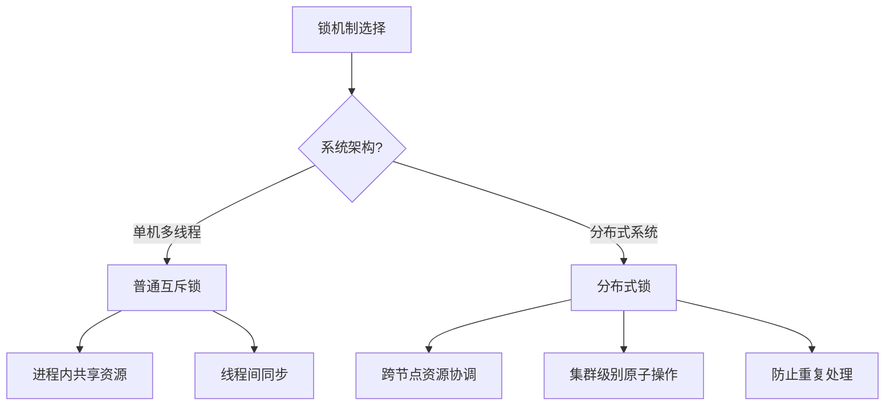

# 分布式锁和普通互斥锁的区别与联系

> 在现代分布式系统和微服务架构中，并发控制是一个核心挑战。本文档详细分析了分布式锁和普通互斥锁的定义、特点、应用场景以及在 GoMall 项目中的具体实现，旨在帮助开发者理解它们的区别与联系，从而在适当的场景下选择合适的锁机制，确保系统的数据一致性和高性能。

## 1. 基本概念与定义

> 分布式锁和普通互斥锁都是为了解决并发访问共享资源的问题，但它们的应用场景、实现机制和性能特点有着本质区别。普通互斥锁主要用于单机多线程环境，而分布式锁则用于跨节点的分布式环境。

### 1.1 普通互斥锁的定义与特点

**普通互斥锁（Mutex Lock）** 是一种在单机多线程环境下用于控制对共享资源访问的同步原语，具有以下特点：

- **作用范围**：仅限于单个进程内部或单台服务器上的多个线程
- **实现机制**：基于操作系统提供的线程同步原语（如 futex）
- **性能特点**：低延迟、低开销、高效率
- **状态保存**：锁状态保存在进程内存中

```go
// Go 中的普通互斥锁示例
type Counter struct {
    mu    sync.Mutex
    value int
}

func (c *Counter) Increment() {
    c.mu.Lock()
    defer c.mu.Unlock()
    c.value++
}
```

### 1.2 分布式锁的定义与特点

**分布式锁（Distributed Lock）** 是一种在分布式系统中用于协调多个节点对共享资源访问的同步机制，具有以下特点：

- **作用范围**：跨进程、跨服务器、跨数据中心
- **实现机制**：基于分布式协调服务（如 Redis、ZooKeeper、etcd）
- **性能特点**：相对较高延迟、较大开销
- **状态保存**：锁状态保存在外部存储系统中

```go
// 基于 Redis 的分布式锁示例
func AcquireLock(ctx context.Context, redisClient *redis.Client, lockKey string, lockValue string, expiration time.Duration) (bool, error) {
    return redisClient.SetNX(ctx, lockKey, lockValue, expiration).Result()
}

func ReleaseLock(ctx context.Context, redisClient *redis.Client, lockKey string, lockValue string) (bool, error) {
    script := redis.NewScript(`
        if redis.call("get", KEYS[1]) == ARGV[1] then
            return redis.call("del", KEYS[1])
        else
            return 0
        end
    `)
    result, err := script.Run(ctx, redisClient, []string{lockKey}, lockValue).Result()
    return result == int64(1), err
}
```

## 2. 核心区别对比

> 分布式锁和普通互斥锁在多个维度上存在显著差异，包括适用场景、实现原理、性能特性和可靠性保障等方面。理解这些区别对于选择合适的锁机制至关重要。

### 2.1 适用场景对比



| 场景特征 | 普通互斥锁 | 分布式锁 |
|---------|-----------|---------|
| **系统架构** | 单机多线程 | 分布式多节点 |
| **资源位置** | 进程内存或本地资源 | 共享数据库、文件系统或服务 |
| **并发类型** | 线程级并发 | 进程级、服务级并发 |
| **典型应用** | 内存数据结构保护 | 分布式事务、任务调度、幂等性保证 |

### 2.2 实现原理对比

**普通互斥锁实现原理**：
- 基于 CPU 原子指令（如 CAS）
- 操作系统提供的同步原语
- 锁状态在进程内存中维护

**分布式锁实现原理**：
- 基于共享存储系统的原子操作
- 依赖外部协调服务
- 通常需要租约机制（超时自动释放）
- 可能需要额外的活性检测（心跳）

### 2.3 性能与可靠性对比

| 特性 | 普通互斥锁 | 分布式锁 |
|------|-----------|---------|
| **获取锁延迟** | 微秒级 | 毫秒级 |
| **系统开销** | 极低 | 较高（网络通信） |
| **死锁风险** | 存在（需编程避免） | 较低（通常有超时机制） |
| **故障恢复** | 进程崩溃锁丢失 | 可持久化，支持故障恢复 |
| **活锁问题** | 较少 | 需特别关注（网络分区） |
| **一致性保证** | 强一致性 | 取决于实现（可能是最终一致性） |

## 3. GoMall 中的锁机制应用

> GoMall 项目采用了混合锁策略，在不同场景下选择合适的锁机制，既保证了数据一致性，又兼顾了系统性能。普通互斥锁主要用于单服务内部的并发控制，而分布式锁则用于跨服务的协调。

### 3.1 普通互斥锁应用场景

在 GoMall 中，普通互斥锁主要用于以下场景：

- **内存缓存保护**：保护服务内部的缓存数据结构
- **连接池管理**：数据库连接池、HTTP 客户端池的并发访问控制
- **本地计数器**：限流器、性能指标收集等

```go
// GoMall 中的权限服务使用互斥锁示例
type PermissionService struct {
    enforcer *casbin.Enforcer
    mu       sync.RWMutex
}

func (s *PermissionService) AddPolicy(ctx context.Context, req *permission.AddPolicyRequest) (*permission.AddPolicyResponse, error) {
    s.mu.Lock()
    defer s.mu.Unlock()
    
    // 添加权限策略...
    success, err := s.enforcer.AddPolicy(req.Sub, req.Obj, req.Act)
    if err != nil {
        return nil, err
    }
    
    return &permission.AddPolicyResponse{Success: success}, nil
}
```

### 3.2 分布式锁应用场景

在 GoMall 中，分布式锁主要用于以下场景：

- **订单处理**：防止订单重复处理
- **库存管理**：保证库存扣减的原子性
- **定时任务**：确保定时任务在集群中只执行一次
- **分布式事务**：协调跨服务事务的执行

```go
// GoMall 中基于 Redis 的分布式锁实现示例
func ProcessOrder(ctx context.Context, orderID string) error {
    // 生成唯一锁值（用于安全释放锁）
    lockValue := uuid.New().String()
    
    // 尝试获取锁
    lockKey := fmt.Sprintf("order_lock:%s", orderID)
    acquired, err := redisClient.SetNX(ctx, lockKey, lockValue, 30*time.Second).Result()
    if err != nil {
        return fmt.Errorf("获取锁失败: %w", err)
    }
    
    if !acquired {
        return fmt.Errorf("订单正在处理中，请稍后再试")
    }
    
    // 确保释放锁
    defer func() {
        script := redis.NewScript(`
            if redis.call("get", KEYS[1]) == ARGV[1] then
                return redis.call("del", KEYS[1])
            else
                return 0
            end
        `)
        script.Run(ctx, redisClient, []string{lockKey}, lockValue)
    }()
    
    // 处理订单逻辑...
    
    return nil
}
```

## 4. 分布式锁的实现方案

> 分布式锁有多种实现方案，每种方案都有其优缺点和适用场景。GoMall 项目根据不同的业务需求，选择了合适的分布式锁实现方案。

### 4.1 基于 Redis 的分布式锁

**优点**：
- 性能高，延迟低
- 实现简单
- 与 GoMall 现有 Redis 基础设施集成方便

**缺点**：
- 在网络分区情况下可能出现安全性问题
- 单点 Redis 存在可用性风险

**实现方式**：
1. **获取锁**：使用 `SET key value NX PX milliseconds` 命令
2. **释放锁**：使用 Lua 脚本确保原子性释放
3. **锁续期**：使用后台线程定期延长锁过期时间

```go
// Redis 分布式锁的增强实现（带自动续期）
type RedisLock struct {
    redisClient *redis.Client
    key         string
    value       string
    expiration  time.Duration
    stopCh      chan struct{}
}

func NewRedisLock(client *redis.Client, key string, expiration time.Duration) *RedisLock {
    return &RedisLock{
        redisClient: client,
        key:         key,
        value:       uuid.New().String(),
        expiration:  expiration,
        stopCh:      make(chan struct{}),
    }
}

func (l *RedisLock) Acquire(ctx context.Context) (bool, error) {
    acquired, err := l.redisClient.SetNX(ctx, l.key, l.value, l.expiration).Result()
    if err != nil || !acquired {
        return acquired, err
    }
    
    // 启动自动续期
    go l.autoRenew(ctx)
    
    return true, nil
}

func (l *RedisLock) Release(ctx context.Context) (bool, error) {
    // 停止自动续期
    close(l.stopCh)
    
    script := redis.NewScript(`
        if redis.call("get", KEYS[1]) == ARGV[1] then
            return redis.call("del", KEYS[1])
        else
            return 0
        end
    `)
    result, err := script.Run(ctx, l.redisClient, []string{l.key}, l.value).Result()
    return result == int64(1), err
}

func (l *RedisLock) autoRenew(ctx context.Context) {
    ticker := time.NewTicker(l.expiration / 3)
    defer ticker.Stop()
    
    for {
        select {
        case <-ticker.C:
            script := redis.NewScript(`
                if redis.call("get", KEYS[1]) == ARGV[1] then
                    return redis.call("pexpire", KEYS[1], ARGV[2])
                else
                    return 0
                end
            `)
            script.Run(ctx, l.redisClient, []string{l.key}, l.value, int(l.expiration/time.Millisecond))
        case <-l.stopCh:
            return
        case <-ctx.Done():
            return
        }
    }
}
```

### 4.2 基于 etcd 的分布式锁

**优点**：
- 强一致性（基于 Raft 协议）
- 内置租约机制
- 支持监听锁状态变化

**缺点**：
- 相对 Redis 性能较低
- 部署和维护成本较高

**实现方式**：
1. **获取锁**：使用 etcd 的事务操作创建键
2. **释放锁**：删除对应的键
3. **自动续期**：使用 etcd 的租约机制

```go
// etcd 分布式锁实现示例
func AcquireEtcdLock(ctx context.Context, client *clientv3.Client, lockKey string, leaseSeconds int64) (*clientv3.LeaseGrantResponse, error) {
    // 创建租约
    lease, err := client.Grant(ctx, leaseSeconds)
    if err != nil {
        return nil, err
    }
    
    // 尝试获取锁
    _, err = client.Txn(ctx).
        If(clientv3.Compare(clientv3.CreateRevision(lockKey), "=", 0)).
        Then(clientv3.OpPut(lockKey, "", clientv3.WithLease(lease.ID))).
        Commit()
    
    if err != nil {
        return nil, err
    }
    
    return lease, nil
}

func ReleaseEtcdLock(ctx context.Context, client *clientv3.Client, lease *clientv3.LeaseGrantResponse) error {
    _, err := client.Revoke(ctx, lease.ID)
    return err
}
```

### 4.3 基于 ZooKeeper 的分布式锁

**优点**：
- 强一致性
- 临时节点机制（客户端断开连接自动释放）
- 丰富的监听机制

**缺点**：
- 部署复杂
- 性能相对较低
- 客户端库较重

**实现方式**：
1. **获取锁**：创建临时顺序节点，判断是否最小
2. **释放锁**：删除节点或等待会话超时
3. **等待机制**：监听前一个节点变化

## 5. 锁机制的选择策略

> 在 GoMall 项目中，我们根据不同的业务场景和需求特点，制定了清晰的锁机制选择策略，确保在保证数据一致性的同时，最大化系统性能。

### 5.1 选择普通互斥锁的场景

在以下场景中，GoMall 项目优先选择普通互斥锁：

1. **单服务内部并发控制**：
   - 内存缓存访问
   - 本地资源管理
   - 非分布式数据结构保护

2. **性能敏感场景**：
   - 高频访问的热点代码路径
   - 低延迟要求的核心功能

3. **无需跨节点协调的场景**：
   - 仅在单个服务实例内部处理的业务逻辑
   - 使用粘性会话确保用户请求路由到同一节点

### 5.2 选择分布式锁的场景

在以下场景中，GoMall 项目优先选择分布式锁：

1. **跨服务协调**：
   - 涉及多个微服务的复合操作
   - 需要全局唯一性保证的操作

2. **防止重复处理**：
   - 确保幂等性的关键业务流程
   - 防止重复支付、下单等操作

3. **集群级别的任务调度**：
   - 定时任务在集群中只执行一次
   - 批处理作业的协调

4. **有状态服务的主备切换**：
   - Leader 选举
   - 主备角色协调

### 5.3 混合锁策略

在某些复杂场景中，GoMall 项目采用混合锁策略：

1. **多级锁策略**：
   - 先使用本地锁过滤大部分并发
   - 再使用分布式锁确保全局一致性

2. **锁降级策略**：
   - 正常情况使用分布式锁
   - 分布式锁服务不可用时降级为本地锁（接受一定程度的不一致）

```go
// 混合锁策略示例
func ProcessPayment(ctx context.Context, paymentID string) error {
    // 1. 先尝试本地锁（快速失败）
    localLockKey := fmt.Sprintf("local_payment:%s", paymentID)
    if !localLockManager.TryLock(localLockKey) {
        return errors.New("payment is being processed locally")
    }
    defer localLockManager.Unlock(localLockKey)
    
    // 2. 再获取分布式锁（确保全局唯一）
    distLockKey := fmt.Sprintf("payment:%s", paymentID)
    distLock := NewRedisLock(redisClient, distLockKey, 30*time.Second)
    
    acquired, err := distLock.Acquire(ctx)
    if err != nil {
        return fmt.Errorf("failed to acquire distributed lock: %w", err)
    }
    
    if !acquired {
        return errors.New("payment is being processed by another server")
    }
    defer distLock.Release(ctx)
    
    // 3. 执行实际的支付处理逻辑
    // ...
    
    return nil
}
```

## 6. 常见问题与解决方案

> 在使用锁机制时，尤其是分布式锁，会面临各种挑战和问题。GoMall 项目总结了常见问题及其解决方案，帮助开发者构建更可靠的并发控制机制。

### 6.1 死锁问题

**普通互斥锁死锁**：
- **问题**：多个线程循环等待对方持有的锁
- **解决方案**：
  - 按固定顺序获取多个锁
  - 使用超时锁
  - 使用死锁检测工具

**分布式锁死锁**：
- **问题**：锁持有者崩溃未释放锁
- **解决方案**：
  - 必须使用自动过期机制
  - 实现锁续期（保持锁活性）
  - 监控锁持有时间，告警异常情况

### 6.2 性能问题

**普通互斥锁性能问题**：
- **问题**：锁竞争导致线程阻塞
- **解决方案**：
  - 减小锁粒度（锁分段）
  - 使用读写锁区分读写操作
  - 无锁数据结构和算法

**分布式锁性能问题**：
- **问题**：网络延迟导致锁操作慢
- **解决方案**：
  - 本地缓存热点数据减少锁使用
  - 批处理合并多个操作减少锁获取次数
  - 使用 Redis 集群提高锁服务性能

### 6.3 一致性问题

**分布式锁一致性问题**：
- **问题**：网络分区导致多个节点同时获得锁
- **解决方案**：
  - 使用 Redlock 算法（多 Redis 实例）
  - 采用强一致性系统如 etcd
  - 业务层实现最终一致性补偿

```go
// Redlock 算法简化实现
func AcquireRedlock(ctx context.Context, clients []*redis.Client, key string, value string, expiration time.Duration) (bool, error) {
    quorum := len(clients)/2 + 1
    successCount := 0
    
    for _, client := range clients {
        acquired, err := client.SetNX(ctx, key, value, expiration).Result()
        if err == nil && acquired {
            successCount++
        }
    }
    
    // 判断是否获得多数派锁
    if successCount >= quorum {
        return true, nil
    }
    
    // 未获得多数派，释放所有锁
    for _, client := range clients {
        client.Del(ctx, key)
    }
    
    return false, nil
}
```

### 6.4 锁泄露问题

**普通互斥锁泄露**：
- **问题**：忘记释放锁导致其他线程永久等待
- **解决方案**：
  - 使用 defer 确保锁释放
  - 代码审查和静态分析
  - 超时机制

**分布式锁泄露**：
- **问题**：客户端崩溃或网络问题导致锁未释放
- **解决方案**：
  - 必须设置合理的过期时间
  - 监控长时间持有的锁
  - 定期清理过期锁

## 7. 未来演进方向

> 随着 GoMall 项目的发展和技术的进步，锁机制也将不断演进，以适应更大规模的业务需求和更复杂的系统架构。

### 7.1 普通互斥锁演进

1. **无锁数据结构**：
   - 使用原子操作和无锁算法替代传统锁
   - 采用 CAS（Compare-And-Swap）机制
   - 利用 Go 1.19+ 的原子类型

2. **上下文感知锁**：
   - 支持 context 取消的锁
   - 可追踪锁持有者和获取时间
   - 自适应的锁争用策略

### 7.2 分布式锁演进

1. **多级缓存锁**：
   - 本地缓存 + 分布式锁的混合架构
   - 减少网络调用，提高性能

2. **智能锁管理**：
   - 基于机器学习的锁争用预测
   - 自适应锁超时和重试策略
   - 锁使用模式分析和优化

3. **服务网格集成**：
   - 与 Istio 等服务网格集成
   - 利用流量控制代替部分锁场景
   - 分布式锁即服务（Lock-as-a-Service）

## 8. 总结

> 普通互斥锁和分布式锁作为并发控制的两种核心机制，在 GoMall 项目中扮演着不同但互补的角色。理解它们的区别与联系，有助于开发者在适当的场景下选择合适的锁机制，构建高性能、高可靠性的分布式系统。

在 GoMall 项目中，我们采用了以下并发控制策略：

1. **分层锁策略**：
   - 单机并发使用普通互斥锁
   - 跨服务协调使用分布式锁
   - 关键业务采用多重保障机制

2. **技术选型**：
   - 普通互斥锁：Go 标准库 sync 包
   - 分布式锁：主要基于 Redis，关键场景使用 etcd
   - 混合方案：根据业务特点定制

3. **最佳实践**：
   - 锁粒度最小化
   - 持有时间最短化
   - 监控和告警全覆盖
   - 故障自动恢复

通过合理结合普通互斥锁和分布式锁技术，GoMall 项目成功构建了一个高性能、可扩展且数据一致性有保障的电商平台。随着业务的发展，我们将持续优化锁策略，探索更高效的并发控制机制。