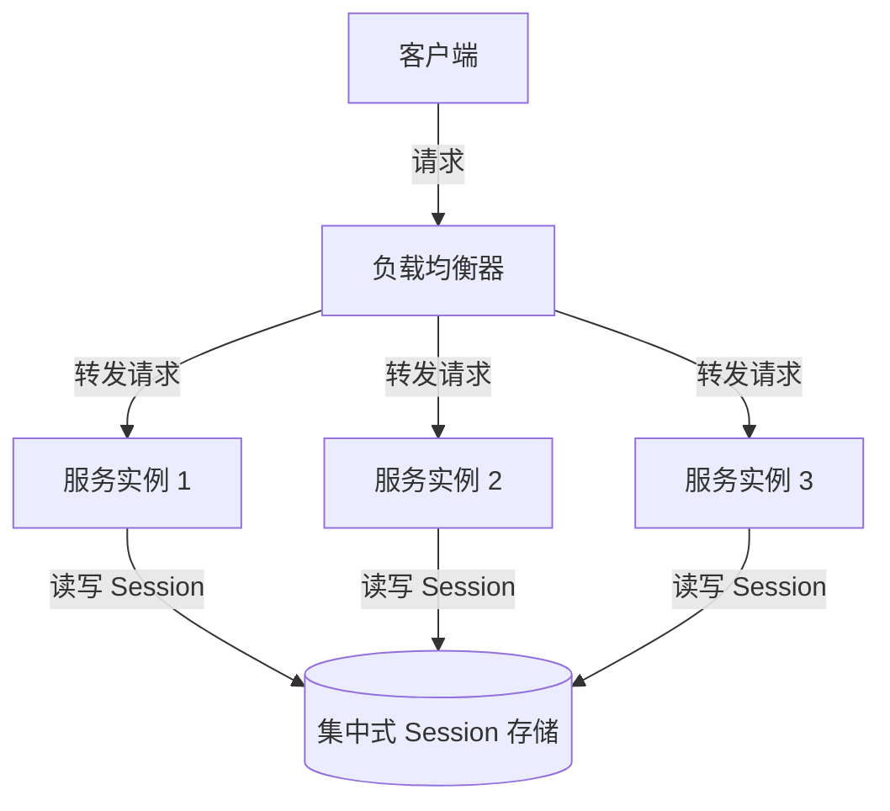
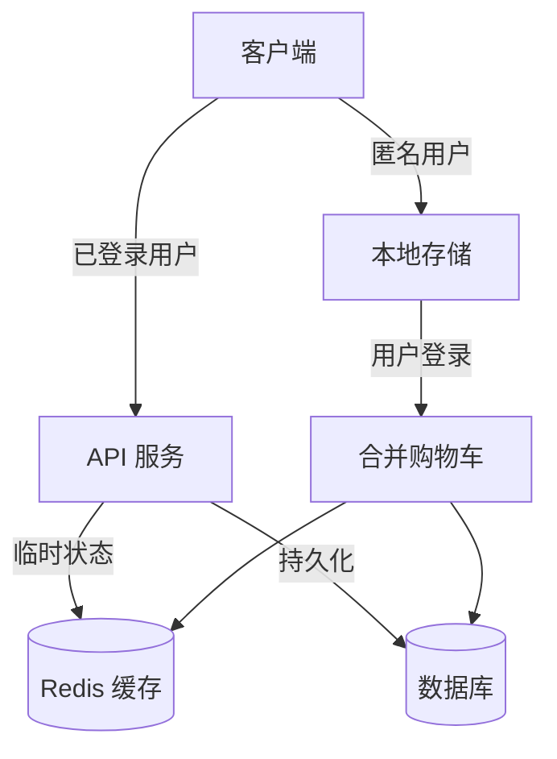

# 商城系统中维护 Session 的必要性分析

> 在微服务架构的商城系统中，是否维护 session 是一个关键的架构决策。本文将分析维护 session 对服务无状态性的影响，并探讨在无 session 设计下如何实现购物车等典型功能，帮助开发者在性能、可扩展性和用户体验之间做出合理的权衡。

## 1. Session 与服务无状态性的关系

> 传统的 session 机制与微服务架构追求的无状态性存在一定的矛盾。无状态服务更易于扩展和部署，而 session 则为用户提供了连续一致的体验。

### 1.1 无状态服务的优势

无状态服务设计具有以下优势：

- **水平扩展**：服务实例可以随时增减，无需考虑状态迁移
- **负载均衡**：请求可以被路由到任何服务实例，无需会话亲和性
- **故障恢复**：服务实例故障不会导致用户状态丢失
- **部署简化**：可以采用不可变基础设施模式，简化部署流程
- **资源利用**：避免了单个实例因长时间保持会话而占用资源

### 1.2 Session 维护的挑战

在微服务架构中维护 session 面临以下挑战：

- **会话亲和性**：需要确保用户请求总是路由到同一服务实例
- **状态复制**：需要在服务实例间同步会话状态
- **故障处理**：服务实例故障可能导致会话状态丢失
- **扩展性限制**：有状态服务的扩展比无状态服务更复杂

### 1.3 集中式 Session 存储

为了解决上述挑战，现代系统通常采用集中式 session 存储：



这种方式虽然保留了 session 的便利性，但也引入了额外的复杂性和性能开销。

## 2. 商城系统中的 Session 使用场景

> 商城系统中有多个功能可能依赖于 session，但并非所有功能都必须通过传统 session 实现。

### 2.1 典型的 Session 依赖场景

1. **用户认证**：存储登录状态和用户信息
2. **购物车**：临时存储用户选择的商品
3. **订单流程**：多步骤结账过程中的状态维护
4. **个性化推荐**：基于用户当前浏览行为的推荐
5. **表单填写**：多步骤表单的中间状态保存

### 2.2 Session 的替代方案

对于上述场景，有多种替代方案可以在保持服务无状态的同时提供类似的功能：

- **JWT（JSON Web Tokens）**：将用户信息编码在令牌中，无需服务端存储
- **客户端存储**：利用浏览器的 localStorage 或 IndexedDB 存储数据
- **数据库持久化**：将状态直接存储在数据库中
- **分布式缓存**：使用 Redis 等分布式缓存系统存储临时状态

## 3. 无 Session 架构下的购物车设计

> 购物车功能是商城系统的核心，在无 session 架构下，可以采用多种方式实现高效的购物车功能。

### 3.1 基于客户端存储的购物车

**实现方式**：

```javascript
// 添加商品到购物车
function addToCart(productId, quantity) {
    let cart = JSON.parse(localStorage.getItem('cart') || '{}');
    cart[productId] = (cart[productId] || 0) + quantity;
    localStorage.setItem('cart', JSON.stringify(cart));
}

// 结账时将购物车数据发送到服务器
function checkout() {
    let cart = JSON.parse(localStorage.getItem('cart') || '{}');
    fetch('/api/orders', {
        method: 'POST',
        headers: {
            'Content-Type': 'application/json',
            'Authorization': 'Bearer ' + getJwtToken()
        },
        body: JSON.stringify({ items: cart })
    });
}
```

**优势**：
- 减轻服务器负担
- 即使在离线状态下也能操作购物车
- 无需会话亲和性

**劣势**：
- 无法跨设备同步
- 安全性较低，数据可能被篡改
- 存储容量有限

### 3.2 基于数据库的购物车

**实现方式**：

```go
// 添加商品到购物车
func AddToCart(ctx context.Context, userId int64, productId int64, quantity int) error {
    // 检查商品是否已在购物车中
    var count int
    err := db.QueryRowContext(ctx, 
        "SELECT COUNT(*) FROM cart_items WHERE user_id = ? AND product_id = ?", 
        userId, productId).Scan(&count)
    if err != nil {
        return err
    }
    
    // 更新或插入购物车项
    if count > 0 {
        _, err = db.ExecContext(ctx, 
            "UPDATE cart_items SET quantity = quantity + ? WHERE user_id = ? AND product_id = ?", 
            quantity, userId, productId)
    } else {
        _, err = db.ExecContext(ctx, 
            "INSERT INTO cart_items (user_id, product_id, quantity) VALUES (?, ?, ?)", 
            userId, productId, quantity)
    }
    return err
}

// 获取用户购物车
func GetCart(ctx context.Context, userId int64) ([]CartItem, error) {
    rows, err := db.QueryContext(ctx, 
        "SELECT ci.product_id, p.name, p.price, ci.quantity FROM cart_items ci " +
        "JOIN products p ON ci.product_id = p.id WHERE ci.user_id = ?", userId)
    if err != nil {
        return nil, err
    }
    defer rows.Close()
    
    var items []CartItem
    for rows.Next() {
        var item CartItem
        if err := rows.Scan(&item.ProductID, &item.Name, &item.Price, &item.Quantity); err != nil {
            return nil, err
        }
        items = append(items, item)
    }
    return items, nil
}
```

**优势**：
- 支持跨设备同步
- 可以实现更复杂的购物车逻辑
- 数据安全性更高

**劣势**：
- 每次操作都需要数据库交互
- 需要处理并发问题
- 对匿名用户支持有限

### 3.3 基于分布式缓存的购物车

**实现方式**：

```go
// 添加商品到购物车
func AddToCart(ctx context.Context, cartId string, productId int64, quantity int) error {
    // 使用 Redis Hash 存储购物车
    _, err := redisClient.HIncrBy(ctx, "cart:"+cartId, strconv.FormatInt(productId, 10), int64(quantity)).Result()
    if err != nil {
        return err
    }
    // 设置过期时间（例如 7 天）
    redisClient.Expire(ctx, "cart:"+cartId, 7*24*time.Hour)
    return nil
}

// 获取购物车内容
func GetCart(ctx context.Context, cartId string) (map[int64]int, error) {
    // 从 Redis 获取购物车数据
    result, err := redisClient.HGetAll(ctx, "cart:"+cartId).Result()
    if err != nil {
        return nil, err
    }
    
    cart := make(map[int64]int)
    for productIdStr, quantityStr := range result {
        productId, _ := strconv.ParseInt(productIdStr, 10, 64)
        quantity, _ := strconv.Atoi(quantityStr)
        cart[productId] = quantity
    }
    return cart, nil
}
```

**优势**：
- 高性能，低延迟
- 支持匿名用户
- 可以设置数据过期时间

**劣势**：
- 需要额外的缓存基础设施
- 数据持久性较弱
- 需要处理缓存一致性问题

### 3.4 混合方案

在实际应用中，通常采用混合方案以获得最佳效果：

1. **匿名用户**：使用客户端存储 + 临时 ID 标识
2. **已登录用户**：使用分布式缓存 + 数据库持久化
3. **结账时**：将临时购物车与用户账户关联



## 4. 其他无 Session 功能设计

> 除了购物车，商城系统中的其他功能也可以采用无 session 设计。

### 4.1 用户认证

使用 JWT（JSON Web Token）实现无状态认证：

```go
// 用户登录并生成 JWT
func Login(ctx context.Context, email, password string) (string, error) {
    // 验证用户凭据
    user, err := authenticateUser(ctx, email, password)
    if err != nil {
        return "", err
    }
    
    // 创建 JWT 令牌
    token := jwt.NewWithClaims(jwt.SigningMethodHS256, jwt.MapClaims{
        "user_id": user.ID,
        "email":   user.Email,
        "exp":     time.Now().Add(24 * time.Hour).Unix(),
    })
    
    // 签名并返回令牌
    tokenString, err := token.SignedString([]byte(secretKey))
    return tokenString, err
}

// 验证 JWT 并提取用户信息
func AuthMiddleware(next http.Handler) http.Handler {
    return http.HandlerFunc(func(w http.ResponseWriter, r *http.Request) {
        // 从请求中提取令牌
        tokenString := extractToken(r)
        
        // 解析和验证令牌
        token, err := jwt.Parse(tokenString, func(token *jwt.Token) (interface{}, error) {
            return []byte(secretKey), nil
        })
        
        if err != nil || !token.Valid {
            http.Error(w, "Unauthorized", http.StatusUnauthorized)
            return
        }
        
        // 将用户信息添加到请求上下文
        claims := token.Claims.(jwt.MapClaims)
        userId := int64(claims["user_id"].(float64))
        ctx := context.WithValue(r.Context(), "user_id", userId)
        
        // 继续处理请求
        next.ServeHTTP(w, r.WithContext(ctx))
    })
}
```

### 4.2 订单流程

使用状态机模式和数据库持久化管理订单流程：

```go
// 创建订单
func CreateOrder(ctx context.Context, userId int64, items []OrderItem) (string, error) {
    // 生成订单 ID
    orderId := generateOrderId()
    
    // 开始数据库事务
    tx, err := db.BeginTx(ctx, nil)
    if err != nil {
        return "", err
    }
    defer tx.Rollback()
    
    // 创建订单记录
    _, err = tx.ExecContext(ctx, 
        "INSERT INTO orders (id, user_id, status, created_at) VALUES (?, ?, 'PENDING', NOW())",
        orderId, userId)
    if err != nil {
        return "", err
    }
    
    // 添加订单项
    for _, item := range items {
        _, err = tx.ExecContext(ctx,
            "INSERT INTO order_items (order_id, product_id, quantity, price) VALUES (?, ?, ?, ?)",
            orderId, item.ProductID, item.Quantity, item.Price)
        if err != nil {
            return "", err
        }
    }
    
    // 提交事务
    if err := tx.Commit(); err != nil {
        return "", err
    }
    
    return orderId, nil
}

// 更新订单状态
func UpdateOrderStatus(ctx context.Context, orderId string, newStatus string) error {
    // 获取当前状态
    var currentStatus string
    err := db.QueryRowContext(ctx, 
        "SELECT status FROM orders WHERE id = ?", orderId).Scan(&currentStatus)
    if err != nil {
        return err
    }
    
    // 验证状态转换是否有效
    if !isValidStatusTransition(currentStatus, newStatus) {
        return errors.New("invalid status transition")
    }
    
    // 更新状态
    _, err = db.ExecContext(ctx, 
        "UPDATE orders SET status = ?, updated_at = NOW() WHERE id = ?", 
        newStatus, orderId)
    return err
}
```

### 4.3 个性化推荐

结合客户端行为追踪和服务端分析实现个性化推荐：

```javascript
// 客户端：记录用户行为
function trackUserBehavior(eventType, productId) {
    // 收集行为数据
    const event = {
        eventType,
        productId,
        timestamp: Date.now(),
        sessionId: getSessionId()
    };
    
    // 发送到分析服务
    fetch('/api/analytics/events', {
        method: 'POST',
        headers: { 'Content-Type': 'application/json' },
        body: JSON.stringify(event)
    });
    
    // 同时存储在本地，用于即时推荐
    let recentViews = JSON.parse(localStorage.getItem('recentViews') || '[]');
    if (eventType === 'view' && !recentViews.includes(productId)) {
        recentViews.unshift(productId);
        recentViews = recentViews.slice(0, 10); // 保留最近 10 个
        localStorage.setItem('recentViews', JSON.stringify(recentViews));
    }
}
```

```go
// 服务端：获取推荐
func GetRecommendations(ctx context.Context, userId int64, recentViews []int64) ([]Product, error) {
    // 对已登录用户，使用历史数据和用户画像
    if userId > 0 {
        return getPersonalizedRecommendations(ctx, userId)
    }
    
    // 对匿名用户，使用最近浏览记录
    if len(recentViews) > 0 {
        return getSimilarProducts(ctx, recentViews)
    }
    
    // 默认推荐热门商品
    return getPopularProducts(ctx)
}
```

## 5. 性能与可扩展性对比

> 不同的状态管理方案在性能和可扩展性方面各有优劣，需要根据具体场景做出选择。

| 方案 | 读性能 | 写性能 | 可扩展性 | 数据持久性 | 跨设备同步 |
|------|--------|--------|----------|------------|------------|
| 传统 Session | 中 | 中 | 低 | 中 | 支持 |
| 客户端存储 | 高 | 高 | 高 | 低 | 不支持 |
| 数据库持久化 | 低 | 低 | 高 | 高 | 支持 |
| 分布式缓存 | 高 | 高 | 高 | 中 | 支持 |
| 混合方案 | 高 | 中 | 高 | 高 | 支持 |

## 6. GoMall 项目的实践

> 在 GoMall 项目中，我们采用了混合状态管理方案，既保持了服务的无状态性，又提供了良好的用户体验。

### 6.1 认证方案

GoMall 使用 JWT + Redis 的混合认证方案：

- JWT 用于无状态身份验证
- Redis 存储黑名单，支持令牌撤销
- HTTP-Only Cookie 传递令牌，增强安全性

### 6.2 购物车实现

购物车采用三级存储策略：

1. **前端临时存储**：使用 localStorage 存储匿名用户购物车
2. **Redis 缓存**：存储已登录用户的活跃购物车
3. **数据库持久化**：定期将购物车数据持久化到数据库

### 6.3 订单管理

订单流程采用状态机模式，每个状态变更都持久化到数据库：

- 使用事务确保数据一致性
- 通过消息队列处理异步操作
- 实现幂等性设计，支持操作重试

## 7. 总结

> 在商城系统中，是否维护 session 不是非黑即白的选择，而是需要根据具体场景和需求做出权衡。通过合理的架构设计，可以在保持服务无状态的同时，提供流畅的用户体验。

维护 session 的决策应考虑以下因素：

1. **业务复杂度**：复杂的多步骤流程可能更适合使用某种形式的会话管理
2. **性能需求**：高并发场景下，无状态服务更容易扩展
3. **用户体验**：需要在性能和用户体验之间找到平衡点
4. **开发复杂度**：无状态设计可能增加前端开发的复杂性

最佳实践是采用混合方案，根据不同功能的特点选择最合适的状态管理方式，而不是教条地坚持单一模式。在 GoMall 项目中，我们通过结合 JWT、客户端存储、Redis 缓存和数据库持久化，实现了既高效又可靠的商城系统。