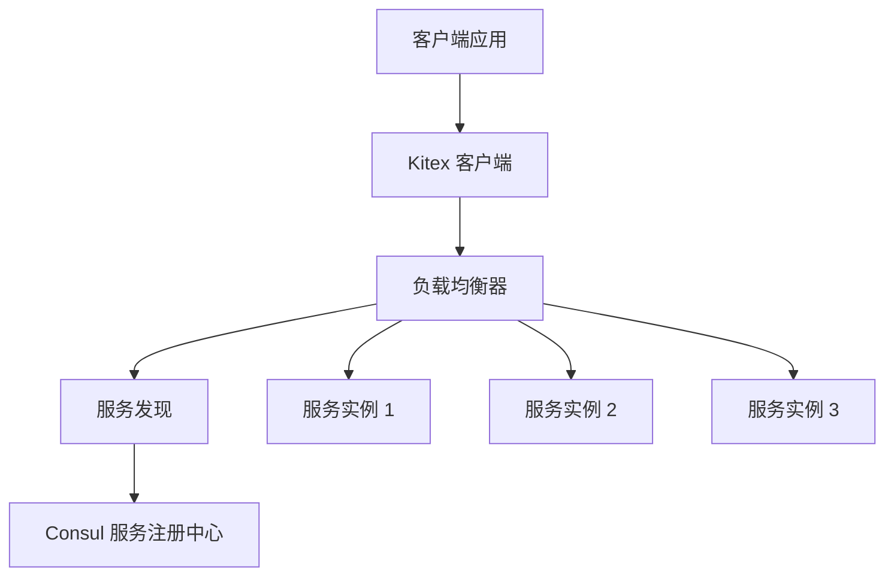
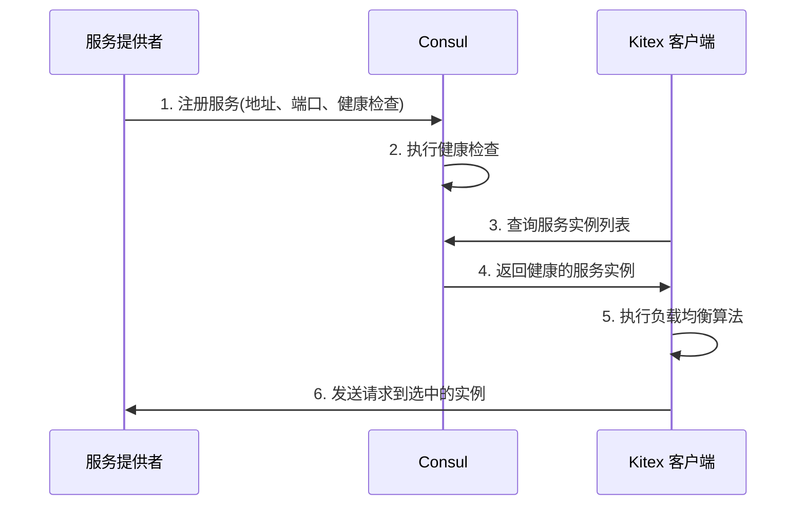

# 微服务之间的负载均衡实现：基于 Kitex 和 Consul

> 本文档详细介绍了在微服务架构中如何实现负载均衡，特别关注基于 Kitex RPC 框架和 Consul 服务注册中心的实现方案。文档涵盖了负载均衡的核心概念、Kitex 中的负载均衡机制、与 Consul 的集成方式，以及在 GoMall 项目中的具体实践。

## 1. 负载均衡核心概念

> 负载均衡是分布式系统中的关键组件，它能够将请求或网络流量分发到多个服务实例上，提高系统的可用性、可扩展性和性能。在微服务架构中，负载均衡尤为重要，因为它直接影响服务间通信的效率和可靠性。

### 1.1 负载均衡的目标

- **高可用性**：即使部分服务实例不可用，系统仍能继续运行
- **可扩展性**：能够轻松添加或移除服务实例以应对流量变化
- **性能优化**：通过合理分配请求减少响应时间和资源消耗
- **故障隔离**：防止单点故障影响整个系统

### 1.2 负载均衡的分类

按照实现层面，负载均衡可以分为：

1. **客户端负载均衡**：由服务消费者直接选择目标服务实例
2. **服务端负载均衡**：由独立的负载均衡器组件选择目标服务实例
3. **中间代理负载均衡**：由位于客户端和服务端之间的代理组件实现

## 2. Kitex 中的负载均衡机制

> Kitex 是字节跳动开源的高性能 RPC 框架，它内置了强大的负载均衡功能。Kitex 采用客户端负载均衡模式，通过与服务注册中心（如 Consul）集成，实现了高效的服务发现和负载分配。

### 2.1 Kitex 负载均衡架构



### 2.2 Kitex 内置负载均衡算法

Kitex 提供了多种负载均衡算法，包括：

1. **加权轮询（Weighted Round Robin）**：按照预定义的权重轮流选择服务实例
2. **加权随机（Weighted Random）**：根据权重随机选择服务实例
3. **一致性哈希（Consistent Hashing）**：根据请求的特定属性映射到固定的服务实例
4. **最少连接（Least Connection）**：选择当前连接数最少的服务实例

默认情况下，Kitex 使用加权轮询算法。

## 3. Consul 服务注册与发现

> Consul 是一个功能强大的服务网格解决方案，提供服务发现、健康检查、KV 存储等功能。在微服务负载均衡中，Consul 主要负责维护可用服务实例的列表，并提供服务健康状态信息。

### 3.1 Consul 在负载均衡中的角色



### 3.2 Consul 健康检查机制

Consul 通过定期执行健康检查来确保服务实例的可用性。健康检查可以是：

- **HTTP 检查**：定期向服务的指定端点发送 HTTP 请求
- **TCP 检查**：尝试建立 TCP 连接
- **TTL 检查**：服务需要定期报告自己的健康状态
- **gRPC 检查**：针对 gRPC 服务的专用检查

## 4. Kitex 与 Consul 集成实现负载均衡

> 在 GoMall 项目中，我们通过 Kitex 与 Consul 的集成实现了高效的微服务间负载均衡。这种集成利用了 Kitex 的客户端负载均衡能力和 Consul 的服务注册发现功能。

### 4.1 服务注册实现

在 GoMall 项目中，服务注册是通过以下步骤实现的：

1. 服务启动时，创建 Consul 客户端
2. 定义服务注册信息，包括服务 ID、名称、地址、端口和健康检查配置
3. 调用 Consul API 注册服务

```go
func registerServiceWithConsul(serviceID, serviceName, serviceAddress string, servicePort int) {
    // 配置 Consul 客户端
    config := consulapi.DefaultConfig()
    config.Address = "127.0.0.1:8500"
    client, err := consulapi.NewClient(config)

    if err != nil {
        log.Fatalf("Failed to create Consul client: %v", err)
    }

    // 定义服务注册信息
    registration := &consulapi.AgentServiceRegistration{
        ID:      serviceID,
        Name:    serviceName,
        Address: serviceAddress,
        Port:    servicePort,
        Check: &consulapi.AgentServiceCheck{
            HTTP:     fmt.Sprintf("http://%s:%d/ping", serviceAddress, servicePort),
            Interval: "10s",
            Timeout:  "5s",
        },
    }

    // 注册服务
    err = client.Agent().ServiceRegister(registration)
    if err != nil {
        log.Fatalf("Failed to register service with Consul: %v", err)
    }
    log.Printf("Service %s registered with Consul", serviceName)
}
```

### 4.2 服务发现与负载均衡实现

在 Kitex 客户端中，服务发现和负载均衡是通过以下步骤实现的：

1. 创建 Consul 解析器（Resolver）
2. 将解析器配置到 Kitex 客户端
3. 配置负载均衡策略

```go
// 创建 Consul 解析器
r, err := consul.NewConsulResolver("127.0.0.1:8500")
if err != nil {
    log.Fatal(err)
}

// 创建 Kitex 客户端，配置服务发现和负载均衡
client, err := userservice.NewClient(
    "user-service",  // 目标服务名称
    client.WithResolver(r),  // 使用 Consul 解析器
    client.WithLoadBalancer(loadbalance.NewWeightedBalancer()),  // 配置负载均衡策略
)
```

### 4.3 完整的负载均衡流程

在 GoMall 项目中，微服务间的负载均衡流程如下：

1. 服务提供者启动时向 Consul 注册自己
2. Consul 定期执行健康检查，维护可用服务列表
3. 服务消费者创建 Kitex 客户端，配置 Consul 解析器
4. 客户端发起 RPC 调用时，Kitex 从 Consul 获取可用服务列表
5. Kitex 应用负载均衡算法选择一个服务实例
6. Kitex 将请求发送到选中的服务实例
7. 如果请求失败，Kitex 可以自动重试其他实例

## 5. GoMall 项目中的实际应用

> 在 GoMall 项目中，我们采用了基于 Kitex 和 Consul 的客户端负载均衡方案，这种方案在我们的微服务架构中表现出色，提供了高效的服务调用和良好的可扩展性。

### 5.1 客户端配置示例

在 GoMall 项目中，我们通过 `CommonClientSuite` 封装了客户端公共配置：

```go
package clientsuite

import (
    "github.com/cloudwego/kitex/client"
    "github.com/cloudwego/kitex/pkg/rpcinfo"
    "github.com/cloudwego/kitex/transport"
    consul "github.com/kitex-contrib/registry-consul"
)

type CommonClientSuite struct {
    CurrentServiceName string
    RegisteryAddr      string
}

func (s CommonClientSuite) Options() []client.Option {
    r, _ := consul.NewConsulResolver(s.RegisteryAddr)
    
    opts := []client.Option{
        client.WithClientBasicInfo(&rpcinfo.EndpointBasicInfo{
            ServiceName: s.CurrentServiceName,
        }),
        client.WithTransportProtocol(transport.GRPC),
        client.WithResolver(r),
    }
    return opts
}
```

### 5.2 监控与指标收集

为了更好地监控负载均衡效果，我们在 GoMall 项目中集成了 Prometheus 指标收集：

```go
func InitMetrics(serviceName, metricsPort, registeryAddr string) {
    Register = prometheus.NewRegistry()
    Register.MustRegister(collectors.NewGoCollector())
    Register.MustRegister(collectors.NewProcessCollector(collectors.ProcessCollectorOpts{}))
    r, _ := consul.NewConsulRegister(registeryAddr)
    addr, _ := net.ResolveTCPAddr("tcp", metricsPort)
    registerInfo := &registry.Info{
        ServiceName: "prometheus",
        Addr:        addr,
        Weight:      1,
        Tags:        map[string]string{"service": serviceName},
    }
    r.Register(registerInfo)
    server.RegisterShutdownHook(func() {
        r.Deregister(registerInfo)
    })
    http.Handle("/metrics", promhttp.HandlerFor(Register, promhttp.HandlerOpts{}))
    go http.ListenAndServe(metricsPort, nil)
}
```

## 6. 负载均衡最佳实践

> 基于 GoMall 项目的实践经验，我们总结了一些在 Kitex 和 Consul 环境下实现微服务负载均衡的最佳实践，这些实践可以帮助提高系统的可靠性、性能和可维护性。

### 6.1 选择合适的负载均衡算法

- **加权轮询**：适用于服务实例性能相近的场景
- **一致性哈希**：适用于需要会话粘性的场景
- **最少连接**：适用于服务实例处理能力差异大的场景

### 6.2 健康检查配置优化

- 设置合理的健康检查间隔，通常为 5-10 秒
- 配置适当的超时时间，通常为健康检查间隔的一半
- 使用与服务通信协议匹配的健康检查类型（HTTP/TCP/gRPC）

### 6.3 故障处理策略

- 实现断路器模式，防止故障级联
- 配置重试策略，但避免过度重试
- 实现超时控制，防止请求长时间阻塞

### 6.4 扩展性考虑

- 服务实例应支持动态扩缩容
- 负载均衡配置应支持动态更新
- 考虑使用服务网格（如 Istio）进一步增强负载均衡能力

## 7. 总结

> 在 GoMall 项目中，我们通过 Kitex 和 Consul 的集成实现了高效的微服务间负载均衡。这种实现方式充分利用了 Kitex 的高性能 RPC 框架和 Consul 的服务注册发现能力，为我们的微服务架构提供了可靠的通信基础。

客户端负载均衡方案在我们的项目中表现出色，它避免了额外的网络跳转，减少了延迟，并且能够快速响应服务实例的变化。通过合理配置健康检查和负载均衡策略，我们的系统能够有效应对流量波动和部分服务故障的情况。

未来，我们将继续优化负载均衡实现，探索更多高级特性，如自适应负载均衡、流量控制和服务网格集成，以进一步提升系统的可靠性和性能。
