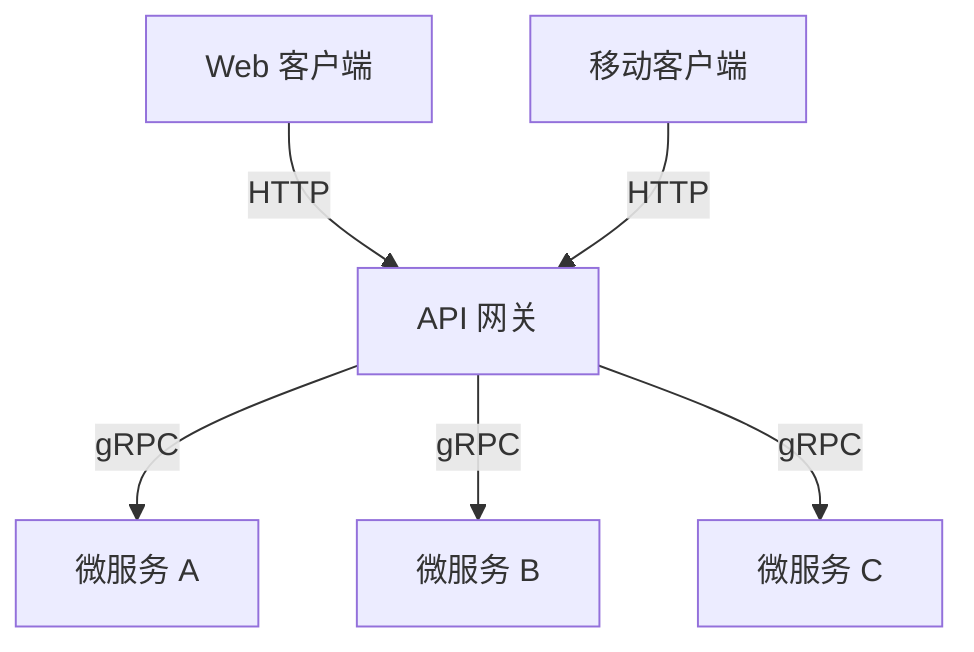
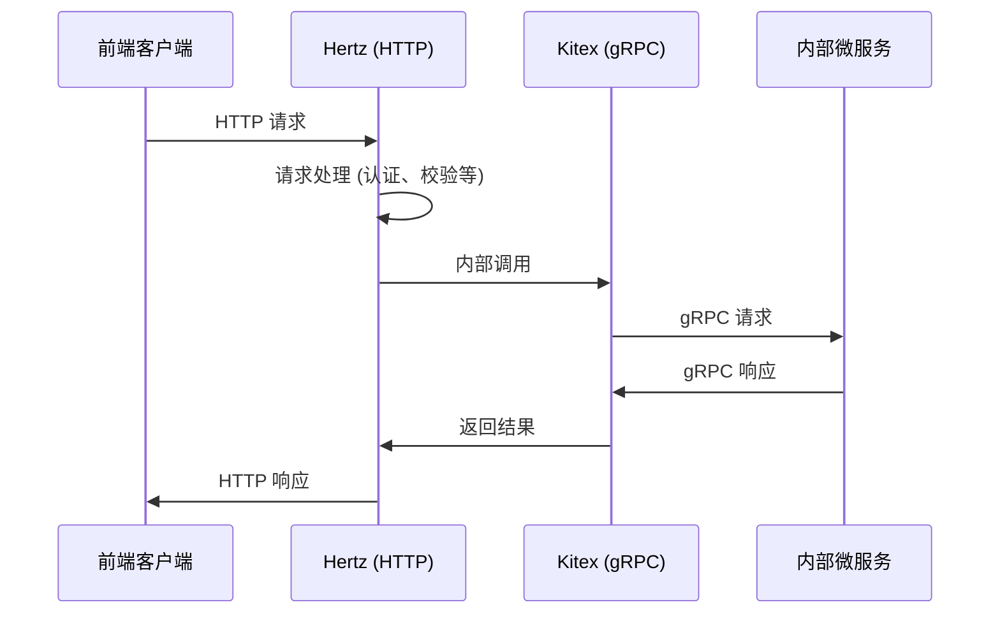
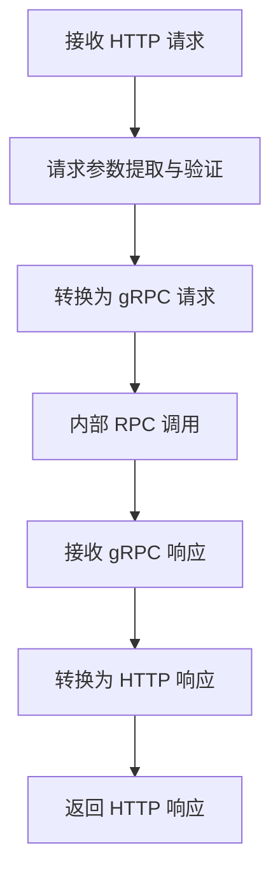
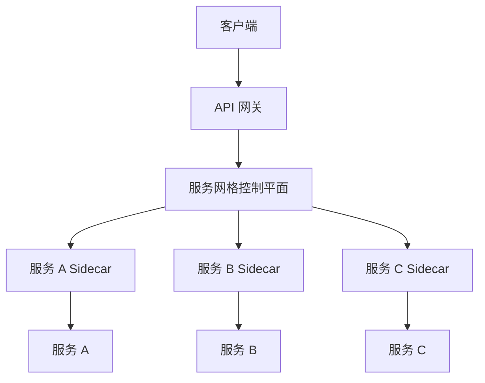

# 微服务最外层网关的选型与设计

> 本文档详细介绍了在微服务架构中，最外层与前端交互的网关如何选型和设计，特别关注微服务内部使用 gRPC 而与前端交互需要 HTTP 的协议转换场景。文档涵盖了网关的核心概念、常见选型方案、GoMall 项目中的具体实现，以及最佳实践和优化建议。

## 1. 微服务网关核心概念

> 微服务网关是微服务架构中的关键组件，作为系统的入口点，它负责接收来自客户端的请求并将其路由到相应的微服务。在内部使用 gRPC 而前端需要 HTTP 的场景下，网关还承担着协议转换的重要职责。

### 1.1 网关的主要职责

- **请求路由**：将客户端请求转发到相应的微服务
- **协议转换**：在 HTTP 和 gRPC 之间进行协议转换
- **认证授权**：统一处理身份验证和权限控制
- **限流熔断**：保护后端服务免受流量冲击
- **日志监控**：记录请求日志并提供监控能力
- **请求响应转换**：处理不同客户端需要的数据格式

### 1.2 网关面临的挑战

在微服务架构中，网关面临以下主要挑战：

1. **性能开销**：网关作为额外的网络跳转可能引入延迟
2. **协议兼容**：需要处理 HTTP 和 gRPC 等不同协议
3. **可扩展性**：随着服务数量增长，网关需要高效扩展
4. **单点故障**：作为系统入口，需要高可用设计
5. **复杂性管理**：随着功能增加，网关可能变得复杂

## 2. 微服务网关的常见选型方案

> 针对微服务网关，业界有多种成熟的解决方案，每种方案都有其特点和适用场景。在选择网关方案时，需要考虑性能、功能、复杂度和团队技术栈等因素。

### 2.1 主流网关方案比较

| 网关方案 | 特点 | 适用场景 | 协议支持 |
|---------|------|---------|---------|
| **Kong** | 基于 Nginx，插件丰富，性能高 | 大型微服务架构，需要丰富插件生态 | HTTP, gRPC, WebSocket |
| **APISIX** | 基于 Nginx，动态路由，性能高 | 需要动态配置和高性能的场景 | HTTP, gRPC, Dubbo |
| **Envoy** | 现代代理，高性能，可观测性强 | 服务网格场景，需要高级流量管理 | HTTP/1.1, HTTP/2, gRPC |
| **Spring Cloud Gateway** | 与 Spring 生态集成，易用 | Java 技术栈，需要与 Spring 集成 | HTTP, WebSocket |
| **Traefik** | 自动服务发现，配置简单 | 容器化环境，需要自动配置 | HTTP, gRPC, TCP |
| **自研网关** | 完全定制化，满足特定需求 | 特殊需求场景，现有方案不满足 | 根据需求定制 |

### 2.2 gRPC-HTTP 转换的实现方式

在微服务内部使用 gRPC 而需要与 HTTP 客户端交互的场景下，有以下几种实现方式：

1. **gRPC-Gateway**：基于 Protocol Buffers 的 HTTP 注解生成 RESTful API
2. **gRPC-Web**：允许浏览器客户端直接与 gRPC 服务通信
3. **自定义转换层**：根据业务需求实现定制化的协议转换
4. **API 网关转换**：利用网关进行协议转换，如 Envoy, APISIX 等
5. **双协议服务器**：服务同时支持 gRPC 和 HTTP 协议



## 3. GoMall 项目的网关选型与设计

> 在 GoMall 项目中，我们采用了基于 Hertz 和 Kitex 的双协议服务器方案，通过在同一服务中同时支持 HTTP 和 gRPC 协议，实现了高效的协议转换和请求处理。这种方案避免了额外的网关组件，降低了系统复杂度和延迟。

### 3.1 选型考虑因素

在 GoMall 项目的网关选型中，我们考虑了以下因素：

1. **性能要求**：需要高性能的请求处理能力
2. **技术栈一致性**：与现有 Go 技术栈保持一致
3. **开发维护成本**：避免引入过多组件增加维护负担
4. **协议转换效率**：高效处理 HTTP 和 gRPC 之间的转换
5. **扩展性**：支持未来功能扩展和服务增长

### 3.2 Hertz + Kitex 双协议服务器方案

在 GoMall 项目中，我们采用了 Hertz 和 Kitex 的组合方案：

- **Hertz**：字节跳动开源的高性能 Go HTTP 框架，处理与前端的 HTTP 交互
- **Kitex**：字节跳动开源的高性能 Go RPC 框架，处理微服务内部 gRPC 通信
- **混合协议处理**：在同一服务中集成两种协议的处理能力



## 4. GoMall 项目的网关实现细节

> GoMall 项目采用了创新的方式实现了网关功能，通过 Hertz 和 Kitex 的紧密集成，在同一服务进程中同时处理 HTTP 和 gRPC 请求，避免了传统网关带来的额外网络跳转和性能开销。

### 4.1 混合协议处理器实现

在 GoMall 项目中，我们通过自定义的 `transHandler` 实现了 HTTP 和 gRPC 请求的检测和分发：

```go
func (t *transHandler) OnRead(ctx context.Context, conn net.Conn) error {
    c, ok := conn.(network.Conn)
    if ok {
        pre, _ := c.Peek(4)
        if httpReg.Match(pre) {
            klog.Info("using Hertz to process request")
            err := hertzEngine.Serve(ctx, c)
            if err != nil {
                err = fmt.Errorf("HERTZ: %w", err)
            }
            return err
        }
    }
    return t.ServerTransHandler.OnRead(ctx, conn)
}
```

这段代码通过检查请求的前几个字节来判断是否为 HTTP 请求，如果是则使用 Hertz 引擎处理，否则交给 Kitex 的 RPC 处理器处理。

### 4.2 HTTP 服务器配置

Hertz HTTP 服务器的配置包括路由、中间件和跨域设置等：

```go
func initHertz() *route.Engine {
    h := hertzServer.New(hertzServer.WithIdleTimeout(0))
    
    // 配置 CORS
    h.Use(cors.New(cors.Config{
        AllowOrigins:     []string{"http://192.168.110.112:5173"},
        AllowMethods:     []string{"GET", "POST", "PUT", "PATCH", "DELETE", "HEAD", "OPTIONS"},
        AllowHeaders:     []string{"Origin", "Content-Length", "Content-Type", "Authorization", "csrf"},
        AllowCredentials: true,
        ExposeHeaders:    []string{"Content-Length"},
        MaxAge:           12 * time.Hour,
    }))

    // 注册 session 和 csrf
    mw.InitJwt()
    mw.InitSession(h)
    mw.InitCSRF(h)

    router.GeneratedRegister(h)
    // ...
    return h.Engine
}
```

### 4.3 服务注册与发现集成

为了支持服务发现，我们将 HTTP 和 gRPC 服务都注册到 Consul：

```go
func registerServiceWithConsul(serviceID, serviceName, serviceAddress string, servicePort int) {
    // 配置 Consul 客户端
    config := consulapi.DefaultConfig()
    config.Address = "127.0.0.1:8500"
    client, err := consulapi.NewClient(config)

    // 定义服务注册信息
    registration := &consulapi.AgentServiceRegistration{
        ID:      serviceID,
        Name:    serviceName,
        Address: serviceAddress,
        Port:    servicePort,
        Check: &consulapi.AgentServiceCheck{
            HTTP:     fmt.Sprintf("http://%s:%d/ping", serviceAddress, servicePort),
            Interval: "10s",
            Timeout:  "5s",
        },
    }

    // 注册服务
    err = client.Agent().ServiceRegister(registration)
    // ...
}
```

## 5. 协议转换与请求处理流程

> 在 GoMall 项目中，协议转换是一个关键环节，它实现了 HTTP 请求到 gRPC 调用的无缝转换，以及响应的反向转换。这种转换过程需要处理不同协议的特性和数据格式差异。

### 5.1 HTTP 到 gRPC 的转换流程

1. **请求接收**：Hertz 接收并解析 HTTP 请求
2. **参数提取**：从 HTTP 请求中提取参数（URL、Header、Body）
3. **请求转换**：将 HTTP 参数转换为 gRPC 请求消息
4. **RPC 调用**：使用 Kitex 客户端发起 gRPC 调用
5. **响应转换**：将 gRPC 响应转换为 HTTP 响应格式
6. **响应返回**：通过 Hertz 返回 HTTP 响应



### 5.2 数据格式转换

HTTP 和 gRPC 使用不同的数据格式（JSON vs Protocol Buffers），需要进行转换：

- **请求转换**：JSON → Protocol Buffers
- **响应转换**：Protocol Buffers → JSON

在 GoMall 项目中，我们使用以下方式处理这种转换：

```go
// HTTP 处理函数示例
func Register(ctx context.Context, c *app.RequestContext) {
    var req user.RegisterRequest
    
    // 解析 HTTP JSON 请求
    if err := c.BindAndValidate(&req); err != nil {
        // 错误处理
        return
    }
    
    // 调用 gRPC 服务
    resp, err := userClient.Register(ctx, &req)
    if err != nil {
        // 错误处理
        return
    }
    
    // 返回 HTTP JSON 响应
    c.JSON(consts.StatusOK, resp)
}
```

## 6. 网关性能优化与最佳实践

> 基于 GoMall 项目的实践经验，我们总结了一些微服务网关的性能优化策略和最佳实践，这些经验可以帮助提高网关的性能、可靠性和可维护性。

### 6.1 性能优化策略

1. **连接复用**：使用连接池复用 gRPC 连接，减少建立连接的开销
2. **请求合并**：合并多个小请求为一个批量请求，减少网络往返
3. **异步处理**：对非关键路径使用异步处理，提高响应速度
4. **缓存应用**：缓存频繁访问的数据，减少后端服务调用
5. **协议优化**：使用 HTTP/2 提高传输效率
6. **负载均衡**：实现智能负载均衡，优化请求分发

### 6.2 可靠性设计

1. **熔断机制**：当后端服务不可用时快速失败，防止级联故障
2. **限流保护**：实现请求限流，防止过载
3. **超时控制**：设置合理的超时时间，避免请求长时间阻塞
4. **重试策略**：对可重试的操作实现智能重试
5. **降级机制**：在高负载情况下降级非核心功能

### 6.3 安全性考虑

1. **认证授权**：统一的身份验证和权限控制
2. **输入验证**：严格验证所有客户端输入
3. **HTTPS 加密**：使用 TLS/SSL 保护传输安全
4. **CSRF 防护**：防止跨站请求伪造攻击
5. **速率限制**：防止暴力攻击和 DoS 攻击

### 6.4 可观测性设计

1. **请求追踪**：实现分布式追踪，跟踪请求流程
2. **日志记录**：记录关键操作和错误信息
3. **指标监控**：监控关键性能指标和健康状态
4. **告警机制**：异常情况及时告警
5. **性能分析**：定期分析性能瓶颈

## 7. 未来演进方向

> 随着业务的发展和技术的进步，GoMall 项目的网关设计也需要不断演进。我们规划了几个可能的演进方向，以应对未来的挑战和需求。

### 7.1 服务网格集成

将网关与服务网格（如 Istio）集成，进一步增强流量管理、安全性和可观测性：



### 7.2 GraphQL 支持

引入 GraphQL 支持，提供更灵活的 API 查询能力：

- 减少网络往返
- 按需获取数据
- 强类型 Schema
- 自文档化 API

### 7.3 WebAssembly 扩展

使用 WebAssembly 实现可动态加载的网关扩展：

- 动态部署新功能
- 语言无关的扩展
- 安全的沙箱执行环境
- 高性能的扩展执行

## 8. 总结

> GoMall 项目采用的 Hertz + Kitex 双协议服务器方案为微服务网关提供了一种高效、灵活的实现方式。通过在同一服务中同时处理 HTTP 和 gRPC 请求，我们避免了传统网关带来的额外网络跳转和性能开销，同时保持了良好的可扩展性和可维护性。

这种网关设计充分利用了 Hertz 的 HTTP 处理能力和 Kitex 的 RPC 性能，为前端与微服务后端之间提供了无缝的协议转换。通过精心设计的路由、中间件和服务注册机制，我们实现了一个功能完备、性能优异的微服务网关。

未来，随着业务规模的扩大和技术的发展，我们将继续优化网关设计，引入更多高级特性，如服务网格集成、GraphQL 支持和 WebAssembly 扩展，以满足不断变化的业务需求和技术挑战。