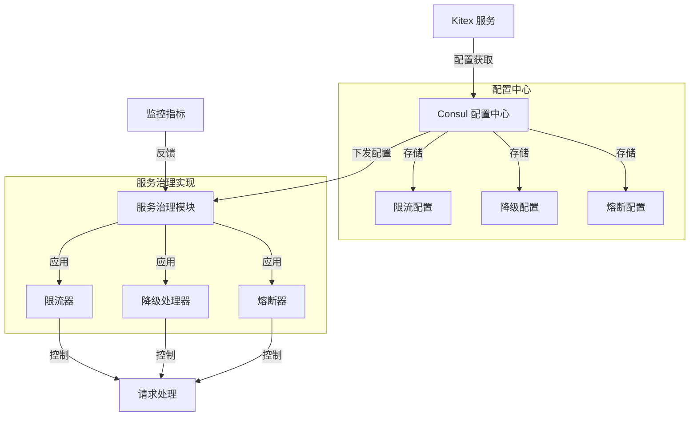

# 服务治理机制总结

## 1. 为什么需要服务限流、降级和熔断？

### 服务限流的必要性
- **保护系统资源**：防止服务器因请求过载而崩溃，确保系统稳定性
- **确保服务质量**：在高峰期维持核心服务的稳定性，提供可靠的用户体验
- **防止恶意攻击**：抵御 DDoS 等恶意请求攻击，保护系统安全
- **成本控制**：合理分配和利用系统资源，避免资源浪费

### 服务降级的必要性
- **优先核心业务**：在系统压力大时，保证核心功能正常运行
- **资源优化分配**：将有限资源分配给最重要的服务
- **故障隔离**：防止非核心服务故障影响核心业务
- **用户体验权衡**：在服务降级时提供基本功能，而不是完全不可用

### 熔断的必要性
- **快速失败**：防止系统因等待不可用服务而耗尽资源
- **防止级联故障**：避免一个服务的故障导致整个系统崩溃
- **自动恢复**：当被调用服务恢复正常后，自动恢复服务调用
- **系统弹性**：提高系统的容错能力和可用性

## 2. Kitex 结合 Consul 的实现机制



### 实现细节说明：

1. **配置管理**
   - Consul 作为配置中心，统一管理服务治理策略
   - 支持动态配置更新，无需重启服务
   - 配置按服务和方法级别进行精细化管理

2. **限流实现**
   - 支持 QPS 限流和并发连接数限流
   - 配置路径：`/KitexConfig/ServiceName/limit`
   - 支持全局配置和方法级配置

3. **降级机制**
   - 基于错误率和响应时间进行服务降级
   - 支持自定义降级策略和降级后的返回值
   - 配置路径：`/KitexConfig/ClientName/ServiceName/retry`

4. **熔断策略**
   - 基于错误率和最小采样数进行熔断判断
   - 支持半开状态自动恢复机制
   - 配置路径：`/KitexConfig/ClientName/ServiceName/circuit_break`

### 优势
- **集中管理**：所有服务治理配置统一在 Consul 中管理
- **实时生效**：配置更新后实时生效，无需重启服务
- **灵活配置**：支持全局配置和细粒度的方法级配置
- **可观测性**：支持监控指标收集和查看

## 3. 服务治理模块实现机制

服务治理模块是由 Kitex 实现的，而不是 Consul 自带的功能。具体实现机制如下：

### 角色分工
- **Consul**: 仅作为配置中心，负责存储和分发配置
- **Kitex**: 实现了所有服务治理的核心逻辑

### 具体实现
1. **配置存储**
   - Consul 只负责存储配置信息（如限流阈值、熔断策略等）
   - 使用 Key-Value 存储，通过不同的路径区分不同的配置

2. **服务治理逻辑**
   - 限流实现：Kitex 内部实现了令牌桶、计数器等算法
   - 熔断实现：Kitex 维护熔断状态机，处理错误统计和状态转换
   - 降级实现：Kitex 处理服务降级的判断和执行逻辑

3. **工作流程**
   ```mermaid
   sequenceDiagram
       participant Client
       participant Kitex
       participant Consul
       
       Kitex->>Consul: 1. 获取配置
       Consul-->>Kitex: 2. 返回配置数据
       Kitex->>Kitex: 3. 初始化服务治理模块
       Client->>Kitex: 4. 发送请求
       Kitex->>Kitex: 5. 执行服务治理逻辑
       Note right of Kitex: - 限流检查<br>- 熔断检查<br>- 降级处理
       Kitex-->>Client: 6. 处理结果
   ```

### 关键点说明
- Consul 只是配置的载体，不参与具体的服务治理逻辑
- 所有的限流、熔断、降级算法都是由 Kitex 实现的
- Kitex 会实时监听 Consul 的配置变更，动态更新服务治理策略
- 服务治理模块的执行是在请求处理管道中进行的
