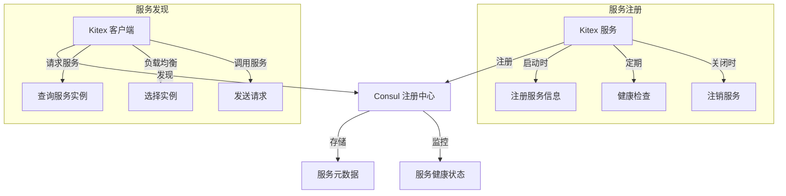
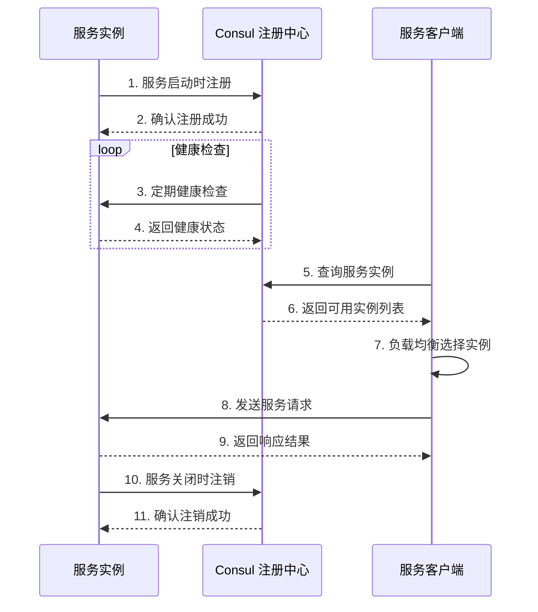

# 服务注册与发现机制实现

## 1. 服务注册与发现的核心概念

> 服务注册与发现是微服务架构中的关键组件，它使服务能够动态地注册自己并发现其他服务，从而实现服务间的可靠通信，无需硬编码服务地址。

### 服务注册的意义
- **动态服务管理**：服务实例可以在启动时自动注册到注册中心
- **健康检查**：注册中心可以定期检查服务健康状态，剔除不健康的服务实例
- **元数据存储**：存储服务的地址、端口、版本等关键信息
- **配置中心**：可以作为集中式配置管理的载体

### 服务发现的意义
- **负载均衡**：客户端可以从多个服务实例中选择一个进行调用
- **服务容错**：当某个服务实例不可用时，可以自动切换到其他实例
- **服务隔离**：可以根据服务标签实现环境隔离、灰度发布等功能
- **动态扩缩容**：支持服务的动态扩缩容，无需修改客户端配置

## 2. GoMall 项目中的服务注册与发现实现



### 实现细节说明：

1. **服务注册实现**
   - 使用 Consul 作为注册中心，统一管理服务实例
   - 通过 Kitex 框架集成 Consul 注册功能
   - 服务启动时自动注册，关闭时自动注销

2. **服务发现实现**
   - 客户端通过服务名称查询可用的服务实例
   - 支持负载均衡策略选择合适的服务实例
   - 自动剔除不健康的服务实例

## 3. 代码实现分析

### 服务注册实现

> 在 GoMall 项目中，服务注册主要通过 Kitex 框架与 Consul 的集成实现，核心代码位于服务启动流程中。

#### 配置文件定义

在 `app/user/conf/conf.go` 中定义了注册中心的配置结构：

```go
type Registry struct {
    RegistryAddress []string `yaml:"registry_address"`
    Username        string   `yaml:"username"`
    Password        string   `yaml:"password"`
}
```

配置文件 `app/user/conf/dev/conf.yaml` 中的具体配置：

```yaml
registry:
  registry_address:
    - 127.0.0.1:8500
  username: ""
  password: ""
```

#### 服务注册实现

在 `app/user/main.go` 中，服务启动时进行注册：

```go
func main() {
    // ...
    consulAddr := "127.0.0.1:8500"
    mtl.InitMetrics(serviceName, conf.GetConf().Kitex.MetricsPort, consulAddr)
    // ...
    opts = append(opts, server.WithSuite(&serversuite.CommonServerSuite{
        CurrentServiceName: serviceName,
        RegisteryAddr:      consulAddr,
    }))
    // ...
    registerServiceWithConsul(serviceID, serviceName, serviceAddress, servicePort)
    // ...
}
```

具体的注册实现在 `app/user/hex_trans_handler.go` 中：

```go
func registerServiceWithConsul(serviceID, serviceName, serviceAddress string, servicePort int) {
    // 配置 Consul 客户端
    config := consulapi.DefaultConfig()
    config.Address = "127.0.0.1:8500"
    client, err := consulapi.NewClient(config)
    // ...
    // 定义服务注册信息
    registration := &consulapi.AgentServiceRegistration{
        ID:      serviceID,
        Name:    serviceName,
        Address: serviceAddress,
        Port:    servicePort,
        Check: &consulapi.AgentServiceCheck{
            HTTP:     fmt.Sprintf("http://%s:%d/ping", serviceAddress, servicePort),
            Interval: "10s",
            Timeout:  "5s",
        },
    }
    // 注册服务
    err = client.Agent().ServiceRegister(registration)
    // ...
}
```

### 服务发现实现

> 在 GoMall 项目中，服务发现主要通过 Kitex 客户端与 Consul 的集成实现，使客户端能够动态发现和调用服务。

#### 客户端配置

在 `common/clientsuite/clientsuite.go` 中定义了客户端配置：

```go
type CommonClientSuite struct {
    CurrentServiceName string
    RegisteryAddr      string
}

func (s CommonClientSuite) Options() []client.Option {
    opts := []client.Option{
        client.WithClientBasicInfo(&rpcinfo.EndpointBasicInfo{
            ServiceName: s.CurrentServiceName,
        }),
        client.WithTransportProtocol(transport.GRPC),
    }
    return opts
}
```

#### 客户端调用服务

客户端通过服务名称调用服务，而不是直接指定服务地址：

```go
kc, err := helloservice.NewClient("user", client.WithHostPorts("127.0.0.1:8888"))
```

在实际生产环境中，客户端会通过服务名称从 Consul 获取可用的服务实例列表，然后通过负载均衡策略选择一个实例进行调用。

## 4. 服务注册与发现的工作流程



## 5. 优势与注意事项

### 优势
- **高可用性**：服务实例可以动态增减，提高系统可用性
- **自动发现**：客户端无需硬编码服务地址，自动发现可用服务
- **健康监控**：自动剔除不健康的服务实例，提高调用成功率
- **配置中心**：Consul 同时作为配置中心，统一管理服务配置

### 注意事项
- **网络分区**：在网络分区情况下，可能导致服务注册与发现不一致
- **服务缓存**：客户端应该缓存服务实例列表，避免频繁查询注册中心
- **超时设置**：合理设置健康检查超时时间，避免误判服务状态
- **安全性**：在生产环境中应该启用 Consul 的 ACL 功能，保障安全