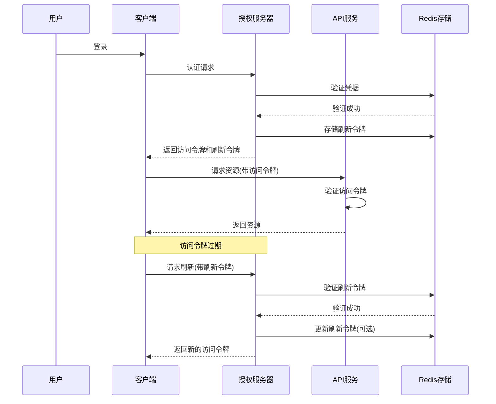

# 访问令牌与刷新令牌：原理与实践

> 访问令牌（Access Token）和刷新令牌（Refresh Token）是现代认证授权系统的核心组件，它们共同构成了安全、高效且用户友好的身份验证机制。在 GoMall 微服务架构中，这两种令牌扮演着不同但互补的角色，确保系统既安全又高性能，同时提供良好的用户体验。

## 1. 令牌基础概念

> 访问令牌和刷新令牌是 OAuth 2.0 和类似授权框架中的关键元素，它们采用不同的生命周期和权限范围，共同构建了一个平衡安全性和便利性的认证体系。

### 1.1 访问令牌（Access Token）

访问令牌是授权服务器颁发的凭证，用于访问受保护的资源。它具有以下特点：

- **短期有效**：通常有效期较短（几分钟到几小时）
- **轻量级**：包含必要的身份和权限信息
- **用途广泛**：用于访问 API 和受保护资源
- **无状态可选**：可以设计为无状态（如 JWT）或有状态

在 GoMall 中，访问令牌通常以 JWT（JSON Web Token）形式实现，包含用户 ID、权限范围和过期时间等信息。

### 1.2 刷新令牌（Refresh Token）

刷新令牌用于获取新的访问令牌，而无需用户重新登录。它具有以下特点：

- **长期有效**：有效期较长（数天、数周或数月）
- **高安全性**：需要更严格的存储和传输保护
- **单一用途**：仅用于获取新的访问令牌
- **通常有状态**：服务器端需要存储和跟踪

刷新令牌通常不会包含在每个 API 请求中，而是仅在需要获取新访问令牌时使用。

### 1.3 令牌对比

| 特性 | 访问令牌 | 刷新令牌 |
|------|----------|----------|
| 生命周期 | 短（分钟/小时） | 长（天/周/月） |
| 使用频率 | 高（每次 API 请求） | 低（仅刷新访问令牌） |
| 存储位置 | 客户端内存/本地存储 | 安全 HTTP-Only Cookie |
| 撤销难度 | 较难（尤其是 JWT） | 较容易 |
| 安全要求 | 中等 | 高 |

## 2. 令牌生命周期

> 令牌生命周期管理是确保系统安全性和用户体验的关键环节，包括令牌的创建、验证、刷新和撤销等过程。

### 2.1 令牌流程



### 2.2 令牌创建

访问令牌和刷新令牌在用户成功认证后由授权服务器创建：

```go
// 创建访问令牌和刷新令牌
func generateTokens(userID int64, scopes []string) (accessToken, refreshToken string, err error) {
    // 创建访问令牌
    accessClaims := jwt.MapClaims{
        "user_id": userID,
        "scopes":  scopes,
        "exp":     time.Now().Add(time.Hour).Unix(),      // 1小时过期
        "jti":     uuid.New().String(),                   // 唯一标识符
    }
    
    accessToken, err = jwt.NewWithClaims(jwt.SigningMethodHS256, accessClaims).
        SignedString([]byte(config.JWT.Secret))
    if err != nil {
        return "", "", err
    }
    
    // 创建刷新令牌
    refreshClaims := jwt.MapClaims{
        "user_id": userID,
        "exp":     time.Now().Add(30 * 24 * time.Hour).Unix(), // 30天过期
        "jti":     uuid.New().String(),                        // 唯一标识符
    }
    
    refreshToken, err = jwt.NewWithClaims(jwt.SigningMethodHS256, refreshClaims).
        SignedString([]byte(config.JWT.RefreshSecret))
    if err != nil {
        return "", "", err
    }
    
    // 存储刷新令牌信息到Redis
    err = storeRefreshToken(refreshClaims["jti"].(string), userID, 30*24*time.Hour)
    
    return accessToken, refreshToken, err
}
```

### 2.3 令牌验证

访问令牌在每次 API 请求时验证：

```go
// 验证访问令牌
func validateAccessToken(tokenString string) (*jwt.Token, jwt.MapClaims, error) {
    token, err := jwt.Parse(tokenString, func(token *jwt.Token) (interface{}, error) {
        // 验证签名算法
        if _, ok := token.Method.(*jwt.SigningMethodHMAC); !ok {
            return nil, fmt.Errorf("unexpected signing method: %v", token.Header["alg"])
        }
        return []byte(config.JWT.Secret), nil
    })
    
    if err != nil {
        return nil, nil, err
    }
    
    if claims, ok := token.Claims.(jwt.MapClaims); ok && token.Valid {
        // 检查令牌是否在黑名单中
        jti, ok := claims["jti"].(string)
        if !ok {
            return nil, nil, errors.New("invalid token ID")
        }
        
        blacklisted, err := isTokenBlacklisted(jti)
        if err != nil || blacklisted {
            return nil, nil, errors.New("token has been revoked")
        }
        
        return token, claims, nil
    }
    
    return nil, nil, errors.New("invalid token")
}
```

### 2.4 令牌刷新

当访问令牌过期时，使用刷新令牌获取新的访问令牌：

```go
// 使用刷新令牌获取新的访问令牌
func refreshAccessToken(refreshTokenString string) (string, error) {
    // 验证刷新令牌
    token, err := jwt.Parse(refreshTokenString, func(token *jwt.Token) (interface{}, error) {
        if _, ok := token.Method.(*jwt.SigningMethodHMAC); !ok {
            return nil, fmt.Errorf("unexpected signing method: %v", token.Header["alg"])
        }
        return []byte(config.JWT.RefreshSecret), nil
    })
    
    if err != nil {
        return "", err
    }
    
    if claims, ok := token.Claims.(jwt.MapClaims); ok && token.Valid {
        // 验证刷新令牌是否在Redis中存在
        jti, ok := claims["jti"].(string)
        if !ok {
            return "", errors.New("invalid refresh token")
        }
        
        userID, err := validateRefreshToken(jti)
        if err != nil {
            return "", err
        }
        
        // 获取用户权限范围
        scopes, err := getUserScopes(userID)
        if err != nil {
            return "", err
        }
        
        // 创建新的访问令牌
        accessClaims := jwt.MapClaims{
            "user_id": userID,
            "scopes":  scopes,
            "exp":     time.Now().Add(time.Hour).Unix(),
            "jti":     uuid.New().String(),
        }
        
        return jwt.NewWithClaims(jwt.SigningMethodHS256, accessClaims).
            SignedString([]byte(config.JWT.Secret))
    }
    
    return "", errors.New("invalid refresh token")
}
```

### 2.5 令牌撤销

撤销令牌是安全机制的重要部分，特别是在用户登出或检测到安全威胁时：

```go
// 撤销访问令牌和刷新令牌
func revokeTokens(accessToken, refreshToken string) error {
    // 解析访问令牌以获取jti
    accessClaims, err := extractClaims(accessToken, config.JWT.Secret)
    if err == nil {
        if jti, ok := accessClaims["jti"].(string); ok {
            // 将访问令牌添加到黑名单
            err = blacklistToken(jti, time.Unix(int64(accessClaims["exp"].(float64)), 0).Sub(time.Now()))
            if err != nil {
                log.Printf("Error blacklisting access token: %v", err)
            }
        }
    }
    
    // 解析刷新令牌以获取jti
    refreshClaims, err := extractClaims(refreshToken, config.JWT.RefreshSecret)
    if err == nil {
        if jti, ok := refreshClaims["jti"].(string); ok {
            // 从Redis中删除刷新令牌
            err = removeRefreshToken(jti)
            if err != nil {
                log.Printf("Error removing refresh token: %v", err)
                return err
            }
        }
    }
    
    return nil
}
```

## 3. 安全考虑

> 令牌安全是认证系统的核心关注点，需要从存储、传输、内容和生命周期等多个方面进行保护，防止令牌被盗用或滥用。

### 3.1 令牌存储

**客户端存储**：

- **访问令牌**：应存储在内存中或短期存储中，避免持久化
- **刷新令牌**：应存储在 HTTP-Only、Secure Cookie 中，或安全的本地存储中

**服务器存储**：

- **访问令牌**：对于 JWT，通常不需要存储；对于不透明令牌，需要存储在 Redis 等高性能存储中
- **刷新令牌**：必须存储在 Redis 或数据库中，以支持验证和撤销

### 3.2 令牌传输

令牌传输应遵循以下安全实践：

- **始终使用 HTTPS**：防止传输过程中的窃听
- **访问令牌**：通过 Authorization 头传输（`Bearer <token>`）
- **刷新令牌**：仅在令牌刷新端点使用，避免在常规 API 请求中传输
- **避免 URL 参数**：不要在 URL 参数中传递令牌

### 3.3 令牌内容

令牌内容设计应遵循最小权限原则：

- **避免敏感信息**：令牌不应包含密码等敏感信息
- **包含必要声明**：如用户 ID、权限范围、过期时间、令牌 ID
- **验证签名**：确保令牌未被篡改
- **验证受众**：确保令牌用于预期服务

### 3.4 防止令牌泄露

防止令牌泄露的措施：

- **短期访问令牌**：限制令牌有效期，减少被盗用的风险
- **令牌轮换**：定期刷新访问令牌
- **令牌绑定**：将令牌绑定到特定设备或会话
- **令牌撤销**：支持单个令牌或用户所有令牌的撤销

## 4. GoMall 中的实现

> GoMall 项目采用了基于 JWT 的访问令牌和基于 Redis 的刷新令牌管理机制，结合了两种方案的优点，实现了安全、高效且可扩展的认证系统。

### 4.1 令牌配置

GoMall 中的令牌配置：

```go
// JWT配置
type JWTConfig struct {
    Secret        string        // 访问令牌密钥
    RefreshSecret string        // 刷新令牌密钥
    AccessExpiry  time.Duration // 访问令牌过期时间
    RefreshExpiry time.Duration // 刷新令牌过期时间
    Issuer        string        // 令牌颁发者
    Audience      string        // 令牌受众
}

// 初始化JWT配置
func initJWTConfig() *JWTConfig {
    return &JWTConfig{
        Secret:        config.GetString("jwt.secret"),
        RefreshSecret: config.GetString("jwt.refresh_secret"),
        AccessExpiry:  time.Hour,                  // 1小时
        RefreshExpiry: 30 * 24 * time.Hour,        // 30天
        Issuer:        "gomall.auth.service",
        Audience:      "gomall.api",
    }
}
```

### 4.2 Redis 存储实现

GoMall 使用 Redis 存储刷新令牌和访问令牌黑名单：

```go
// 存储刷新令牌
func storeRefreshToken(tokenID string, userID int64, expiry time.Duration) error {
    key := fmt.Sprintf("refresh_token:%s", tokenID)
    return redisClient.Set(context.Background(), key, userID, expiry).Err()
}

// 验证刷新令牌
func validateRefreshToken(tokenID string) (int64, error) {
    key := fmt.Sprintf("refresh_token:%s", tokenID)
    val, err := redisClient.Get(context.Background(), key).Int64()
    if err != nil {
        if err == redis.Nil {
            return 0, errors.New("refresh token not found or expired")
        }
        return 0, err
    }
    return val, nil
}

// 将令牌加入黑名单
func blacklistToken(tokenID string, expiry time.Duration) error {
    key := fmt.Sprintf("blacklist:%s", tokenID)
    return redisClient.Set(context.Background(), key, true, expiry).Err()
}

// 检查令牌是否在黑名单中
func isTokenBlacklisted(tokenID string) (bool, error) {
    key := fmt.Sprintf("blacklist:%s", tokenID)
    exists, err := redisClient.Exists(context.Background(), key).Result()
    if err != nil {
        return false, err
    }
    return exists > 0, nil
}
```

### 4.3 令牌中间件

GoMall 使用中间件验证访问令牌：

```go
// JWT认证中间件
func JWTAuthMiddleware() app.HandlerFunc {
    return func(ctx context.Context, c *app.RequestContext) {
        token := extractToken(c)
        if token == "" {
            c.AbortWithStatusJSON(http.StatusUnauthorized, utils.H{
                "code":    401,
                "message": "未提供认证令牌",
            })
            return
        }
        
        _, claims, err := validateAccessToken(token)
        if err != nil {
            c.AbortWithStatusJSON(http.StatusUnauthorized, utils.H{
                "code":    401,
                "message": "无效的认证令牌",
                "error":   err.Error(),
            })
            return
        }
        
        // 将用户信息添加到上下文
        userID, _ := claims["user_id"].(float64)
        scopes, _ := claims["scopes"].([]interface{})
        
        c.Set("user_id", int64(userID))
        c.Set("scopes", convertToStringSlice(scopes))
        
        c.Next(ctx)
    }
}

// 从请求中提取令牌
func extractToken(c *app.RequestContext) string {
    // 从Authorization头提取
    auth := c.GetHeader("Authorization")
    if len(auth) > 7 && strings.ToUpper(string(auth[:7])) == "BEARER " {
        return string(auth[7:])
    }
    
    // 从Cookie提取
    token, _ := c.Cookie("jwt")
    if len(token) > 0 {
        return string(token)
    }
    
    return ""
}
```

### 4.4 令牌刷新端点

GoMall 提供了专门的端点用于刷新访问令牌：

```go
// 刷新访问令牌处理函数
func handleTokenRefresh(ctx context.Context, c *app.RequestContext) {
    var req struct {
        RefreshToken string `json:"refresh_token"`
    }
    
    if err := c.BindJSON(&req); err != nil {
        c.JSON(http.StatusBadRequest, utils.H{
            "code":    400,
            "message": "无效的请求格式",
        })
        return
    }
    
    if req.RefreshToken == "" {
        // 尝试从Cookie获取刷新令牌
        refreshToken, err := c.Cookie("refresh_token")
        if err != nil || len(refreshToken) == 0 {
            c.JSON(http.StatusBadRequest, utils.H{
                "code":    400,
                "message": "未提供刷新令牌",
            })
            return
        }
        req.RefreshToken = string(refreshToken)
    }
    
    // 刷新访问令牌
    newAccessToken, err := refreshAccessToken(req.RefreshToken)
    if err != nil {
        c.JSON(http.StatusUnauthorized, utils.H{
            "code":    401,
            "message": "无效的刷新令牌",
            "error":   err.Error(),
        })
        return
    }
    
    // 返回新的访问令牌
    c.JSON(http.StatusOK, utils.H{
        "code":         200,
        "message":      "令牌刷新成功",
        "access_token": newAccessToken,
        "token_type":   "Bearer",
        "expires_in":   3600, // 1小时
    })
}
```

## 5. 最佳实践

> 令牌管理的最佳实践涵盖了安全性、性能和用户体验等多个方面，需要在实际应用中根据具体需求进行权衡和调整。

### 5.1 安全最佳实践

- **使用非对称加密**：考虑使用 RS256 等非对称算法签名 JWT
- **实施令牌绑定**：将令牌绑定到客户端指纹或会话 ID
- **定期轮换密钥**：定期更新用于签名令牌的密钥
- **实施速率限制**：限制令牌刷新和验证的请求频率
- **监控异常活动**：检测和响应可疑的令牌使用模式

### 5.2 性能最佳实践

- **使用 Redis 缓存**：缓存频繁使用的令牌验证结果
- **优化令牌大小**：减少 JWT 中的声明数量，保持令牌紧凑
- **批量处理撤销**：使用令牌家族概念批量撤销相关令牌
- **异步处理**：非关键路径的令牌操作可以异步处理

### 5.3 用户体验最佳实践

- **无感刷新**：在后台自动刷新即将过期的访问令牌
- **保持登录状态**：使用刷新令牌实现"记住我"功能
- **优雅降级**：当令牌验证服务不可用时提供备用验证机制
- **清晰的错误消息**：提供有用但不过度暴露信息的错误消息

## 6. 常见问题与解决方案

> 在实施令牌认证系统时，会遇到各种挑战和问题，了解这些常见问题及其解决方案有助于构建更健壮的系统。

### 6.1 令牌泄露

**问题**：访问令牌或刷新令牌被窃取。

**解决方案**：
- 实施短期访问令牌
- 使用令牌绑定技术
- 提供令牌撤销机制
- 监控异常使用模式

### 6.2 刷新令牌轮换

**问题**：长期使用同一刷新令牌增加安全风险。

**解决方案**：
```go
// 刷新令牌轮换
func rotateRefreshToken(oldRefreshToken string) (string, string, error) {
    // 验证旧的刷新令牌
    claims, err := extractClaims(oldRefreshToken, config.JWT.RefreshSecret)
    if err != nil {
        return "", "", err
    }
    
    jti, ok := claims["jti"].(string)
    if !ok {
        return "", "", errors.New("invalid token ID")
    }
    
    userID, err := validateRefreshToken(jti)
    if err != nil {
        return "", "", err
    }
    
    // 删除旧的刷新令牌
    err = removeRefreshToken(jti)
    if err != nil {
        return "", "", err
    }
    
    // 创建新的访问令牌和刷新令牌
    accessToken, refreshToken, err := generateTokens(userID, getUserScopes(userID))
    
    return accessToken, refreshToken, err
}
```

### 6.3 跨域问题

**问题**：在跨域环境中使用令牌认证。

**解决方案**：
- 正确配置 CORS 头
- 使用 Authorization 头传输访问令牌
- 考虑使用 SameSite Cookie 策略

### 6.4 令牌同步

**问题**：多设备间的令牌同步和管理。

**解决方案**：
- 实现设备特定令牌
- 提供设备管理界面
- 支持单个设备或所有设备的令牌撤销

## 7. 总结

> GoMall 项目采用的访问令牌和刷新令牌机制，成功地平衡了安全性、性能和用户体验的需求。通过结合 JWT 的无状态特性和 Redis 的集中管理能力，实现了一个既安全又高效的认证系统。

访问令牌和刷新令牌的双令牌架构提供了以下优势：

1. **增强安全性**：短期访问令牌限制了令牌泄露的风险
2. **改善用户体验**：刷新令牌允许用户保持登录状态，无需频繁重新认证
3. **高性能**：JWT 访问令牌支持无状态验证，减少数据库查询
4. **灵活控制**：支持令牌撤销和权限范围控制
5. **可扩展性**：架构设计适应不同类型的客户端和服务

通过遵循本文档中的最佳实践和实现模式，GoMall 项目能够提供一个安全、高效且用户友好的认证系统，满足现代微服务架构的需求。