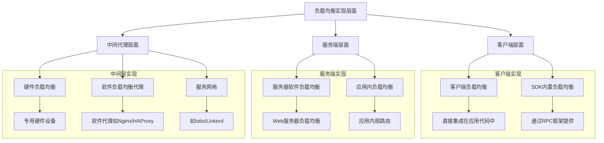
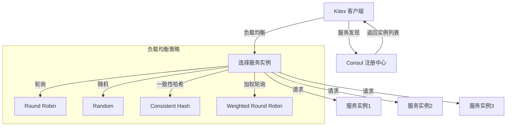

# 负载均衡应该实现在哪个层面

## 1. 负载均衡的核心概念

> 负载均衡是分布式系统中的关键技术，它通过将工作负载分散到多个计算资源上，提高系统的整体性能、可靠性和可用性。在微服务架构中，负载均衡可以在不同层面实现，每种实现方式都有其特定的优势和适用场景。

### 负载均衡的主要目标
- **提高系统吞吐量**：通过分散请求到多个服务实例，提高整体处理能力
- **增强系统可用性**：避免单点故障，即使部分实例不可用，系统仍能继续运行
- **优化资源利用**：合理分配负载，避免某些实例过载而其他实例闲置
- **支持弹性扩缩容**：随着负载变化动态调整资源，无需中断服务

### 负载均衡的关键指标
- **响应时间**：请求从发起到接收响应的时间
- **吞吐量**：单位时间内系统能处理的请求数量
- **资源利用率**：系统资源（CPU、内存、网络等）的使用效率
- **可用性**：系统正常运行的时间比例

## 2. 负载均衡的实现层面



### 各层面负载均衡对比：

| 实现层面 | 优势 | 劣势 | 适用场景 |
|---------|------|------|---------|
| 客户端层面 | 减少网络跳转、实时感知服务状态 | 增加客户端复杂性、跨语言实现困难 | 同语言微服务、性能敏感场景 |
| 服务端层面 | 对客户端透明、集中式管理 | 可能成为性能瓶颈、增加网络延迟 | 多语言服务、遗留系统集成 |
| 中间代理层面 | 语言无关、功能丰富、集中管理 | 额外的网络跳转、运维复杂性增加 | 复杂网络拓扑、多协议支持 |

## 3. GoMall 项目中的负载均衡实现

> GoMall 项目采用了基于 Kitex 框架的客户端负载均衡方案，结合 Consul 服务注册中心，实现了高效的服务发现和负载均衡。

### 实现架构



### 代码实现分析

在 GoMall 项目中，负载均衡主要通过 Kitex 框架提供的客户端负载均衡功能实现。虽然在当前代码中没有显式配置负载均衡策略，但 Kitex 默认提供了多种负载均衡算法。

客户端初始化代码示例：

```go
// 在 demo/hex/client/rpc_test.go 中的客户端初始化
kc, err := helloservice.NewClient("user", client.WithHostPorts("127.0.0.1:8888"))
```

在生产环境中，应该使用服务发现和负载均衡的完整实现：

```go
// 推荐的生产环境实现方式
r, err := consul.NewConsulResolver("127.0.0.1:8500")
if err != nil {
    log.Fatal(err)
}

// 创建客户端并配置负载均衡策略
client, err := echo.NewClient(
    "echo-server",
    client.WithResolver(r),                     // 配置服务发现
    client.WithLoadBalancer(loadbalance.NewWeightedBalancer()), // 配置负载均衡策略
)
```

## 4. 不同层面负载均衡的适用场景分析

### 客户端层面负载均衡（GoMall 项目采用）

> 客户端负载均衡将负载均衡逻辑集成在服务消费者端，直接从服务注册中心获取可用服务列表，并在客户端实现负载分配。

**优势：**
- **减少网络跳转**：客户端直接与服务实例通信，减少中间代理
- **实时感知服务状态**：可以快速感知服务实例的健康状态变化
- **灵活的负载均衡策略**：可以根据业务需求实现自定义的负载均衡算法
- **降低基础设施复杂性**：不需要额外的负载均衡设备或软件

**劣势：**
- **增加客户端复杂性**：客户端需要承担更多的责任
- **跨语言实现困难**：不同语言的客户端需要各自实现负载均衡逻辑
- **配置分散**：负载均衡配置分散在各个客户端，不易统一管理

**适用场景：**
- 同语言微服务架构
- 对性能和延迟敏感的场景
- 服务实例变化不频繁的环境
- 轻量级微服务系统

### 服务端层面负载均衡

> 服务端负载均衡将负载均衡逻辑集成在服务提供者端，由服务端决定如何分配请求。

**优势：**
- **对客户端透明**：客户端无需关心负载均衡逻辑
- **集中式管理**：负载均衡配置集中在服务端，易于管理
- **适合异构客户端**：不同语言的客户端可以统一使用

**劣势：**
- **可能成为性能瓶颈**：所有请求都需要经过服务端负载均衡器
- **增加网络延迟**：多一次网络跳转
- **单点故障风险**：如果负载均衡器故障，整个服务不可用

**适用场景：**
- 多语言客户端环境
- 遗留系统集成
- 对客户端透明度要求高的场景
- 需要集中管理流量的场景

### 中间代理层面负载均衡

> 中间代理负载均衡通过独立的代理层（如 Nginx、HAProxy、Kong 等）实现负载均衡，请求先到达代理层，再转发到后端服务。

**优势：**
- **语言无关**：适用于任何编程语言和框架
- **功能丰富**：通常提供更多高级功能，如 SSL 终止、缓存、限流等
- **集中管理**：配置集中，易于管理和监控
- **成熟稳定**：大多数代理软件都经过广泛验证和优化

**劣势：**
- **额外的网络跳转**：增加请求延迟
- **运维复杂性增加**：需要额外维护代理层
- **可能成为系统瓶颈**：代理层需要处理所有流量
- **状态感知不及时**：可能不能及时感知服务实例状态变化

**适用场景：**
- 复杂的网络拓扑结构
- 需要支持多种协议
- 需要高级流量管理功能
- 大型企业级应用

## 5. 负载均衡层面选择的最佳实践

### 选择考虑因素
- **系统规模**：小型系统可以选择客户端负载均衡，大型系统可能需要多层负载均衡
- **性能要求**：对延迟敏感的场景优先考虑客户端负载均衡
- **技术栈统一性**：同构系统适合客户端负载均衡，异构系统适合代理层负载均衡
- **运维能力**：考虑团队对不同负载均衡方案的运维能力
- **功能需求**：考虑是否需要高级流量管理功能

### 推荐实践
1. **小型微服务系统**：采用客户端负载均衡，如 GoMall 项目中的实现
2. **中型混合系统**：结合客户端负载均衡和边缘代理（如 Nginx）
3. **大型复杂系统**：采用多层负载均衡策略，结合服务网格（如 Istio）

### GoMall 项目的最佳实践
对于 GoMall 项目，基于其当前的架构和规模，推荐继续使用 Kitex 框架提供的客户端负载均衡方案，并考虑以下优化：

1. **显式配置负载均衡策略**：根据业务特点选择合适的负载均衡算法
2. **添加熔断和重试机制**：增强系统弹性
3. **监控负载均衡效果**：收集和分析负载分布情况
4. **考虑边缘代理**：对外部流量可以考虑增加 Nginx 等边缘代理